# 传统锁回顾

## 从减库存开始

多线程并发安全问题最典型的代表就是超卖现象。库存在并发量较大情况下很容易发生超卖现象，一旦发生超卖现象，就会出现多成交了订单而发不了货的情况。

> 商品S库存余量为5时，用户A和B同时来购买一个商品，此时查询库存数都为5，库存充足则开始减库存：
>
> 用户A：update db_stock set stock = stock - 1 where id = 1
>
> 用户B：update db_stock set stock = stock - 1 where id = 1
>
> 并发情况下，更新后的结果可能是4，而实际的最终库存量应该是3才对。
>

## 准备

### 建表

~~~sql
CREATE TABLE `db_stock` (
  `id` bigint(20) NOT NULL AUTO_INCREMENT,
  `product_code` varchar(255) DEFAULT NULL COMMENT '商品编号',
  `stock_code` varchar(255) DEFAULT NULL COMMENT '仓库编号',
  `count` int(11) DEFAULT NULL COMMENT '库存量',
  PRIMARY KEY (`id`)
) ENGINE=InnoDB AUTO_INCREMENT=1 DEFAULT CHARSET=utf8mb4;
~~~

### 创建项目

pom.xml

~~~xml
<?xml version="1.0" encoding="UTF-8"?>
<project xmlns:xsi="http://www.w3.org/2001/XMLSchema-instance" xmlns="http://maven.apache.org/POM/4.0.0"
         xsi:schemaLocation="http://maven.apache.org/POM/4.0.0 https://maven.apache.org/xsd/maven-4.0.0.xsd">
    <modelVersion>4.0.0</modelVersion>
    <parent>
        <groupId>org.springframework.boot</groupId>
        <artifactId>spring-boot-starter-parent</artifactId>
        <version>2.7.6</version>
        <relativePath/> <!-- lookup parent from repository -->
    </parent>
    <groupId>com.lock</groupId>
    <artifactId>distributed-lock</artifactId>
    <version>0.0.1-SNAPSHOT</version>
    <name>distributed-lock</name>
    <description>distributed-lock</description>
    <properties>
        <java.version>8</java.version>
    </properties>
    <dependencies>
        <dependency>
            <groupId>org.springframework.boot</groupId>
            <artifactId>spring-boot-starter-web</artifactId>
        </dependency>

        <dependency>
            <groupId>org.springframework.boot</groupId>
            <artifactId>spring-boot-starter-test</artifactId>
            <scope>test</scope>
        </dependency>

        <dependency>
            <groupId>org.projectlombok</groupId>
            <artifactId>lombok</artifactId>
            <optional>true</optional>
        </dependency>

        <dependency>
            <groupId>mysql</groupId>
            <artifactId>mysql-connector-java</artifactId>
            <version>8.0.30</version>
        </dependency>

        <dependency>
            <groupId>com.baomidou</groupId>
            <artifactId>mybatis-plus-boot-starter</artifactId>
            <version>3.5.2</version>
        </dependency>
    </dependencies>

    <build>
        <plugins>
            <plugin>
                <groupId>org.springframework.boot</groupId>
                <artifactId>spring-boot-maven-plugin</artifactId>
                <configuration>
                    <excludes>
                        <exclude>
                            <groupId>org.projectlombok</groupId>
                            <artifactId>lombok</artifactId>
                        </exclude>
                    </excludes>
                </configuration>
            </plugin>
        </plugins>
    </build>

</project>
~~~

~~~yaml
mybatis-plus:
#  configuration:
#    log-impl: org.apache.ibatis.logging.stdout.StdOutImpl
  mapper-locations: classpath:mapper/*.xml
spring:
  datasource:
    type: com.zaxxer.hikari.HikariDataSource
    driver-class-name: com.mysql.cj.jdbc.Driver
    url: jdbc:mysql://192.168.25.10:3306/lock?characterEncoding=utf8&zeroDateTimeBehavior=convertToNull&useSSL=false&serverTimezone=Asia/Shanghai
    username: root
    password: 111111
  jackson:
    date-format: yyyy-MM-dd HH:mm:ss
    time-zone: GMT+8

server:
  port: 8888
~~~

Pojo

~~~java
@Data
@AllArgsConstructor
@NoArgsConstructor
@TableName(value = "db_stock")
public class Stock {
    @TableId(value = "id", type = IdType.AUTO)
    private Long id;

    /**
     * 商品编号
     */
    @TableField(value = "product_code")
    private String productCode;

    /**
     * 仓库编号
     */
    @TableField(value = "stock_code")
    private String stockCode;

    /**
     * 库存量
     */
    @TableField(value = "`count`")
    private Integer count;

    public static final String COL_ID = "id";

    public static final String COL_PRODUCT_CODE = "product_code";

    public static final String COL_STOCK_CODE = "stock_code";

    public static final String COL_COUNT = "count";
}
~~~

Mapper

~~~java
@Mapper
public interface StockMapper extends BaseMapper<Stock> {
}
~~~

Service

~~~java
@Service
@Slf4j
public class StockServiceImpl extends ServiceImpl<StockMapper, Stock> implements StockService {
    @Autowired
    private StockMapper stockMapper;

    @Override
    public void deduct() {
        Stock stock = stockMapper.selectOne(new QueryWrapper<Stock>().eq(Stock.COL_PRODUCT_CODE, "1001"));
        if (null != stock && stock.getCount() > 0) {
            stock.setCount(stock.getCount() - 1);
            updateById(stock);
        }
    }
}
~~~

Controller

~~~java
@RestController
public class StockController {

    @Autowired
    private StockService stockService;

    @GetMapping("stock/deduct")
    public String deduct(){
        this.stockService.deduct();
        return "hello stock deduct！！";
    }
}
~~~

## 演示超卖现象

接下来咱们使用jmeter压力测试工具，高并发下压测一下，添加线程组：并发100循环50次，即5000次请求。

给线程组添加HTTP Request请求：

填写测试接口路径如下：

再选择你想要的测试报表，例如这里选择聚合报告：

启动测试，查看压力测试报告：

- Label          取样器别名，如果勾选**Include group name** ，则会添加线程组的名称作为前缀
- \# Samples      取样器运行次数
- Average       请求（事务）的平均响应时间
- Median        中位数
- 90% Line       90%用户响应时间
- 95% Line       90%用户响应时间
- 99% Line       90%用户响应时间
- Min           最小响应时间
- Max           最大响应时间
- Error          错误率
- Throughput     吞吐率
- Received KB/sec  每秒收到的千字节
- Sent KB/sec      每秒收到的千字节

测试结果：请求总数5000次，平均请求时间37ms，中位数（50%）请求是在36ms内完成的，错误率0%，每秒钟平均吞吐量2568.1次。

查看mysql数据库剩余库存数：还有4870

此时如果还有人来下单，就会出现超卖现象（别人购买成功，而无货可发）。

## 问题演示

### 添加 jvm 锁

修改service

~~~java
//加上synchronized修饰符
public synchronized void deduct() {
    Stock stock = stockMapper.selectOne(new QueryWrapper<Stock>().eq(Stock.COL_PRODUCT_CODE, "1001"));
    if (null != stock && stock.getCount() > 0) {
        stock.setCount(stock.getCount() - 1);
        updateById(stock);
    }
}
~~~

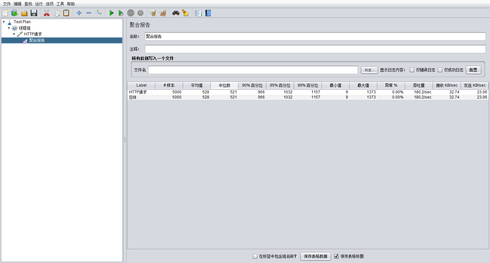

查看MySql，发现完美解决了。

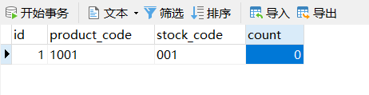

**原理**

添加synchronized关键字之后，StockService就具备了对象锁，由于添加了独占的排他锁，同一时刻只有一个请求能够获取到锁，并减库存。此时，所有请求只会one-by-one执行下去，也就不会发生超卖现象。

### 添加 juc 锁

~~~java
@Service
@Slf4j
public class StockServiceImpl extends ServiceImpl<StockMapper, Stock> implements StockService {
    @Autowired
    private StockMapper stockMapper;

    private ReentrantLock lock = new ReentrantLock();

    @Override
    public void deduct() {
        lock.lock();
        try {
            Stock stock = stockMapper.selectOne(new QueryWrapper<Stock>().eq(Stock.COL_PRODUCT_CODE, "1001"));
            if (null != stock && stock.getCount() > 0) {
                stock.setCount(stock.getCount() - 1);
//                log.info("剩余：" + stock.getCount());
                updateById(stock);
            }
        } catch (Exception e) {
            e.printStackTrace();
        } finally {
            lock.unlock();
        }
    }
}
~~~

原来和上述synchronized一致。

### 添加事务

如果添加了事务注解，所添加的锁会失效。问题发生的原因主要是：**@Transactional注解的底层还是基于 AOP 思想来完成的，前置方法里开启了事务，然后进入到调用方法中开始加锁、执行业务、释放锁、然后才提交事务，但是在提交事务之前可能会其他线程已经查询到库存，导致超卖。**

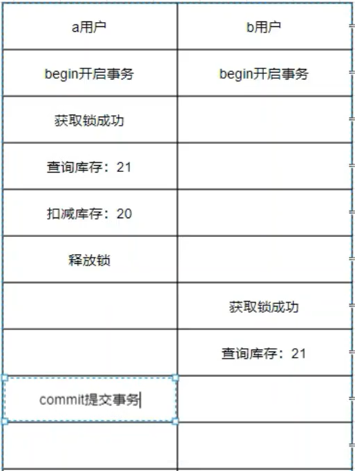

~~~java
@Transactional(isolation = Isolation.READ_UNCOMMITTED) //将事务的模式修改为读未提交
~~~

**一定不能这么做，这样会发生脏读、不可重复读和幻读。**

## 多服务问题

但是上述的锁仅在单例模式或者但应用部署的时候才有效。

### 多例模式

~~~java
@Service
@Scope(value = "prototype", proxyMode = ScopedProxyMode.TARGET_CLASS)
@Slf4j
public class StockServiceImpl extends ServiceImpl<StockMapper, Stock> implements StockService {
    @Autowired
    private StockMapper stockMapper;

    private ReentrantLock lock = new ReentrantLock();

    @Override
    public void deduct() {
        lock.lock();
        try {
            Stock stock = stockMapper.selectOne(new QueryWrapper<Stock>().eq(Stock.COL_PRODUCT_CODE, "1001"));
            if (null != stock && stock.getCount() > 0) {
                stock.setCount(stock.getCount() - 1);
//                log.info("剩余：" + stock.getCount());
                updateById(stock);
            }
        } catch (Exception e) {
            e.printStackTrace();
        } finally {
            lock.unlock();
        }
    }
}
~~~

执行 Jmeter 发现库存还剩下4904，明显不对。因为ReentrantLock和非静态方法的上synchronized都只是对当前实例有效。每次请求都会创建一个新的deduct()。

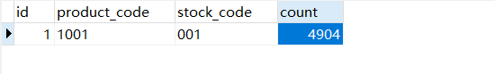

### 多服务模式

启动多个服务并使用nginx负载均衡，结构如下：

启动两个服务：8888、9999。

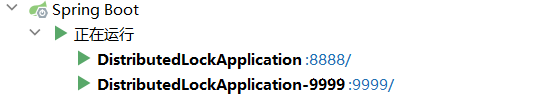

#### 安装配置 nginx

[nginx: download](http://nginx.org/en/download.html)

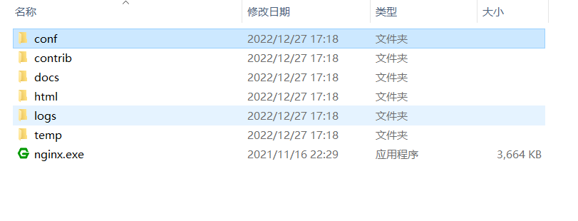

#### 修改配置文件

~~~properties
#user  nobody;
worker_processes  1;

#error_log  logs/error.log;
#error_log  logs/error.log  notice;
#error_log  logs/error.log  info;

#pid        logs/nginx.pid;

events {
    worker_connections  1024;
}

http {
    include       mime.types;
    default_type  application/octet-stream;

    #log_format  main  '$remote_addr - $remote_user [$time_local] "$request" '
    #                  '$status $body_bytes_sent "$http_referer" '
    #                  '"$http_user_agent" "$http_x_forwarded_for"';

    #access_log  logs/access.log  main;

    sendfile        on;
    #tcp_nopush     on;

    #keepalive_timeout  0;
    keepalive_timeout  65;

    #gzip  on;
    
    upstream distributedLock {
        server localhost:8888;
        server localhost:9999;
    }

    server {
        listen       80;
        server_name  localhost;

        #charset koi8-r;

        #access_log  logs/host.access.log  main;

        location / {
            proxy_pass http://distributedLock;
        }

        #error_page  404              /404.html;

        # redirect server error pages to the static page /50x.html
        #
        error_page   500 502 503 504  /50x.html;
        location = /50x.html {
            root   html;
        }
    }
}
~~~

#### 启动

在浏览器中测试：localhost/stock/deduct 是我的nginx服务器地址

经过测试，通过nginx访问服务一切正常。

**再次使用Jmeter进行压测，发现库存出现超卖现象，仅仅吞吐有所提高。**

## MySQL 锁演示

除了使用jvm锁之外，还可以使用数据锁：**悲观锁** 或者 **乐观锁**

* 一个SQL：直接更新时判断，在更新中判断库存是否大于0。

  * ~~~sql
    update db_stock set `count` = `count`-1 where product_code = '1001' and `count` >=1
    ~~~

  * 可以解决上述问题，但是会引发新的问题。

    * 如果有多行记录会导致一起减少

      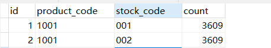

    * 无法记录库存变化前后的状态

### MySQL 锁范围

#### 表级所

MySQL 中锁定粒度最大的一种锁，是针对非索引字段加的锁，对当前操作的整张表加锁，实现简单，**资源消耗也比较少**，加锁快，**不会出现死锁**。其锁定粒度**最大**，触发锁冲突的概率最高，并发度最低，MyISAM 和 InnoDB 引擎都支持表级锁。

如果下所示，终端1如果不提交 / 回滚事务，终端2就一直在等待，直到终端1提交，终端2经过7秒等待也完成插入。

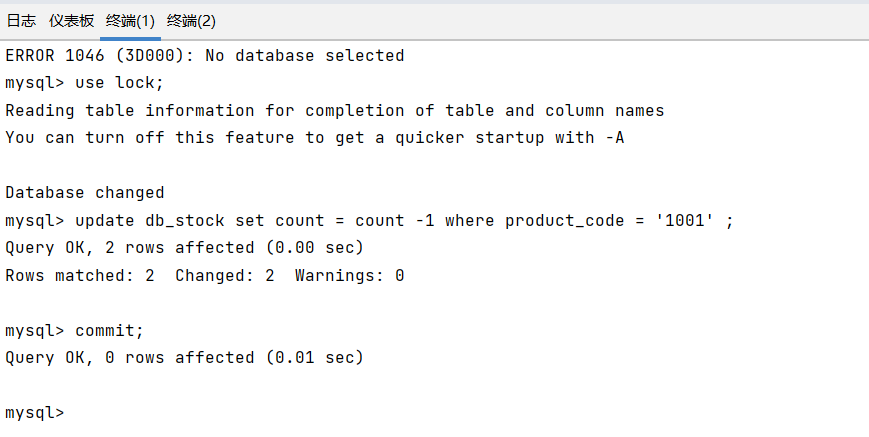

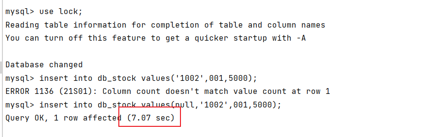

#### 行级锁

MySQL 中锁定粒度最小的一种锁，是针对**索引字段**加的锁，只针对**当前操作的记录**进行加锁。行级锁能大大减少数据库操作的冲突。其加锁粒度最小，并发度高，但加锁的**开销也最大**，加锁慢，会出现**死锁**。

首先添加索引字段。可以看到，终端1还未提交事务，终端二已经完成了更新。

> 使用行级锁的条件
>
> 1. 锁的查询或者更新的条件必须是索引字段。
> 2. 查询或者更新的条件必须是具体值。

### 悲观锁

在MySQL的InnoDB中，预设的Tansaction isolation level 为REPEATABLE READ（可重读）

**在SELECT 的读取锁定主要分为两种方式：**

- SELECT ... LOCK IN SHARE MODE　（共享锁）
- SELECT ... FOR UPDATE                     （排他锁）

这两种方式在事务(Transaction) 进行当中SELECT 到同一个数据表时，都必须等待其它事务数据被提交(Commit)后才会执行。

而主要的不同在于LOCK IN SHARE MODE 在有一方事务要Update 同一个表单时很容易造成死锁。

简单的说，如果SELECT 后面若要UPDATE 同一个表单，最好使用SELECT ... FOR UPDATE。

~~~java
/**
     * 使用排它锁根据ProductCode查询
     * @param productCode   商品Code
     * @return 库存列表
     */
@Select("select id,product_code, stock_code,`count` from lock.db_stock where product_code = #{productCode,jdbcType=VARCHAR} for update")
List<Stock> selectForUpdate(@Param("productCode") String productCode);
}
~~~

~~~java
@Override
@Transactional
public void deduct() {
    List<Stock> stocks = stockMapper.selectForUpdate("1001");
    // 判断哪个仓库最近且有货。这需要有个算法，这里就选择第一个
    Stock stock = stocks.get(0);
    // 再减库存
    if (stock != null && stock.getCount() > 0) {
        stock.setCount(stock.getCount() - 1);
        updateById(stock);
    }
}
~~~

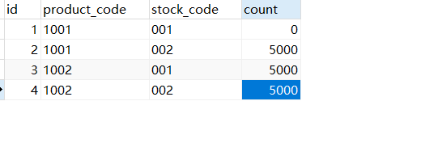

#### 引发的问题

1. 性能问题：一个事务用悲观锁对数据加锁之后，其他事务将不能对加锁的数据进行除了查询以外的所有操作，如果事务执行时间比较长，其他事务一直在阻塞状态，一定会影响系统的吞吐量。
2. 死锁问题： 如果一个事务A正在对一条数据R1进行更新操作，然后另一个事务B正在对数据R2进行更新操作，然后事务A对数据R2进行更新操作，事务B对数据R1进行更新操作就会出现死锁。

### 乐观锁

乐观锁（ Optimistic Locking ） 相对悲观锁而言，乐观锁假设认为数据一般情况下不会造成冲突，所以在数据进行提交更新的时候，才会正式对数据的冲突与否进行检测，如果发现冲突了，则重试。那么如何实现乐观锁呢？

使用数据版本（Version）记录机制实现，这是乐观锁最常用的实现方式。一般是通过为数据库表增加一个数字类型的 “version” 字段来实现。当读取数据时，将 version 字段的值一同读出，数据每更新一 次，对此version值加一。当我们提交更新的时候，判断数据库表对应记录 的当前版本信息与第一次取 出来的 version 值进行比对，如果数据库表当前版本号与第一次取出来的 version 值相等，则予以更新。

~~~java
/**
     * 使用排它锁根据ProductCode查询
     * @param productCode   商品Code
     * @return 库存列表
     */
@Select("select id,product_code, stock_code,`count` from lock.db_stock where product_code = #{productCode,jdbcType=VARCHAR} for update")
    List<Stock> selectForUpdate(@Param("productCode") String productCode);
}
~~~

~~~java
@Service
@Slf4j
public class StockServiceImpl extends ServiceImpl<StockMapper, Stock> implements StockService {
    @Autowired
    private StockMapper stockMapper;

    @Override
    @Transactional
    public void deduct() {
        //查询出来库存对象
        Stock stock = stockMapper.selectById(1L);
        // 再减库存
        if (stock != null && stock.getCount() > 0) {
            // 获取版本号
            Integer oldVersion = stock.getVersion();

            // 更新
            stock.setCount(stock.getCount() - 1);
            stock.setVersion(oldVersion + 1);

            if (stockMapper.update(stock, new UpdateWrapper<Stock>().eq(Stock.COL_ID, stock.getId()).eq(Stock.COL_VERSION, oldVersion)) ==0) {
                deduct();
            }
        }
    }
}
~~~

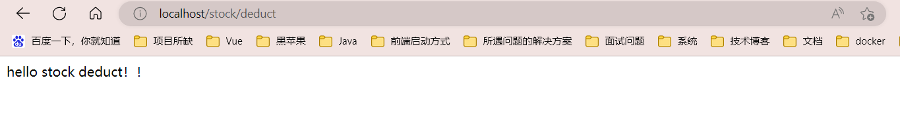

#### 引发的问题

1. 当运行压力测试的时候，错误率高达98%。后台抛出了栈内存异常。

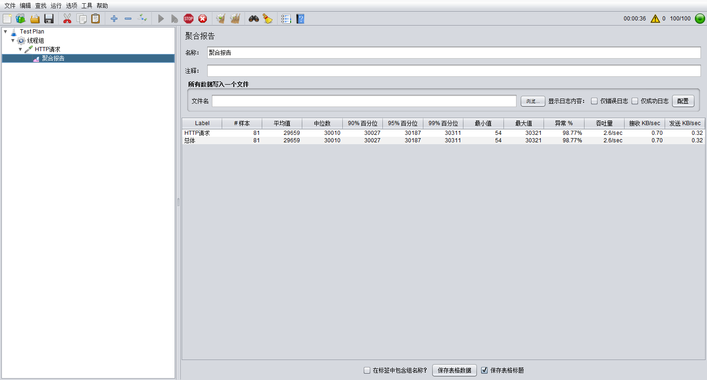

2. 因为程序中一直在自旋，这个问题是可能会出现的。程序中加上一个20ms的等待。

~~~java
@Override
@Transactional
public void deduct() {
    //查询出来库存对象
    Stock stock = stockMapper.selectById(1L);
    // 再减库存
    if (stock != null && stock.getCount() > 0) {
        // 获取版本号
        Integer oldVersion = stock.getVersion();

        // 更新
        stock.setCount(stock.getCount() - 1);
        stock.setVersion(oldVersion + 1);

        if (stockMapper.update(stock, new UpdateWrapper<Stock>().eq(Stock.COL_ID, stock.getId()).eq(Stock.COL_VERSION, oldVersion)) ==0) {
            try {
                // 休眠20ms
                TimeUnit.MILLISECONDS.sleep(20);
            } catch (InterruptedException e) {
                throw new RuntimeException(e);
            }
            deduct();
        }
    }
}
~~~

3. 再次执行发现错误率依然高达99%，后台程序中一直在抛出**超时**异常。

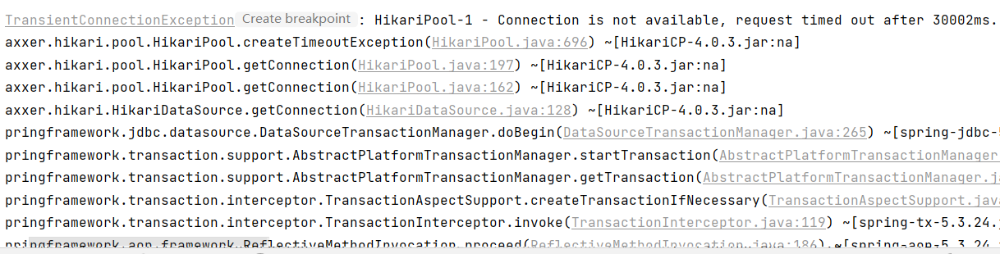

**这个主要是因为 @Transactional 注解导致的，加上事务注解就相当于开启了手动事务，整个方法的每一步都被加上了锁，一旦update执行失败，那么方法就会递归调用，导致其他的线程一直阻塞在这里，就出现了上述超时的异常，去掉事务注解后，MDL操作会自动加锁，其实MDL加锁过程是`系统自动控制，无法直接干预，也不需要直接干预，当我们对一个表做增删改查操作的时候，会自动加MDL读锁`，一旦update操作失败后，会立刻释放锁，下一个线程就可以继续执行。**

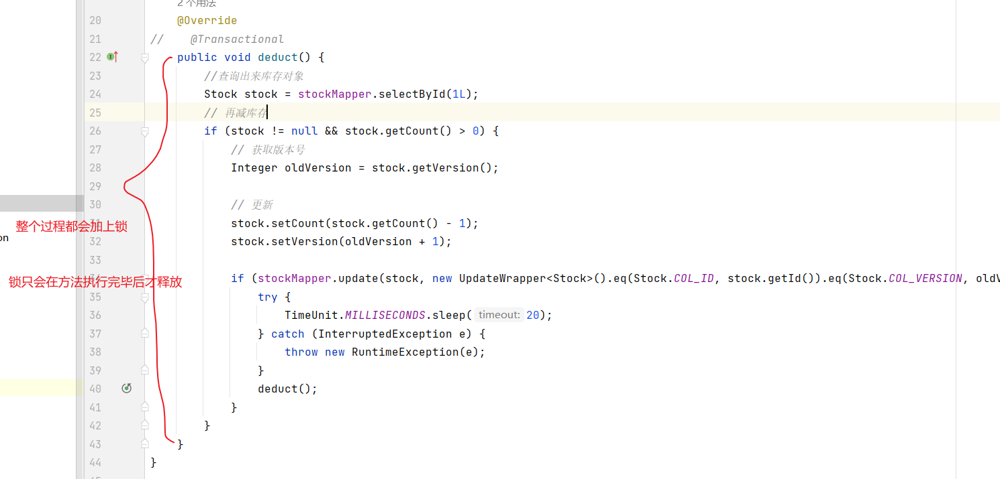

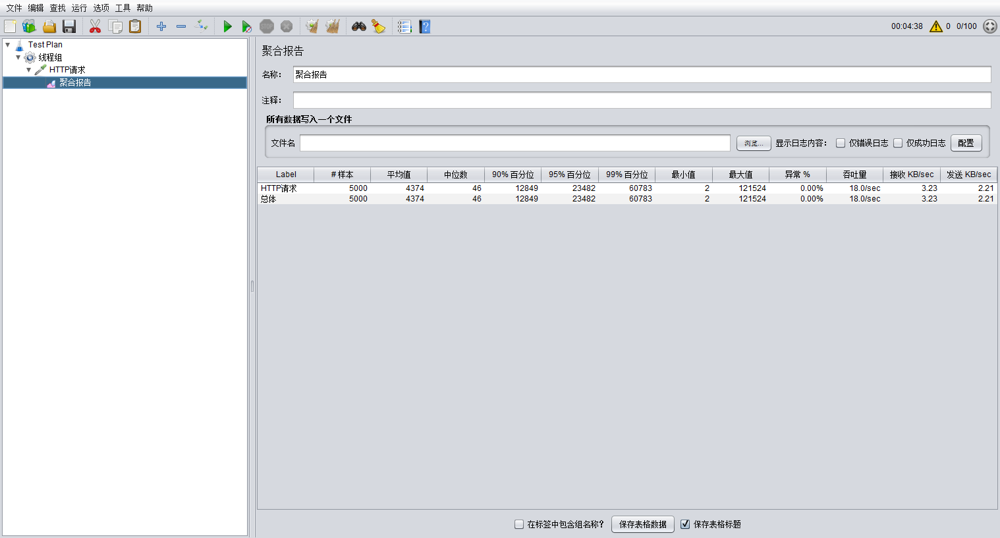

>  乐观锁在并发量越大的情况下，性能越低（因为需要大量的重试）；并发量越小，性能越高。

### MySQL 锁缺陷 

在数据库集群情况下会导致数据库锁失效，并且很多数据库集群的中间件压根就不支持悲观锁。例如： mycat 在读写分离的场景下可能会导致乐观锁不可靠。 这把锁强依赖数据库的可用性，数据库是一个单点，一旦数据库挂掉，会导致业务系统不可用。

## 总结

性能：一个sql > 悲观锁 >  jvm锁 > 乐观锁。

* 如果追求极致性能、业务场景简单并且不用数据前后变化状态的情况下，**优先选择一个SQL** 。
* 如果写并发量较低（多读），争抢不是很严重的情况下**优先选择乐观锁**。
* 如果写并发量较高，一般会经常冲突，此时选择乐观锁的话，会导致代码不断的重试。**优先选择悲观锁**。
* 不推荐使用JVM本地锁。
