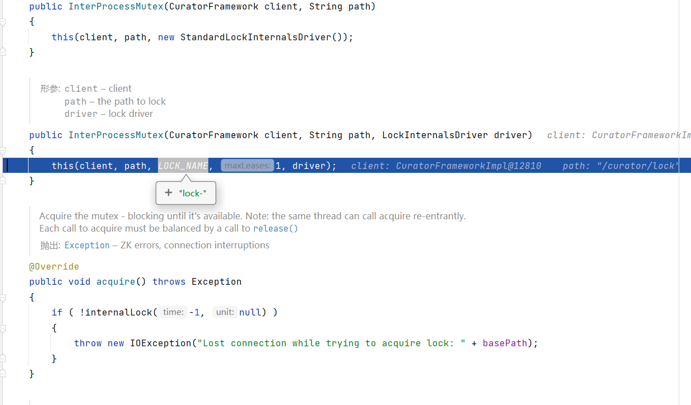
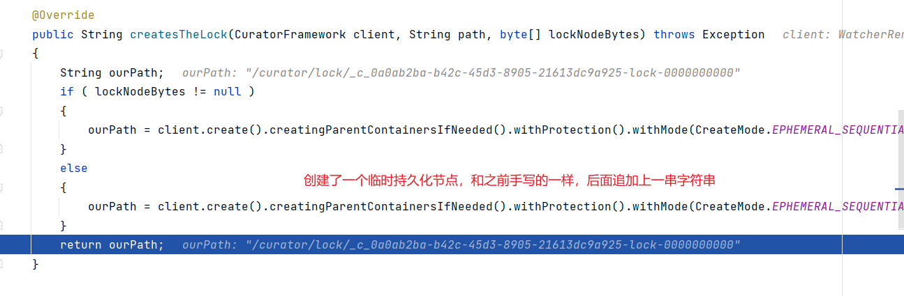

# 基于 Zookeeper 实现分布式锁

实现分布式锁目前有三种流行方案，分别为基于数据库、Redis、Zookeeper的方案。这里主要介绍基于zk怎么实现分布式锁。在实现分布式锁之前，先回顾zookeeper的相关知识点


## 基础知识

### 安装

#### 本地安装

把zk安装包上传到/opt目录下，并切换到/opt目录下，执行以下指令

```shell
# 解压
tar -zxvf zookeeper-3.7.0-bin.tar.gz
# 重命名
mv apache-zookeeper-3.7.0-bin/ zookeeper
# 打开zookeeper根目录
cd /opt/zookeeper
# 创建一个数据目录，备用
mkdir data
# 打开zk的配置目录
cd /opt/zookeeper/conf
# copy配置文件，zk启动时会加载zoo.cfg文件
cp zoo_sample.cfg zoo.cfg
# 编辑配置文件
vim zoo.cfg
# 修改dataDir参数为之前创建的数据目录：/opt/zookeeper/data
# 切换到bin目录
cd /opt/zookeeper/bin
# 启动 
./zkServer.sh start
./zkServer.sh status # 查看启动状态
./zkServer.sh stop # 停止
./zkServer.sh restart # 重启
./zkCli.sh # 查看zk客户端
```

如下，说明启动成功：


#### Docker安装（集群安装）

leader 节点由选举产生。

~~~yaml
# docker-compose.yml
networks:
  zookeeper-net:
    name: zookeeper-net
    driver: bridge

version: '3'
services:
    zoo1:
        image: zookeeper:3.6.3
        container_name: zookeeper-1
        restart: "no"
        ports:
            - 2181:2181
            - 8080:8080
        volumes:
            - "./zookeeper/zookeeper-1/data:/data"
            - "./zookeeper/zookeeper-1/datalog:/datalog"
            - "./zookeeper/zookeeper-1/logs:/logs"
            - "./zookeeper/zookeeper-1/conf:/conf"
        environment:
            ZOO_MY_ID: 1
            ZOO_SERVERS: server.1=zoo1:2888:3888;2181 server.2=zoo2:2888:3888;2181 server.3=zoo3:2888:3888;2181
        networks:
            - zookeeper-net
    zoo2:
        image: zookeeper:3.6.3
        container_name: zookeeper-2
        restart: "no"
        ports:
            - 2182:2181
            - 8081:8080
        volumes:
        - "./zookeeper/zookeeper-2/data:/data"
        - "./zookeeper/zookeeper-2/datalog:/datalog"
        - "./zookeeper/zookeeper-2/logs:/logs"
        - "./zookeeper/zookeeper-2/conf:/conf"
        environment:
            ZOO_MY_ID: 2
            ZOO_SERVERS: server.1=zoo1:2888:3888;2181 server.2=zoo2:2888:3888;2181 server.3=zoo3:2888:3888;2181
        networks:
            - zookeeper-net
    zoo3:
        image: zookeeper:3.6.3
        container_name: zookeeper-3
        restart: "no"
        ports:
            - 2183:2181
            - 8082:8080            
        volumes:
        - "./zookeeper/zookeeper-3/data:/data"
        - "./zookeeper/zookeeper-3/datalog:/datalog"
        - "./zookeeper/zookeeper-3/logs:/logs"
        - "./zookeeper/zookeeper-3/conf:/conf"        
        environment:
            ZOO_MY_ID: 3
            ZOO_SERVERS: server.1=zoo1:2888:3888;2181 server.2=zoo2:2888:3888;2181 server.3=zoo3:2888:3888;2181
        networks:
            - zookeeper-net
~~~

> <font color="red">每个zookeeper的conf文件夹下都需要放</font>

~~~properties
# log4j.properties
zookeeper.root.logger=INFO, CONSOLE

zookeeper.console.threshold=INFO

zookeeper.log.dir=/logs
zookeeper.log.file=zookeeper.log
zookeeper.log.threshold=INFO
zookeeper.log.maxfilesize=256MB
zookeeper.log.maxbackupindex=20

zookeeper.tracelog.dir=${zookeeper.log.dir}
zookeeper.tracelog.file=zookeeper_trace.log

log4j.rootLogger=${zookeeper.root.logger}

#
# console
# Add "console" to rootlogger above if you want to use this 
#
log4j.appender.CONSOLE=org.apache.log4j.ConsoleAppender
log4j.appender.CONSOLE.Threshold=${zookeeper.console.threshold}
log4j.appender.CONSOLE.layout=org.apache.log4j.PatternLayout
log4j.appender.CONSOLE.layout.ConversionPattern=%d{ISO8601} [myid:%X{myid}] - %-5p [%t:%C{1}@%L] - %m%n

#
# Add ROLLINGFILE to rootLogger to get log file output
#
log4j.appender.ROLLINGFILE=org.apache.log4j.RollingFileAppender
log4j.appender.ROLLINGFILE.Threshold=${zookeeper.log.threshold}
log4j.appender.ROLLINGFILE.File=${zookeeper.log.dir}/${zookeeper.log.file}
log4j.appender.ROLLINGFILE.MaxFileSize=${zookeeper.log.maxfilesize}
log4j.appender.ROLLINGFILE.MaxBackupIndex=${zookeeper.log.maxbackupindex}
log4j.appender.ROLLINGFILE.layout=org.apache.log4j.PatternLayout
log4j.appender.ROLLINGFILE.layout.ConversionPattern=%d{ISO8601} [myid:%X{myid}] - %-5p [%t:%C{1}@%L] - %m%n

#
# Add TRACEFILE to rootLogger to get log file output
#    Log TRACE level and above messages to a log file
#
log4j.appender.TRACEFILE=org.apache.log4j.FileAppender
log4j.appender.TRACEFILE.Threshold=TRACE
log4j.appender.TRACEFILE.File=${zookeeper.tracelog.dir}/${zookeeper.tracelog.file}

log4j.appender.TRACEFILE.layout=org.apache.log4j.PatternLayout
### Notice we are including log4j's NDC here (%x)
log4j.appender.TRACEFILE.layout.ConversionPattern=%d{ISO8601} [myid:%X{myid}] - %-5p [%t:%C{1}@%L][%x] - %m%n
#
# zk audit logging
#
zookeeper.auditlog.file=zookeeper_audit.log
zookeeper.auditlog.threshold=INFO
audit.logger=INFO, RFAAUDIT
log4j.logger.org.apache.zookeeper.audit.Log4jAuditLogger=${audit.logger}
log4j.additivity.org.apache.zookeeper.audit.Log4jAuditLogger=false
log4j.appender.RFAAUDIT=org.apache.log4j.RollingFileAppender
log4j.appender.RFAAUDIT.File=${zookeeper.log.dir}/${zookeeper.auditlog.file}
log4j.appender.RFAAUDIT.layout=org.apache.log4j.PatternLayout
log4j.appender.RFAAUDIT.layout.ConversionPattern=%d{ISO8601} %p %c{2}: %m%n
log4j.appender.RFAAUDIT.Threshold=${zookeeper.auditlog.threshold}

# Max log file size of 10MB
log4j.appender.RFAAUDIT.MaxFileSize=10MB
log4j.appender.RFAAUDIT.MaxBackupIndex=10
~~~

~~~properties
# zoo.cfg
clientPort=2181
dataDir=/data
dataLogDir=/datalog
tickTime=2000
initLimit=5
syncLimit=2
autopurge.snapRetainCount=3
autopurge.purgeInterval=0
maxClientCnxns=60
standaloneEnabled=true
admin.enableServer=true
#和下面的docker-compose 创建的docker container实例对应
server.1=zoo1:2888:3888
server.2=zoo2:2888:3888
server.3=zoo3:2888:3888
~~~

### 相关命令

Zookeeper提供一个多层级的节点命名空间（节点称为znode），每个节点都用一个以斜杠（/）分隔的路径表示，而且每个节点都有父节点（根节点除外），非常类似于文件系统。并且每个节点都是唯一的。

znode节点有四种类型：

- **PERSISTENT**：永久节点。客户端与zookeeper断开连接后，该节点依旧存在
- **EPHEMERAL**：临时节点。客户端与zookeeper断开连接后，该节点被删除
- **PERSISTENT_SEQUENTIAL**：永久节点、序列化。客户端与zookeeper断开连接后，该节点依旧存在，只是Zookeeper给该节点名称进行顺序编号
- **EPHEMERAL_SEQUENTIAL**：临时节点、序列化。客户端与zookeeper断开连接后，该节点被删除，只是Zookeeper给该节点名称进行顺序编号

创建这四种节点：

```shell
[zk: localhost:2181(CONNECTED) 0] create /aa test  # 创建持久化节点
Created /aa
[zk: localhost:2181(CONNECTED) 1] create -s /bb test  # 创建持久序列化节点
Created /bb0000000001
[zk: localhost:2181(CONNECTED) 2] create -e /cc test  # 创建临时节点
Created /cc
[zk: localhost:2181(CONNECTED) 3] create -e -s /dd test  # 创建临时序列化节点
Created /dd0000000003
[zk: localhost:2181(CONNECTED) 4] ls /   # 查看某个节点下的子节点
[aa, bb0000000001, cc, dd0000000003, zookeeper]
[zk: localhost:2181(CONNECTED) 5] stat /  # 查看某个节点的状态
cZxid = 0x0
ctime = Thu Jan 01 08:00:00 CST 1970
mZxid = 0x0
mtime = Thu Jan 01 08:00:00 CST 1970
pZxid = 0x5
cversion = 3
dataVersion = 0
aclVersion = 0
ephemeralOwner = 0x0
dataLength = 0
numChildren = 5
[zk: localhost:2181(CONNECTED) 6] get /aa  # 查看某个节点的内容
test
[zk: localhost:2181(CONNECTED) 11] delete /aa  # 删除某个节点
[zk: localhost:2181(CONNECTED) 7] ls /  # 再次查看
[bb0000000001, cc, dd0000000003, zookeeper]
```

事件监听：在读取数据时，我们可以同时对节点设置事件监听，当节点数据或结构变化时，zookeeper会通知客户端。当前zookeeper针对节点的监听有如下四种事件：

1. 节点创建：stat -w /xx

   当/xx节点创建时：NodeCreated

2. 节点删除：stat -w /xx

   当/xx节点删除时：NodeDeleted

3. 节点数据修改：get -w /xx

   当/xx节点数据发生变化时：NodeDataChanged

4. 子节点变更：ls -w /xx

   当/xx节点的子节点创建或者删除时：NodeChildChanged

### Java 客户端

#### 依赖

ZooKeeper 的 java 客户端有：原生客户端、ZkClient、Curator框架（类似于redisson，有很多功能性封装）。依赖分别是：

~~~xml
<!-- zookeeper 官方客户端-->
<dependency>
    <groupId>org.apache.zookeeper</groupId>
    <artifactId>zookeeper</artifactId>
    <version>3.8.1</version>
</dependency>
<!-- zkClient 客户端-->
<dependency>
    <groupId>com.101tec</groupId>
    <artifactId>zkclient</artifactId>
    <version>0.11</version>
</dependency>
<!-- Curator 客户端 -->
<dependency>
    <groupId>org.apache.curator</groupId>
    <artifactId>curator-recipes</artifactId>
    <version>5.4.0</version>
</dependency>
~~~

#### 基础 API

~~~java
public class ZkTest {
    /**
     * zookeeper集群多个服务器之间用逗号隔开
     */
    private static String connectString = "192.168.25.10:2181,192.168.25.10:2182,192.168.25.10:2183";
    /**
     * 会话超时时间,不要设置太小
     * 如果此值小于zookeeper的创建时间则当zookeeper还未来得及创建连接,会话时间已到
     * 则抛出异常:org.apache.zookeeper.KeeperException$ConnectionLossException: KeeperErrorCode = ConnectionLoss for /znode2
     * 注意关闭防火墙
     */
    private static int sessionTimeout = 170000;

    public static void main(String[] args) throws KeeperException, InterruptedException {

        CountDownLatch countDownLatch = new CountDownLatch(1);
        // 获取zookeeper链接
        ZooKeeper zooKeeper = null;
        try {
            zooKeeper = new ZooKeeper(connectString, sessionTimeout, event -> {
                // 需要以下判断，否则监听内容变动的时候也会被当前创建连接的监听器捕获
                if (Watcher.Event.KeeperState.SyncConnected.equals(event.getState())
                        && Watcher.Event.EventType.None.equals(event.getType())) {
                    // 获取链接成功。。。。。。WatchedEvent state:SyncConnected type:None path:null
                    System.out.println("获取链接成功。。。。。。" + event);
                    countDownLatch.countDown();
                }
            });

            countDownLatch.await();
        } catch (Exception e) {
            e.printStackTrace();
        }
        // 判断节点是否存在
        Stat stat = zooKeeper.exists("/test", true);
        if (stat != null) {
            System.out.println("当前节点存在！" + stat.getVersion());
        } else {
            System.out.println("当前节点不存在！开始创建节点");
            /**
             *形参:
             *  path – 节点的路径
             *  data – 节点内容
             *  acl – 节点的访问权限
             *        OPEN_ACL_UNSAFE：任何人可以操作该节点
             *        CREATOR_ALL_ACL：创建者拥有所有访问权限
             *        READ_ACL_UNSAFE: 任何人都可以读取该节点
             *  createMode – 节点类型：指定要创建的节点是临时的还是顺序的
             */
            zooKeeper.create("/test", "烧杯".getBytes(), ZooDefs.Ids.OPEN_ACL_UNSAFE, CreateMode.PERSISTENT);
            System.out.println("节点创建成功。");
        }
        byte[] data = zooKeeper.getData("/test", false, stat);
        System.out.println("当前节点的内容：" + new String(data));

        // 获取当前节点下的子节点
        List<String> children = zooKeeper.getChildren("/test", false);
        System.out.println(children);

        // 更新当前节点
        // 参数3：如果存在此类节点并且给定版本与节点的版本匹配，则为给定路径的节点设置数据（如果给定版本为 -1，则它与任何节点的版本匹配）。
        stat = zooKeeper.setData("/test", "大烧杯".getBytes(), stat.getVersion());

        // 删除节点,存在数据的不能删除
        zooKeeper.delete("/test", stat.getVersion());

        // 监听
        //最后关闭链接
        zooKeeper.close();
    }
}
~~~

## 实现思路

* 分布式锁的步骤：
  * 获取锁：create一个节点
  * 删除锁：delete一个节点
  * 重试：没有获取到锁的请求重试

* 参照redis分布式锁的特点：
  * 互斥 排他
  * 防死锁：
    * 可自动释放锁（临时节点） ：获得锁之后客户端所在机器宕机了，客户端没有主动删除子节点；如果创建的是永久的节点，那么这个锁永远不会释放，导致死锁；由于创建的是临时节点，客户端宕机后，过了一定时间zookeeper没有收到客户端的心跳包判断会话失效，将临时节点删除从而释放锁。
    * 可重入锁：借助于ThreadLocal
  * 防误删：宕机自动释放临时节点，不需要设置过期时间，也就不存在误删问题。
  * 加锁/解锁要具备原子性
  * 单点问题：使用Zookeeper可以有效的解决单点问题，ZK一般是集群部署的。
  * 集群问题：zookeeper集群是强一致性的，只要集群中有半数以上的机器存活，就可以对外提供服务。

### 代码实现

~~~java
/**
     * Zookeeper 分布式锁
     * @param key       锁名称
     * @param expire    过期时间
     * @param unit      时间单位
     * @return
     */
public DistributedZookeeperLock getZookeeperLock(String key, long expire, TimeUnit unit) {
    return new DistributedZookeeperLock(ZkClientConfig.zooKeeper, key, expire, unit);
}

/**
     * Zookeeper 分布式锁
     * @param key       锁名称
     * @return
     */
public DistributedZookeeperLock getZookeeperLock(String key) {
    return new DistributedZookeeperLock(ZkClientConfig.zooKeeper, key);
}
~~~

~~~java
/**
 * 基于 Zookeeper 的分布式锁的实现
 */
@Slf4j
public class DistributedZookeeperLock implements Lock {
    private final ZooKeeper zooKeeper;
    private final String lockName;
    private final long expire;
    private final TimeUnit unit;
    private static final String ROOT_PATH = "/locks";


    public DistributedZookeeperLock(ZooKeeper zooKeeper, String lockName, long expire, TimeUnit unit) {
        this.zooKeeper = zooKeeper;
        this.lockName = lockName;
        this.expire = expire;
        this.unit = unit;
        try {
            if (zooKeeper.exists(ROOT_PATH, false) == null) {
                zooKeeper.create(ROOT_PATH, null, ZooDefs.Ids.OPEN_ACL_UNSAFE, CreateMode.PERSISTENT);
            }
        } catch (Exception e) {
            e.printStackTrace();
        }
    }

    public DistributedZookeeperLock(ZooKeeper zooKeeper, String lockName) {
        this.zooKeeper = zooKeeper;
        this.lockName = lockName;
        this.expire = -1L;
        // 不能为NULL 否则程序报错,随意给个值
        this.unit = TimeUnit.SECONDS;
        try {
            if (zooKeeper.exists(ROOT_PATH, false) == null) {
                zooKeeper.create(ROOT_PATH, null, ZooDefs.Ids.OPEN_ACL_UNSAFE, CreateMode.PERSISTENT);
            }
        } catch (Exception e) {
            e.printStackTrace();
        }
    }

    @Override
    public void lock() {
        try {
            this.tryLock(expire, unit);
        } catch (InterruptedException e) {
            e.printStackTrace();
        }
    }

    @Override
    public void lockInterruptibly() throws InterruptedException {

    }

    @Override
    public boolean tryLock() {
        try {
            tryLock(-1L, TimeUnit.MILLISECONDS);
            return true;
        } catch (InterruptedException e) {
            e.printStackTrace();
        }
        return false;
    }

   
    @Override
    public boolean tryLock(long time, @NotNull TimeUnit unit) throws InterruptedException {
        // 创建ZNode节点的过程
        try {
            if (-1L == time || 0L == time) {
                // 防止客户端程序获取到锁后，服务器端宕机，导致的死锁问题，需要创建一个临时的节点。
                zooKeeper.create(ROOT_PATH + "/" + lockName, null, ZooDefs.Ids.OPEN_ACL_UNSAFE, CreateMode.EPHEMERAL);
            } else if (time < -1L) {
                throw new RuntimeException("时间不能够小于-1！");
            } else {
                //时间转换
                long ttl = timeFormat(time, unit);
                zooKeeper.create(ROOT_PATH + "/" + lockName, null, ZooDefs.Ids.OPEN_ACL_UNSAFE, CreateMode.PERSISTENT_WITH_TTL, null, ttl);
            }
            return true;
        } catch (KeeperException e) {
//            e.printStackTrace();
            TimeUnit.SECONDS.sleep(1);
            tryLock(time, unit);
        }
        return false;
    }

    /**
     * 时间转换
     * @param time  时间
     * @param unit  转换的单位
     * @return
     */
    private long timeFormat(long time, TimeUnit unit) {
        long ms = TimeUnit.MILLISECONDS.convert(time, unit);
        return ms;
    }

    @Override
    public void unlock() {
        // 删除ZNode节点的过程
        try {
            Stat stat = zooKeeper.exists(ROOT_PATH + "/" + lockName, false);
            zooKeeper.delete(ROOT_PATH + "/" + lockName, stat.getVersion());
        } catch (Exception e) {
            e.printStackTrace();
        }
    }

    @NotNull
    @Override
    public Condition newCondition() {
        return null;
    }
}

~~~

Jmeter压力测试：


性能非常一般，mysql数据库的库存余量为0（注意：所有测试之前都要先修改库存量为5000）

**存在问题：**

1. 性能一般（比mysql分布式锁略好）
2. 不可重入

## 优化

因为无限自旋，必定会非常影响性能。所以需要让所有的请求都能够创建锁。够避免争抢必然可以提高性能。

**思路：**

利用zk的序列化节点可以避免争抢锁的问题。

### 阻塞锁

### 可重入锁

~~~java
/**
 * 基于 Zookeeper 的分布式锁的实现
 */
@Slf4j
public class DistributedZookeeperLock implements Lock {
    private final ZooKeeper zooKeeper;
    private final String lockName;
    private final long expire;
    private final TimeUnit unit;
    private static final String ROOT_PATH = "/locks";
    //提取的创建路径，方便删除
    private String currentNodePath;
    // 使用ThreadLocal来完成重入锁
    private static final ThreadLocal<Integer> threadLocal = new ThreadLocal<>();


    public DistributedZookeeperLock(ZooKeeper zooKeeper, String lockName, long expire, TimeUnit unit) {
        this.zooKeeper = zooKeeper;
        this.lockName = lockName;
        this.expire = expire;
        this.unit = unit;
        try {
            if (zooKeeper.exists(ROOT_PATH, false) == null) {
                zooKeeper.create(ROOT_PATH, null, ZooDefs.Ids.OPEN_ACL_UNSAFE, CreateMode.PERSISTENT);
            }
        } catch (Exception e) {
            e.printStackTrace();
        }
    }

    public DistributedZookeeperLock(ZooKeeper zooKeeper, String lockName) {
        this.zooKeeper = zooKeeper;
        this.lockName = lockName;
        this.expire = -1L;
        // 不能为NULL 否则程序报错,随意给个值
        this.unit = TimeUnit.SECONDS;
        try {
            if (zooKeeper.exists(ROOT_PATH, false) == null) {
                zooKeeper.create(ROOT_PATH, null, ZooDefs.Ids.OPEN_ACL_UNSAFE, CreateMode.PERSISTENT);
            }
        } catch (Exception e) {
            e.printStackTrace();
        }
    }

    @Override
    public void lock() {
        try {
            this.tryLock(expire, unit);
        } catch (InterruptedException e) {
            e.printStackTrace();
        }
    }

    @Override
    public void lockInterruptibly() throws InterruptedException {

    }

    @Override
    public boolean tryLock() {
        try {
            tryLock(-1L, TimeUnit.MILLISECONDS);
            return true;
        } catch (InterruptedException e) {
            e.printStackTrace();
        }
        return false;
    }

    @Override
    public boolean tryLock(long time, @NotNull TimeUnit unit) throws InterruptedException {
        Integer flag = threadLocal.get();
        if (flag != null && flag > 0) {
            threadLocal.set(flag + 1);
            return true;
        }
        // 创建ZNode节点的过程
        try {
            if (-1L == time || 0L == time) {
                // 防止客户端程序获取到锁后，服务器端宕机，导致的死锁问题，需要创建一个临时的节点。
                currentNodePath = zooKeeper.create(ROOT_PATH + "/" + lockName + "-", null, ZooDefs.Ids.OPEN_ACL_UNSAFE, CreateMode.EPHEMERAL_SEQUENTIAL);
            } else if (time < -1L) {
                throw new RuntimeException("时间不能够小于-1！");
            } else {
                //时间转换
                long ttl = timeFormat(time, unit);
                currentNodePath = zooKeeper.create(ROOT_PATH + "/" + lockName + "-", null, ZooDefs.Ids.OPEN_ACL_UNSAFE, CreateMode.PERSISTENT_SEQUENTIAL_WITH_TTL, null, ttl);
            }
            // 获取当前节点的上一个节点
            String preNode = getPreNode();

            if (StrUtil.isNotBlank(preNode)) {
                // 原子性，查看上个节点是否存在
                CountDownLatch countDownLatch = new CountDownLatch(1);
                if (null == zooKeeper.exists(ROOT_PATH + "/" + preNode, event -> {
                    // 如果存在就阻塞
                    countDownLatch.countDown();
                })) {
                    // 上一个节点已经不存在了，当前节点就是最小的节点
                    threadLocal.set(1);
                    return true;
                }
                // 阻塞。。。。
                countDownLatch.await();
            }
            threadLocal.set(1);
            return true;
        } catch (KeeperException e) {
            e.printStackTrace();
            TimeUnit.SECONDS.sleep(1);
            tryLock(time, unit);
        }
        return false;
    }

    private String getPreNode() {
        List<String> children = null;
        try {
            // 获取根节点下的所有节点
            children = zooKeeper.getChildren(ROOT_PATH, false);
        } catch (Exception e) {
            e.printStackTrace();
        }
        if (CollUtil.isEmpty(children)) {
            throw new IllegalMonitorStateException("非法操作！");
        }
//        List<String> nodes = children.stream().filter(node -> StrUtil.startWith(node, lockName + "-")).sorted().collect(Collectors.toList());
        List<String> nodes = children.stream().filter(node -> StrUtil.startWith(node, lockName + "-")).sorted().collect(Collectors.toList());

        // 获取当前节点的下标
        int index = CollUtil.indexOf(nodes, s -> {
            String sub = StrUtil.sub(s, StrUtil.lastIndexOf(s, "/", s.length(), true) + 1, s.length());
            return sub.equals(StrUtil.sub(currentNodePath, StrUtil.lastIndexOf(currentNodePath, "/", currentNodePath.length(), true) + 1, currentNodePath.length()));
        });
        if (index < 0) {
            throw new IllegalMonitorStateException("非法操作！");
        } else if (index > 0) {
            return nodes.get(index - 1);
        }

        // 如果index == 0 说明就是最小的节点，返回null
        return null;
    }

    /**
     * 时间转换
     * @param time  时间
     * @param unit  转换的单位
     * @return
     */
    private long timeFormat(long time, TimeUnit unit) {
        long ms = TimeUnit.MILLISECONDS.convert(time, unit);
        return ms;
    }

    @Override
    public void unlock() {
        // 删除ZNode节点的过程
        try {
            threadLocal.set(threadLocal.get() - 1);
            if (threadLocal.get() == 0) {
                Stat stat = zooKeeper.exists(currentNodePath, false);
                zooKeeper.delete(currentNodePath, stat.getVersion());
                threadLocal.remove();
            }
        } catch (InterruptedException e) {
            e.printStackTrace();
        } catch (KeeperException e) {
            e.printStackTrace();
        }

    }

    @NotNull
    @Override
    public Condition newCondition() {
        return null;
    }

}
~~~

在网页中访问，经测试，重入锁也正常。

## Curator 中的分布式锁

Curator是netflix公司开源的一套zookeeper客户端，目前是Apache的顶级项目。与Zookeeper提供的原生客户端相比，Curator的抽象层次更高，简化了Zookeeper客户端的开发量。Curator解决了很多zookeeper客户端非常底层的细节开发工作，包括连接重连、反复注册wathcer和NodeExistsException 异常等。

通过查看官方文档，可以发现Curator主要解决了三类问题：

- 封装ZooKeeper client与ZooKeeper server之间的连接处理
- 提供了一套Fluent风格的操作API
- 提供ZooKeeper各种应用场景(recipe， 比如：分布式锁服务、集群领导选举、共享计数器、缓存机制、分布式队列等)的抽象封装，这些实现都遵循了zk的最佳实践，并考虑了各种极端情况

Curator由一系列的模块构成，对于一般开发者而言，常用的是curator-framework和curator-recipes：

- curator-framework：提供了常见的zk相关的底层操作
- curator-recipes：提供了一些zk的典型使用场景的参考。本节重点关注的分布式锁就是该包提供的

### 引入依赖

~~~xml
<!--zookeeper 官方客户端-->
<dependency>
    <groupId>org.apache.zookeeper</groupId>
    <artifactId>zookeeper</artifactId>
    <version>3.8.1</version>
    <exclusions>
        <exclusion>
            <groupId>org.slf4j</groupId>
            <artifactId>slf4j-log4j12</artifactId>
        </exclusion>
    </exclusions>
</dependency>

<!-- Curator 客户端 -->
<dependency>
    <groupId>org.apache.curator</groupId>
    <artifactId>curator-recipes</artifactId>
    <version>5.4.0</version>
    <exclusions>
        <exclusion>
            <artifactId>zookeeper</artifactId>
            <groupId>org.apache.zookeeper</groupId>
        </exclusion>
    </exclusions>
</dependency>
<dependency>
    <groupId>org.apache.curator</groupId>
    <artifactId>curator-framework</artifactId>
    <version>5.4.0</version>
    <exclusions>
        <exclusion>
            <groupId>org.apache.zookeeper</groupId>
            <artifactId>zookeeper</artifactId>
        </exclusion>
    </exclusions>
</dependency>
~~~

### 配置类

~~~java
/**
 * Zookeeper Curator配置类
 */
@Configuration
public class CuratorConfig {

    @Bean
    public CuratorFramework curatorFramework() {
        // 重试策略，这里使用的是指数补偿重试策略，重试3次，初始重试间隔1000ms，每次重试之后重试间隔递增。
        RetryPolicy retry = new ExponentialBackoffRetry(1000, 3);
        // 初始化Curator客户端：指定链接信息 及 重试策略
        CuratorFramework client = CuratorFrameworkFactory.newClient("192.168.25.10:2181,192.168.25.10:2182,192.168.25.10:2183", retry);
        client.start(); // 开始链接，如果不调用该方法，很多方法无法工作
        return client;
    }
}
~~~

### 可重入锁 InterProcessMutex

Reentrant 和 JDK的 ReentrantLock 类似， 意味着同一个客户端在拥有锁的同时，可以多次获取，不会被阻塞。它是由类**InterProcessMutex**来实现。

~~~java
@Autowired
private CuratorFramework curatorFramework;

@Override
public void deduct() {

    // curator锁
    InterProcessMutex processMutex = new InterProcessMutex(curatorFramework, "/curator/lock");
    try {
        processMutex.acquire();
        // 先查询库存是否充足
        String stock = Objects.requireNonNull(redisTemplate.opsForValue().get("stock"));
        if (!stock.equals("")) {
            int res = Integer.parseInt(stock);
            if (res > 0) {
                //扣减库存
                redisTemplate.opsForValue().set("stock", String.valueOf(--res));
            } else {
                System.err.println("库存为空！");
            }
        }
        // 重入
        curatorReentrant(processMutex);
        // 释放锁
        processMutex.release();
    } catch (Exception e) {
        throw new RuntimeException(e);
    }
}

private void curatorReentrant(InterProcessMutex processMutex) {
    try {
        processMutex.acquire();
        log.info("测试可重入锁");
        processMutex.release();
    } catch (Exception e) {
        throw new RuntimeException(e);
    }
}
~~~


但是经过 Jmeter 压测后发现，吞吐量并不高，甚至比手写的还要低。

#### 底层原理

* 初始化





* 加锁




* 解锁


### 不可重入锁 InterProcessSemaphoreMutex

~~~java
@Autowired
private CuratorFramework curatorFramework;

@Override
public void deduct() {
    try {
        InterProcessSemaphoreMutex mutex = new InterProcessSemaphoreMutex(curatorFramework, "/curator/locks");
        mutex.acquire();
        String stock = Objects.requireNonNull(redisTemplate.opsForValue().get("stock"));
        if (!stock.equals("")) {
            int res = Integer.parseInt(stock);
            if (res > 0) {
                //扣减库存
                redisTemplate.opsForValue().set("stock", String.valueOf(--res));
            } else {
                System.err.println("库存为空！");
            }
        }
        curatorReentrant(mutex);
        // 释放锁
        mutex.release();
    } catch (Exception e) {
        throw new RuntimeException(e);
    }

}

private void curatorReentrant(InterProcessSemaphoreMutex mutex) {
    try {
        mutex.acquire();
        log.info("测试可重入锁");
        mutex.release();
    } catch (Exception e) {
        throw new RuntimeException(e);
    }
}
~~~

测试发现会一直阻塞在那里。

### 可重入读写锁 InterProcessReadWriteLock

类似 JDK 的 ReentrantReadWriteLock。一个拥有写锁的线程可重入读锁，但是读锁却不能进入写锁。这也意味着写锁可以降级成读锁。从读锁升级成写锁是不成的。主要实现类 InterProcessReadWriteLock：

~~~java
@GetMapping("zk/read")
public String testZkRead() {
    String msg = testService.testZkRead();
    return "测试读";
}

@GetMapping("zk/write")
public String testZkWrite() {
    String msg = testService.testZkWrite();
    return "测试写";
}
~~~

~~~java
@Override
public String testZkRead() {
    // curator锁
    try {
        InterProcessReadWriteLock rwLock = new InterProcessReadWriteLock(curatorFramework, "/curator/rwlock");
        rwLock.readLock().acquire(10, TimeUnit.SECONDS);
        // TODO：一顿读的操作。。。。
        //rwlock.readLock().unlock();
    } catch (Exception e) {
        throw new RuntimeException(e);
    }
    return null;
}

@Override
public String testZkWrite() {
    // curator锁
    try {
        InterProcessReadWriteLock rwLock = new InterProcessReadWriteLock(curatorFramework, "/curator/rwlock");
        rwLock.writeLock().acquire(10, TimeUnit.SECONDS);
        // TODO：一顿写的操作。。。。
        //rwlock.writeLock().unlock();
    } catch (Exception e) {
        throw new RuntimeException(e);
    }
    return null;
}
~~~

### 联锁 InterProcessMultiLock

Multi Shared Lock是一个锁的容器。当调用 acquire， 所有的锁都会被 acquire，如果请求失败，所有的锁都会被 release。同样调用release 时所有的锁都被 release (失败被忽略)。基本上，它就是组锁的代表，在它上面的请求释放操作都会传递给它包含的所有的锁。实现类 InterProcessMultiLock：

~~~java
// 构造函数需要包含的锁的集合，或者一组ZooKeeper的path
public InterProcessMultiLock(List<InterProcessLock> locks);
public InterProcessMultiLock(CuratorFramework client, List<String> paths);

// 获取锁
public void acquire();
public boolean acquire(long time, TimeUnit unit);

// 释放锁
public synchronized void release();
~~~

### 信号量 InterProcessSemaphoreV2

一个计数的信号量类似 JDK 的 Semaphore。JDK 中 Semaphore 维护的一组许可(permits)，而 Cubator 中称之为租约(Lease)。注意，所有的实例必须使用相同的 numberOfLeases 值。调用 acquire 会返回一个租约对象。客户端必须在 finally 中 close 这些租约对象，否则这些租约会丢失掉。但是，如果客户端 session 由于某种原因比如 crash 丢掉， 那么这些客户端持有的租约会自动 close， 这样其它客户端可以继续使用这些租约。主要实现类 InterProcessSemaphoreV2：

~~~java
// 构造方法
public InterProcessSemaphoreV2(CuratorFramework client, String path, int maxLeases);

// 注意一次你可以请求多个租约，如果Semaphore当前的租约不够，则请求线程会被阻塞。
// 同时还提供了超时的重载方法
public Lease acquire();
public Collection<Lease> acquire(int qty);
public Lease acquire(long time, TimeUnit unit);
public Collection<Lease> acquire(int qty, long time, TimeUnit unit)

// 租约还可以通过下面的方式返还
public void returnAll(Collection<Lease> leases);
public void returnLease(Lease lease);
~~~

~~~java
public void testInterProcessSemaphoreV2() {
    // 一次只能有5个请求打入
    InterProcessSemaphoreV2 semaphoreV2 = new InterProcessSemaphoreV2(curatorFramework, "/curator/semaphore", 5);
    try {
        Lease acquire = semaphoreV2.acquire();// 获取资源，获取资源成功的线程可以继续处理业务操作。否则会被阻塞住
        this.redisTemplate.opsForList().rightPush("log", port + "获取了资源，开始处理业务逻辑。" + Thread.currentThread().getName());
        TimeUnit.SECONDS.sleep(10 + new Random().nextInt(10));
        this.redisTemplate.opsForList().rightPush("log", port + "处理完业务逻辑，释放资源" + Thread.currentThread().getName());
        // 手动释放资源，后续请求线程就可以获取该资源
        semaphoreV2.returnLease(acquire);
    } catch (Exception e) {
        throw new RuntimeException(e);
    }
}
~~~

### 栅栏 Barrier

**定义：**curator 针对分布式场景实现了分布式屏障：barrier。我们在分布式系统中可以使用 barrier 去阻塞进程，知道某个条件被触发。其实跟 Java 多线程的 barrier 是一样的。

**例如：**当两个进程在执行任务的时候，A调用了B，A需要等待B完成以后的通知.

Barrier是这样一个类： 它会阻塞所有节点上的等待进程，知道某一个被满足， 然后所有的节点继续进行。比如赛马比赛中， 等赛马陆续来到起跑线前。 一声令下，所有的赛马都飞奔而出。

~~~java
setBarrier() - 设置栅栏
waitOnBarrier() - 等待栅栏移除
removeBarrier() - 移除栅栏
~~~

~~~java
static DistributedBarrier barrier = null;

@Override
public void testDistributedBarrier() {
    try {
        for (int i = 0; i < 5; i++) {
            new Thread(() -> {
                try {
                    barrier = new DistributedBarrier(curatorFramework, "/super");
                    System.out.println(Thread.currentThread().getName() + "设置barrier!");
                    barrier.setBarrier();    //设置
                    barrier.waitOnBarrier();    //等待
                    System.out.println("---------开始执行程序----------");
                } catch (Exception e) {
                    e.printStackTrace();
                }
            }, "t" + i).start();
        }

        Thread.sleep(5000);
        barrier.removeBarrier();    //释放
    } catch (Exception e) {
        throw new RuntimeException(e);
    }
}

//t4设置barrier!
//t3设置barrier!
//t2设置barrier!
//t1设置barrier!
//t0设置barrier!
//---------开始执行程序----------
//---------开始执行程序----------
//---------开始执行程序----------
//---------开始执行程序----------
//---------开始执行程序----------
~~~

### 双栅栏 Double Barrier

双栅栏，允许客户端在计算的开始和结束时同步。当足够的进程加入到双栅栏时，进程开始计算，当计算完成时，离开栅栏。DistributedDoubleBarrier实现了双栅栏的功能

~~~java
public DistributedDoubleBarrier(CuratorFramework client, String barrierPath, int memberQty)
enter()、enter(long maxWait, TimeUnit unit) - 等待同时进入栅栏
leave()、leave(long maxWait, TimeUnit unit) - 等待同时离开栅栏
~~~

memberQty 是成员数量，当 enter 方法被调用时，成员被阻塞，直到所有的成员都调用了 enter。当 leave 方法被调用时，它也阻塞调用线程，直到所有的成员都调用了 leave。

注意：参数 memberQty 的值只是一个阈值，而不是一个限制值。当等待栅栏的数量大于或等于这个值栅栏就会打开！

与栅栏(DistributedBarrier)一样,双栅栏的barrierPath参数也是用来确定是否是同一个栅栏的，双栅栏的使用情况如下：

1. 从多个客户端在同一个路径上创建双栅栏(DistributedDoubleBarrier),然后调用enter()方法，等待栅栏数量达到memberQty时就可以进入栅栏。
2. 栅栏数量达到memberQty，多个客户端同时停止阻塞继续运行，直到执行leave()方法，等待memberQty个数量的栅栏同时阻塞到leave()方法中。
3. memberQty个数量的栅栏同时阻塞到leave()方法中，多个客户端的leave()方法停止阻塞，继续运行。

~~~java
@Override
public void distributedDoubleBarrier() {
    for (int i = 0; i < 5; i++) {
        new Thread(() -> {
            try {
                DistributedDoubleBarrier barrier = new DistributedDoubleBarrier(curatorFramework, "/super", 5);
                Thread.sleep(1000 * (new Random()).nextInt(3));
                System.out.println(Thread.currentThread().getName() + "已经准备");
                barrier.enter();
                System.out.println("同时开始运行...");
                Thread.sleep(1000 * (new Random()).nextInt(3));
                System.out.println(Thread.currentThread().getName() + "运行完毕");
                barrier.leave();
                System.out.println("同时退出运行...");
            } catch (Exception e) {
                e.printStackTrace();
            }
        }, "t" + i).start();
    }
}
~~~

###  共享计数器

利用ZooKeeper可以实现一个集群共享的计数器。只要使用相同的path就可以得到最新的计数器值， 这是由ZooKeeper的一致性保证的。Curator有两个计数器， 一个是用int来计数，一个用long来计数。

#### SharedCount

~~~java
// 构造方法
public SharedCount(CuratorFramework client, String path, int seedValue);
// 获取共享计数的值
public int getCount();
// 设置共享计数的值
public void setCount(int newCount) throws Exception;
// 当版本号没有变化时，才会更新共享变量的值
public boolean  trySetCount(VersionedValue<Integer> previous, int newCount);
// 通过监听器监听共享计数的变化
public void addListener(SharedCountListener listener);
public void addListener(final SharedCountListener listener, Executor executor);
// 共享计数在使用之前必须开启
public void start() throws Exception;
// 关闭共享计数
public void close() throws IOException;
~~~

~~~java
@Override
public void testZkShareCount() {
    try {
        // 第三个参数是共享计数的初始值
        SharedCount sharedCount = new SharedCount(curatorFramework, "/curator/count", 0);
        // 启动共享计数器
        sharedCount.start();
        // 获取共享计数的值
        int count = sharedCount.getCount();
        // 修改共享计数的值
        int random = new Random().nextInt(1000);
        sharedCount.setCount(random);
        System.out.println("我获取了共享计数的初始值：" + count + "，并把计数器的值改为：" + random);
        sharedCount.close();
    } catch (Exception e) {
        e.printStackTrace();
    }
}
~~~

#### DistributedAtomicNumber

DistributedAtomicNumber接口是分布式原子数值类型的抽象，定义了分布式原子数值类型需要提供的方法。

DistributedAtomicNumber接口有两个实现：`DistributedAtomicLong` 和 `DistributedAtomicInteger`


这两个实现将各种原子操作的执行委托给了`DistributedAtomicValue`，所以这两种实现是类似的，只不过表示的数值类型不同而已。这里以`DistributedAtomicLong` 为例进行演示

DistributedAtomicLong除了计数的范围比SharedCount大了之外，比SharedCount更简单易用。它首先尝试使用乐观锁的方式设置计数器， 如果不成功(比如期间计数器已经被其它client更新了)， 它使用InterProcessMutex方式来更新计数值。此计数器有一系列的操作：

- get(): 获取当前值
- increment()：加一
- decrement(): 减一
- add()：增加特定的值
- subtract(): 减去特定的值
- trySet(): 尝试设置计数值
- forceSet(): 强制设置计数值

你必须检查返回结果的succeeded()， 它代表此操作是否成功。如果操作成功， preValue()代表操作前的值， postValue()代表操作后的值。

~~~java
@Override
public void distributedAtomicNumber() {
    DistributedAtomicLong aLong =
        /**
                 * 参数1 重试次数; 参数2 每次重试间隔的时间
                 */
        new DistributedAtomicLong(curatorFramework, "/curator/atomic", new RetryNTimes(3, 5000));
    try {
        // 初始化
        boolean initialize = aLong.initialize(100L);
        if (initialize) {
            System.out.println(Thread.currentThread().getName() + "初始化 atomicLong 成功");
        } else {
            System.out.println(Thread.currentThread().getName() + "初始化 atomicLong 失败");
        }

        // 比较再设置，当Zookeeper中的值与期望值相等时才能设置新值
        AtomicValue<Long> longAtomicValue = aLong.compareAndSet(100L, 150L);
        if (longAtomicValue.succeeded()) {
            System.out.println(Thread.currentThread().getName() + " compareAndSet 成功" + "当前的值为" + aLong.get().postValue());
        } else {
            System.out.println(Thread.currentThread().getName() + " compareAndSet 失败");
        }

    } catch (Exception e) {
        throw new RuntimeException(e);
    }
}
~~~

