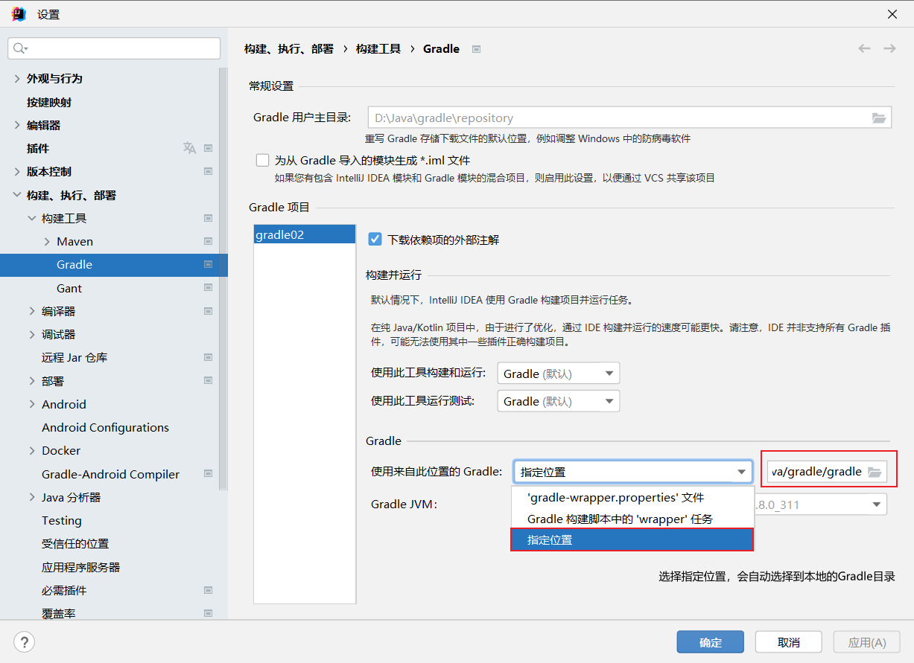

# Gradle 与 IDEA 整合

## Groovy 简介

在某种程度上，Groovy 可以被视为 Java 的一种脚本化改良版,Groovy 也是运行在 JVM 上，它可以很好地与 Java 代码及其相关库进行交互操作。它是一种成熟的面向对象编程语言，既可以面向对象编程，又可以用作纯粹的脚本语言。大多数有效的 Java 代码也可以转换为有效的 Groovy 代码，Groovy 和 Java 语言的主要区别是：完成同样的任务所需的Groovy 代码比 Java 代码更少。  

* 特点
  * 功能强大，例如提供了动态类型转换、闭包和元编程（metaprogramming）支持
  * 支持函数式编程，不需要 main 函数
  * 默认导入常用的包
  * 类不支持 default 作用域,且默认作用域为 public。
  * Groovy 中基本类型也是对象，可以直接调用对象的方法。
  * 支持 DSL（Domain Specific Languages 领域特定语言）和其它简洁的语法，让代码变得易于阅读和维护。
  * Groovy 是基于 Java 语言的，所以完全兼容 Java 语法,所以对于 java 程序员学习成本较低。  

## 安装 Groovy

与Java的环境变量配置一样。

## 创建 Groovy 项目

## Groovy 基本语法

* 类型转换：当需要时，类型之间会自动发生类型转换：字符串（String）、基本类型(如 int) 和类型的包装类 (如 Integer) 。
* 类说明：如果在一个 groovy 文件中没有任何类定义，它将被当做 script 来处理，也就意味着这个文件将被透明的转换为一个 Script类型的类，这个自动转换得到的类将使用原始的 groovy 文件名作为类的名字。groovy 文件的内容被打包进run 方法，另外在新产生的类中被加入一个 main 方法以进行外部执行该脚本。

### 注意点

提示:方法调用时,在不含有歧义的地方可以省略方法调用时的括号。这类似于使用${变量名}时，括号在不引起歧义的地方可以省略是一样的：如

~~~groovy
def num1=1;
def num2= 2;
println "$num1 + $num2 = ${num1+num2}"
~~~

### 引号说明

~~~groovy
package com.groovy.test

//--------------------------------字符串----------------------------------------
def desc = "测试";

def str1 = '单引号,不支持变量引用，不支持换行操作 ${desc}';
println(str1)

def str2 = "双引号,支持变量引用，不支持换行操作 ${desc}";
println(str2)

def str3 = '''模板字符串,不支持变量引用，支持换
                  行操作 ${desc}''';
println(str3)

//基本数据类型也可以作为对象使用,可以调用对象的方法
println(str1.getClass().toString())
println(str2.getClass().toString())
println(str3.getClass().toString())
~~~

### 三个语句结构

Groovy 支持顺序结构从上向下依次解析、分支结构(if..else、if..else if ..else..、switch..case、for、while、do..while)
具体参考官网：[The Apache Groovy programming language - Semantics (groovy-lang.org)](http://www.groovy-lang.org/semantics.html#_conditional_structures)

### 类型及权限修饰符

1. 原生数据类型及包装类

2. 类、内部类、抽象类、接口
3. 注解
4. Trait: 可以看成是带有方法实现的接口

权限修饰符: public、protected、private

> Groovy 类与 Java 类之间的主要区别是:  
>
> 1. 没有可见性修饰符的类或方法自动是公共的(可以使用一个特殊的注释来实现包的私有可见性)。
> 2. 没有可见性修饰符的字段将自动转换为属性，不需要显式的 getter 和 setter 方法。
> 3. 如果属性声明为 final，则不会生成 setter。
> 4. 一个源文件可能包含一个或多个类(但是如果一个文件不包含类定义的代码，则将其视为脚本)。脚本只是具有一些特殊约定的类,它们的名称与源文件相同(所以不要在脚本中包含与脚本源文件名相同的类定义)。   
>
> 有关 Groovy 中 各 种 各 样 的 数 据 类 型 和 权 限 修 饰 符 及 Goovy 与 Java 区 别 请 参 考：
>
> [属性的修饰符](http://www.groovy-lang.org/objectorientation.html#_modifiers_on_a_property)

### 集合操作

Groovy 支持 List、Map 集合操作，并且拓展了 Java 中的 API,具体参考如下方法：

* List:
  * add():添加某个元素
  * plus():添加某个 list 集合
  * remove():删除指定下标的元素
  * removeElement():删除某个指定的元素
  * removeAll(): 移除某个集合中的元素
  * pop():弹出 list 集合中最后一个元素
  * putAt():修改指定下标的元素
  * each():遍历
  * size(): 获取 list 列表中元素的个数
  * contains(): 判断列表中是否包含指定的值，则返回 true
* Map:
  * put():向 map 中添加元素
  * remove():根据某个键做移除，或者移除某个键值对
  * +、-：支持 map 集合的加减操作
  * each():遍历 map 集合  

> [The Apache Groovy programming language - Syntax (groovy-lang.org)](http://www.groovy-lang.org/syntax.html#_number_type_suffixes)
>
> 可以把不同的基本类型添加到同一集合中.

### 类导入

Groovy 遵循 Java 允许 import 语句解析类引用的概念 。

~~~groovy
import groovy.xml.MarkupBuilder
def xml = new MarkupBuilder()
assert xml != null
~~~

Groovy 语言默认提供的导入 。

~~~groovy
import java.lang.*
import java.util.*
import java.io.*
import java.net.*
import groovy.lang.*
import groovy.util.*
import java.math.BigInteger
import java.math.BigDecimal
~~~

这样做是因为这些包中的类最常用。通过导入这些样板代码减少了。  

[The Apache Groovy programming language - Program structure (groovy-lang.org)](http://www.groovy-lang.org/structure.html#_imports)

### 异常处理  

Groovy 中的异常处理和 java 中的异常处理是一样的。

~~~groovy
def z
try {
    def i = 7, j = 0
    try {
        def k = i / j
        assert false
    } finally {
        z = 'reached here'
    }
} catch ( e ) {
    assert e in ArithmeticException
    assert z == 'reached here'
}
~~~

[The Apache Groovy programming language - Semantics (groovy-lang.org)](http://www.groovy-lang.org/semantics.html#_try_catch_finally)

### 闭包

* 闭包：Groovy 中的闭包是一个开放的、匿名的代码块，它可以接受参数、也可以有返回值。闭包可以引用其周围作用域中声明的变量。

* 语法：{ [closureParameters -> ] statements }

  * 其中[ closureParameters-> ]是一个可选的逗号分隔的参数列表,参数后面是 Groovy 语句。参数类似于方法参数列表，这些参数可以是类型化的,也可以是非类型化的。当指定参数列表时，需要使用-> 字符，用于将参数与闭包体分离。  

  * [The Apache Groovy programming language - Closures (groovy-lang.org)](http://www.groovy-lang.org/closures.html)

  * ~~~groovy
    //闭包体完成变量自增操作
    { item++ }
    //闭包使用 空参数列表 明确规定这是无参的
    { -> item++ }
    //闭包中有一个默认的参数[it]，写不写无所谓
    { println it }
    { it -> println it }
    //如果不想使用默认的闭包参数it,那需要显示自定义参数的名称
    { name -> println name }
    //闭包也可以接受多个参数
    { String x, int y ->
        println "hey ${x} the value is ${y}"
    } 
    //闭包参数也可是一个对象
    { reader ->
        def line = reader.readLine()
        line.trim()
    }
    ~~~

* 闭包调用方式： 闭包是 groovy.lang.Closure 的实例。它可以像任何其他变量一样分配给一个变量或字段 。

  * 闭包对象(参数)

  * 闭包对象.call(参数)  

  * ~~~groovy
    def isOdd = { int i -> i%2 != 0 }
    assert isOdd(3) == true
    assert isOdd.call(2) == false
    def isEven = { it%2 == 0 }
    assert isEven(3) == false
    assert isEven.call(2) == true
    ~~~

  * > 特殊说明： 可以把闭包当作一个对象，作为参数传递给方法使用  
    >
    > ~~~groovy
    > /*====================================================
    >    闭包：
    >      定义：是一个开放的、匿名的代码块，它可以接受参数、也可以有返回值。闭包可以引用其周围作用域中声明的变量。
    >      语法：{ [closureParameters -> ] statements }
    >      调用：
    >          第一步：将闭包赋值给一个变量
    >          第二步: 变量名()、变量名.call()
    > 
    >      闭包在实际开发中的使用：作为方法的参数使用
    > ======================================================*/
    > 
    > def running(Closure closure) {
    >  println("running start...")
    >  closure()
    >  println("running end...")
    > }
    > 
    > running({ println("running........") })
    > 
    > 
    > def caculate(Closure closure) {
    >  def num1 = 10
    >  def num2 = 15
    >  closure(num1, num2)
    > }
    > 
    > //闭包作为方法的最后一个参数，那么闭包可以写在方法外边
    > caculate { k, v -> println("$k + $v = ${k + v}") }
    > ~~~

## 在 IDEA 中创建普通 Java 工程

第一步：创建由 Gradle 构建的项目

第二步： 修改本地 Gradle 目录（可以加快下载项目依赖 jar 包的速度）。

> 说明：
>
> 1. 在 Terminal 中执行以 gradlew 开头命令和操作图形化的 IDEA 使用 Gradle 版本不一定是同一个版本。
> 2. 目前只能是在创建项目时重新设置本地 gradle,创建新项目需要重新去改。
> 3. 当 我 们 在 gradle.build 文 件 添 加 依 赖 之 后 ， 这 些 依 赖 会 在 下 载 到GRADLE_USER_HOME/caches/modules-2/files-2.1目录下面,所以这里的 GRADLE_USER_HOME 相当于 Gradle 的本地仓库,当然也可以如下方式找到 jar 包位置。  

## 在 IDEA 中创建普通 WEB 项目

> 在新版本的 IDEA 中是无法直接创建 WEB 工程的，需要先创建一个普通工程然后再手动修改为 WEB 工程。

以 SSM 框架为例

1. 按照普通工程创建完毕后，在 build.gradle 文件里的 plugins 中添加`id 'war'`，然后在 main 文件夹内创建 webapp 目录。
2. 刷新 Gradle 工程。

~~~groovy
/*完整代码*/
plugins {
    id 'java'
    id 'war'
}

group 'com.gradle.demo'
version '1.0-SNAPSHOT'

repositories {
    mavenCentral()
}

dependencies {
    implementation 'org.springframework:spring-beans:4.1.7.RELEASE'
    implementation 'org.springframework:spring-web:4.1.7.RELEASE'
    implementation 'org.springframework:spring-webmvc:4.1.7.RELEASE'
    implementation 'org.springframework:spring-tx:4.1.7.RELEASE'
    implementation 'org.springframework:spring-test:4.0.5.RELEASE'
    implementation 'org.springframework:spring-jdbc:4.1.7.RELEASE'

    implementation 'org.mybatis:mybatis-spring:1.2.3'
    implementation 'org.mybatis:mybatis:3.3.0'

    implementation 'mysql:mysql-connector-java:8.0.29'
    implementation 'com.alibaba:druid:1.0.15'

    implementation "com.fasterxml.jackson.core:jackson-databind:2.2.3"
    implementation "com.fasterxml.jackson.core:jackson-annotations:2.2.3"
    implementation "com.fasterxml.jackson.core:jackson-core:2.2.3"

    implementation 'org.aspectj:aspectjweaver:1.8.6'
    implementation 'log4j:log4j:1.2.17'
    implementation 'org.slf4j:slf4j-api:1.7.25'
    implementation 'jstl:jstl:1.2'
    compileOnly 'javax.servlet:servlet-api:2.5'
    /* junit5测试只加依赖是不可以的 */
    testImplementation 'org.junit.jupiter:junit-jupiter-api:5.8.1'
    testRuntimeOnly 'org.junit.jupiter:junit-jupiter-engine:5.8.1'
}

test {
    /* 还必须要加上下面的代码 */
    useJUnitPlatform()
}
~~~

## 项目部署

部署有两种方式

* Tomcat

  * 这种方式和 Maven 的部署方式完全一致。

* Gretty

  * 内置的插件，在gradle6版本是可用的，在gradle7使用有些问题

  * ~~~groovy
    // 第一步：引入 Gretty 插件
    plugins {
        id ‘war’
        id 'org.gretty' version '2.2.0'
    } 
    // 第二步:指定 maven 仓库
    repositories {
        //指定jcenter仓库，一定要放在前面
        jcenter()
        mavenCentral()
    } 
    // 第三步:针对 Gretty 插件的设置
    gretty {
        httpPort = 8888
        contextPath = "/web"
        debugPort = 5005 // default
        debugSuspend = true // default
        httpsEnabled = true
        managedClassReload=true //修改了类之后重新加载
        //servletContainer = 'tomcat8' //如果不指定默认的servlet容器， 支持tomcat7/8，默认是使用的是Jetty服务器
        httpsPort = 4431
    }
    // 第四步:执行 Gretty 插件
    gradle appRun
    ~~~

  * [Gretty configuration (akhikhl.github.io)](http://akhikhl.github.io/gretty-doc/Gretty-configuration.html)

## Gradle 对测试支持

测试任务自动检测并执行测试源集中的所有单元测试。测试执行完成后会生成一个报告。支持 JUnit 和 TestNG 测试 。

### 默认测试目录及标准输出

### Junit 使用

Gradle 对于 Junit4.x 支持

~~~groovy
dependencies {
	testImplementation group: 'junit' ,name: 'junit', version: '4.12'
} 
test {
	useJUnit()
}
~~~

Gradle 对于 Junit5.x 版本支持

~~~groovy
dependencies {
    testImplementation 'org.junit.jupiter:junit-jupiter-api:5.8.1'
    testRuntimeOnly 'org.junit.jupiter:junit-jupiter-engine:5.8.1'
} 
test {
	useJUnitPlatform()
}
~~~

>无论是 Junt4.x 版本还是 Junit5.x 版本，只需在 build.gradle 目录下执行 gradle test 指令，gradle 就会帮执行所有的加了@Test 注解的测试，并生成测试报告。  

### 包含和排除特定测试

~~~groovy
test {
    enabled true
    useJUnit()
    include 'com/**'
    exclude 'com/abc/**'
}
~~~

gradle 在 junit 中的批量测试,可以设置包含或者排除某些特定测试。