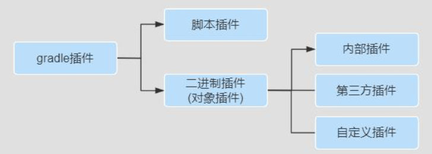

# Gradle 插件

## 使用插件的原因

简单的说,通过应用插件我们可以

* 促进代码重用、 减少功能类似代码编写、 提升工作效率。
* 促进项目更高程度的模块化、 自动化、 便捷化。
* 可插拔式的的扩展项目的功能。

## 插件的作用

在项目构建过程中做很多事情，把插件应用到项目中，通常可以完成:

1. 可以添加任务【task】到项目中，从而帮助完成测试、编译、打包等。
2. 可以添加依赖配置到项目中。
3. 可以向项目中拓展新的扩展属性、方法等。
4. 可以对项目**进行一些约定**，如应用 Java 插件后，约定 src/main/java 目录是我们的源代码存在位置，编译时编译这个目录下的 Java 源代码文件。

## 插件的分类和使用

**第一种：脚本插件**

脚本插件的本质就是一个脚本文件，使用脚本插件时通过 apply from:将脚本加载进来就可以了，后面的脚本文件可以是本地的也可以是网络上的脚本文件，下面定义一段脚本，我们在 build.gradle 文件中使用它，具体如：

~~~groovy
//version.gradle文件
ext {
    username = "东东"
    cfgs = [compileSdkVersion: JavaVersion.VERSION_1_8]
    spring = [version: '5.0.0']
}
~~~

下面将将在构建文件中使用这个脚本文件，具体如下：

~~~groovy
//build.gradle文件
//map作为参数
apply from: 'version.gradle'
task taskVersion {
    doLast {
        println "姓名为：${username},JDK版本是${cfgs.compileSdkVersion},版本号是${spring.version}"
    }
}
~~~

意义：脚本文件模块化的基础，可按功能把我们的脚本进行拆分一个个公用、职责分明的文件，然后在主脚本文件引用，比如：将很多共有的库版本号一起管理、应用构建版本一起管理等。  

**第二种：对象插件之内部插件[核心插件]**
二进制插件[对象插件]就是实现了 org.gradle.api.Plugin 接口的插件，每个 Java Gradle 插件都有一个 plugin id。

可通过如下方式使用一个 Java 插件：  