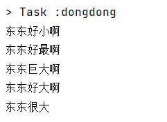

# Gradle 进阶

## 项目的生命周期

Gradle 项目的生命周期分为三大阶段：Initialization -> Configuration -> Execution. 每个阶段都有自己的职责，具体如下


<font color="blue">Initialization 阶段</font>主要目的是初始化构建, 它又分为两个子过程

* 一个是执行 Init Script
* 一个是执行 Setting Script

<font color="blue">init.gradle</font> 文件会在每个项目 build 之前被调用，用于做一些初始化的操作，它主要有如下作用

* 配置内部的仓库信息（如公司的 maven 仓库信息）
* 配置一些全局属性
* 配置用户名及密码信息（如公司仓库的用户名和密码信息）

<font color="blue">Setting Script </font>则更重要, 它初始化了一次构建所参与的所有模块。

<font color="blue">Configuration 阶段</font> 这个阶段开始加载项目中所有模块的 Build Script。所谓 "加载" 就是执行 build.gradle 中的语句，根据脚本代码创建对应的 task ，最终根据所有 task 生成由 Task 组成的**有向无环图(Directed Acyclic Graphs)**，如下:  


从而构成如下**有向无环树**


<font color="blue">Execution </font>阶段 这个阶段会根据上个阶段构建好的有向无环图，按着顺序执行 Task【Action 动作】。

## settings 文件  

首先对 settings 文件的几点说明：

1. 作用：主要是在项目初始化阶段确定一下引入哪些工程需要加入到项目构建中,为构建项目工程树做准备。
2. 工程树：gradle 中有工程树的概念，类似于 maven 中的 project 与 module。  
3. 内容：里面主要定义了当前 gradle 项目及子 project 的项目名称 。
4. 位置：必须放在根工程目录下。
5. 名字：为 settings.gradle 文件，不能发生变化。
6. 对应实例：与 org.gradle.api.initialization.Settings 实例是一一对应的关系。每个项目只有一个 settings 文件。
7. 关注：作为开发者我们只需要关注该文件中的 include 方法即可。使用相对路径【 : 】引入子工程。  
8. 一个子工程只有在 setting 文件中配置了才会被 gradle 识别，这样在构建的时候才会被包含进去 。

~~~groovy
//根工程项目名
rootProject.name = 'root'
//包含的子工程名称
include 'subject01'
include 'subject02'
include 'subject03'
//包含的子工程下的子工程名称
include 'subject01:subproject011'
include 'subject01:subproject012'
~~~

项目名称中 ":" 代表项目的分隔符， 类似路径中的 "/"。如果以 ":" 开头则表示相对于 root project 。然后 Gradle 会为每个带有build.gradle 脚本文件的工程构建一个与之对应的 Project 对象 。

## Task

项目实质上是 Task 对象的集合。一个 Task 表示一个逻辑上较为独立的执行过程，比如编译 Java 源代码，拷贝文件，打包 Jar 文件，甚至可以是执行一个系统命令。另外，一个 Task 可以读取和设置 Project 的 Property 以完成特定的操作。  

### 任务入门

[Build Script Basics (gradle.org)](https://docs.gradle.org/current/userguide/tutorial_using_tasks.html)

~~~groovy
task A {
    println "root taskA"
    doFirst() {
        println "root taskA doFirst"
    }
    doLast() {
        println "root taskA doLast"
    }
}
~~~

在文件所在的目录执行命令: gradle A。
提示 1 :task 的配置段是在配置阶段完成
提示 2 :task 的 doFirst、doLast 方法是执行阶段完成，并且 doFirst 在 doLast 执行之前执行。
提示 3:区分任务的配置段和任务的行为,任务的配置段在配置阶段执行,任务的行为在执行阶段执行  

### 任务的行为

~~~groovy
def map = new HashMap<String, Object>();
//action属性可以设置为闭包， 设置task自身的行为
map.put("action", { println "taskD.." })
task(map, "a") {
    description 'taskA description....'
    group "dfd"
//在task内部定义doFirst、 doLast行为
    doFirst {
        def name = 'doFirst..'
        println name
    }
    doLast {
        def name = 'doLast..'
        println name
    }
}
//在task外部定义doFirst、 doLast行为
a.doFirst {
    println it.description
}
a.doLast {
    println it.group
}
~~~


**底层原理分析**：无论是定义任务自身的 action，还是添加的 doLast、doFirst 方法，其实底层都被放入到一个 Action 的 List中了，最初这个 action List 是空的，当我们设置了 action【任务自身的行为】,它先将 action 添加到列表中，此时列表中只有一个 action,后续执行 doFirst 的时候 doFirst 在 action 前面添加，执行 doLast 的时候 doLast 在 action 后面添加。<font color="red">doFirst永远添加在 actions List 的第一位</font>，保证添加的 Action 在现有的 action List 元素的最前面；<font color="red">doLast 永远都是在 action List末尾添加</font>，保证其添加的 Action 在现有的 action List 元素的最后面。一个往前面添加,一个往后面添加，<font color="red">最后这个 action List 就按顺序形成了 doFirst、doSelf、doLast 三部分的 Actions，就达到 doFirst、doSelf、doLast 三部分的 Actions 顺序执行的目的。</font>

### 任务的依赖方式

Task 之间的依赖关系可以在以下几部分设置：  

1. 参数依赖
2. 内部依赖
3. 外部依赖  

方式一：参数方式依赖

~~~groovy
task A {
    doLast {
        println "TaskA.."
    }
}
task 'B' {
    doLast {
        println "TaskB.."
    }
}
//参数方式依赖: dependsOn后面用冒号
task 'C'(dependsOn: ['A', 'B']) {
    doLast {
        println "TaskC.."
    }
}
~~~

方式二：内部依赖  

~~~groovy
//参数方式依赖
task 'C' {
//内部依赖：dependsOn后面用 = 号
    dependsOn = [A, B]
    doLast {
        println "TaskC.."
    }
}
~~~

方式三：外部依赖

~~~groovy
//外部依赖:可变参数,引号可加可不加
C.dependsOn(B,'A')
~~~

**当然：task 也支持跨项目依赖**  

在 subproject01 工程的 build.gradle 文件中定义

~~~groovy
task A {
    doLast {
        println "TaskA.."
    }
}
~~~

在 subproject02 工程的 build.gradle 文件中定义

~~~groovy
task B {
    dependsOn(":subproject01:A") //依赖根工程下的subject01中的任务A ： 跨项目依赖。
    doLast {
        println "TaskB.."
    }
}
~~~

测试：gradle B ,控制台显示如下


<font color="red">拓展 1：当一个 Task 依赖多个 Task 的时候，被依赖的 Task 之间如果没有依赖关系，那么它们的执行顺序是随机的,并无影响。</font>

<font color="red">拓展 2：重复依赖的任务只会执行一次,比如：</font>
A -> B、C
B -> C
任务 A 依赖任务 B 和任务 C、任务 B 依赖 C 任务。执行任务 A 的时候，显然任务 C 被重复依赖了，C 只会执行一次。  

### 任务执行

任务执行语法：<font color="#317eff">gradle [taskName...] [--option-name...]</font>

| 分类                                                         | 解释                                                         |
| ------------------------------------------------------------ | ------------------------------------------------------------ |
| 常见的任务（*）                                              | gradle build: 构建项目:编译、测试、打包等操作<br />gradle run :运行一个服务,需要 application 插件支持，并且指定了主启动类才能运行 <br />gradle clean: 请求当前项目的 build 目录 <br />gradle init : 初始化 gradle 项目使用 <br />gradle wrapper:生成 wrapper 文件夹的。<br /> gradle wrapper 升级 wrapper 版本号：gradle wrapper --gradle-version=4.4 <br />gradle wrapper --gradle-version 5.2.1 --distribution-type all :关联源码用 |
| 项目报告相关任务                                             | gradle projects : 列出所选项目及子项目列表，以层次结构的形式显示 <br />gradle tasks: 列出所选项目【当前 project,不包含父、子】的已分配给任务组的那些任务。 <br />gradle tasks --all :列出所选项目的所有任务。 <br />gradle tasks --group="build setup":列出所选项目中指定分组中的任务。 <br />gradle help --task someTask :显示某个任务的详细信息 <br />gradle dependencies :查看整个项目的依赖信息，以依赖树的方式显示 <br />gradle properties 列出所选项目的属性列表 |
| 调试相关选项                                                 | -h,--help: 查看帮助信息 <br />-v, --version:打印 Gradle、 Groovy、 Ant、 JVM 和操作系统版本信息。 <br />-S, --full-stacktrace:打印出所有异常的完整(非常详细)堆栈跟踪信息。 <br />-s,--stacktrace: 打印出用户异常的堆栈跟踪(例如编译错误)。 <br />-Dorg.gradle.daemon.debug=true: 调试 Gradle 守护进程。 <br />-Dorg.gradle.debug=true:调试 Gradle 客户端(非 daemon)进程。 <br />-Dorg.gradle.debug.port=(port number):指定启用调试时要侦听的端口号。默认值为 5005。 |
| 性能选项:【备注:在 gradle.properties 中指定这些选项中的许多 选项，因此不需要命 令行标志】 | --build-cache, --no-build-cache： 尝试重用先前版本的输出。默认关闭(off)。 <br />--max-workers: 设置 Gradle 可以使用的 woker 数。默认值是处理器数。 <br />-parallel, --no-parallel: 并行执行项目。有关此选项的限制，请参阅并行项目执行。 默认设置为关闭(off) |
| 守护进程选项                                                 | --daemon, --no-daemon: 使用 Gradle 守护进程运行构建。默认是 on <br />--foreground:在前台进程中启动 Gradle 守护进程。 <br />-Dorg.gradle.daemon.idletimeout=(number of milliseconds): Gradle Daemon 将在这个空闲时间的毫秒数之后停止自己。默认值为 10800000(3 小时)。 |
| 日志选项                                                     | -Dorg.gradle.logging.level=(quiet,warn,lifecycle,info,debug): 通过 Gradle 属性设置日志记录级别。 <br />-q, --quiet: 只能记录错误信息 <br />-w, --warn: 设置日志级别为 warn <br />-i, --info: 将日志级别设置为 info <br />-d, --debug:登录调试模式(包括正常的堆栈跟踪) |
| 其它(*)                                                      | -x:-x 等价于: --exclude-task : 常见 gradle -x test clean build <br />--rerun-tasks: 强制执行任务，忽略 up-to-date ,常见 gradle build --rerun-tasks <br />--continue: 忽略前面失败的任务,继续执行,而不是在遇到第一个失败时立即停止执行。每 个遇到的故障都将在构建结束时报告，常见：gradle build --continue。 <br />gradle init --type pom :将 maven 项目转换为 gradle 项目(根目录执行) <br />gradle [taskName] :执行自定义任务 |

[Command-Line Interface (gradle.org)](https://docs.gradle.org/current/userguide/command_line_interface.html#sec:command_line_executing_tasks)

> 拓展 1：gradle 任务名是缩写: 任务名支持驼峰式命名风格的任务名缩写，如：connectTask 简写为：cT,执行任务 gradle cT。
>
> 拓展 2:前面提到的 Gradle 指令本质:一个个的 task[任务], Gradle 中所有操作都是基于任务完成的。  
>
> 拓展 3：gradle 默认各指令之间相互的依赖关系：  
>
> 
>
> 

### 任务定义方式

任务定义方式，总体分为两大类：一种是通过 Project 中的 task() 方法，另一种是通过 tasks 对象的 create 或者 register 方法。  

~~~groovy
task('A', {//任务名称,闭包都作为参数
    println "taskA..."
})

task('B') {//闭包作为最后一个参数可以直接从括号中拿出来
    println "taskB..."
}

task C {//groovy语法支持省略方法括号:上面三种本质是一种
    println "taskC..."
}

def map = new HashMap<String, Object>();

map.put("action", { println "taskD.." }) //action属性可以设置为闭包

task(map, "D");

tasks.create('E') {//使用tasks的create方法
    println "taskE.."
}

tasks.register('f') { //注：register执行的是延迟创建。也即只有当task被需要使用的时候才会被创建。
    println "taskF...."
}
~~~

当然：我们也可以在定义任务的同时指定任务的属性，具体属性有：  

| 配置项      | 描述                                         | 默认值      |
| ----------- | -------------------------------------------- | ----------- |
| type        | 基于一个存在的Task来创建，和我们类继承差不多 | DefaultTask |
| overwrite   | 是否替换存在的Task，这个和type配合起来用     | false       |
| dependsOn   | 用于配置任务的依赖                           | []          |
| action      | 添加到任务中的一个Action或者闭包             | null        |
| description | 用于配置任务的描述                           | null        |
| group       | 用于配置任务的分组                           | null        |

<font color="red">在定义任务时也可以给任务分配属性</font>：定义任务的时候可以直接指定任务属性，也可以给已有的任务动态分配属性：  

~~~groovy
//1.F是任务名，前面通过具名参数给map的属性赋值,以参数方式指定任务的属性信息
task(group: "dfd", description: "this is task B", "F")
//2.H是任务名，定义任务的同时，在内部直接指定属性信息
task("H") {
    group("dfd")
    description("this is the task H")
}
//3.Y是任务名，给已有的任务 在外部直接指定属性信息
task "y" {}
y.group = "dfd"
clean.group("dfd") //案例：给已有的clean任务重新指定组信息
~~~

可以在 idea 中看到: <font color="red">上面自定义的那几个任务和 gradle 自带的 clean 任务已经跑到：dfd 组了。</font>


### 任务类型

前面我们定义的 task 都是 DefaultTask 类型的,如果要完成某些具体的操作完全需要我们自己去编写 gradle 脚本，势必有些麻烦，那有没有一些现成的任务类型可以使用呢？有的，Gradle 官网给出了一些现成的任务类型帮助我们快速完成想要的任务，我们只需要在创建任务的时候，指定当前任务的类型即可，然后即可使用这种类型中的属性和 API 方法了。  

| 常见任务类型             | 该类型任务的作用                                             |
| ------------------------ | ------------------------------------------------------------ |
| Delete                   | 删除文件或目录                                               |
| Copy                     | 将文件复制到目标目录中。此任务还可以在复制时重命名和筛选文件 |
| CreateStartScripts       | 创建启动脚本                                                 |
| Exec                     | 执行命令行进程                                               |
| GenerateMavenPom         | 生成 Maven 模块描述符(POM)文件                               |
| GradleBuild              | 执行 Gradle 构建                                             |
| Jar                      | 组装 JAR 归档文件                                            |
| JavaCompile              | 编译 Java 源文件                                             |
| Javadoc                  | 为 Java 类生成 HTML API 文档                                 |
| PublishToMavenRepository | 将 MavenPublication 发布到 mavenartifactrepostal             |
| Tar                      | 组装 TAR 存档文件                                            |
| Test                     | 执行 JUnit (3.8.x、4.x 或 5.x)或 TestNG 测试                 |
| Upload                   | 将 Configuration 的构件上传到一组存储库                      |
| War                      | 组装 WAR 档案                                                |
| Zip                      | 组装 ZIP 归档文件。默认是压缩 ZIP 的内容                     |

[Gradle DSL Version 7.5.1](https://docs.gradle.org/current/dsl/index.html)

具体使用例如：

~~~groovy
tasks.register('myClean', Delete) {
    delete buildDir
}
~~~

在命令行执行 `gradle myClean` 发现就可以将当前 project 的 build 目录删除。

当然除了 gradle 自带的 task 类型,我们也可以自定义 task 类型：

~~~groovy
def myTask = task MyDefinitionTask(type: CustomTask)
myTask.doFirst() {
    println "task 执行之前 执行的 doFirst方法"
}
myTask.doLast() {
    println "task 执行之后 执行的 doLast方法"
}

class CustomTask extends DefaultTask {
//@TaskAction表示Task本身要执行的方法
    @TaskAction
    def doSelf() {
        println "Task 自身 在执行的in doSelf"
    }
}
~~~

测试：`gradle MyDefinitionTask`


### 任务的执行顺序

在 Gradle 中,有三种方式可以指定 Task 执行顺序：

1. dependsOn 强依赖方式

2. 通过 Task 输入输出

3. 通过 API 指定执行顺序

详细请参考官网：[Task - Gradle DSL Version 7.5.1](https://docs.gradle.org/current/dsl/org.gradle.api.Task.html)

### 动态分配任务

gradle 的强大功能不仅仅用于定义任务的功能。例如，可以使用它在循环中注册同一类型的多个任务

~~~groovy
4.times { counter ->
    tasks.register("task$counter") {
        doLast {
            println "I'm task number $counter"
        }
    }
}
// 构建 4 个任务,但是任务 0 必须依赖于任务 2 和 3,那么代表任务 2 和 3 需要在任务 0 之前优先加载。
tasks.named('task0') { dependsOn('task2', 'task3') }
~~~

使用`gradle -q task0`执行


### 任务的关闭与开启

每个任务都有一个<font color="red"> enabled </font>默认为的标志<font color="red"> true </font>。将其设置为 <font color="red"> false</font>阻止执行任何任务动作。禁用的任务将标记为<font color="red"> 跳过 </font>。

~~~groovy
task disableMe {
    doLast {
        println 'This task is Executing...'
    }
    enabled(true)//直接设置任务开启， 默认值为true
}
//disableMe.enabled = false //设置关闭任务
~~~

### 任务的超时

每个任务都有一个 timeout 可用于限制其执行时间的属性。当任务达到超时时，其任务执行线程将被中断。该任务将被标记为失败。终结器任务仍将运行。如果 --continue 使用，其他任务可以在此之后继续运行。不响应中断的任务无法超时。Gradle 的所有内置任务均会及时响应超时。

~~~groovy
task a() {
    doLast {
        Thread.sleep(1000)
        println "当前任务a执行了"
    }
    timeout = Duration.ofMillis(500)
}
task b() {
    doLast {
        println "当前任务b执行了"
    }
}
~~~

在控制台使用: gradle a b 测试会发现执行 a 的时候,由于 a 执行超时，抛出异常，所以没有继续往下执行【b 也没执行】。然后在控制台使用: gradle a b –continue,测试会发现 a 虽然执行失败，但是 b 还是执行了  。

### 任务的查找

~~~groovy
task dongdong {
    doLast {
        println "东东很大"
    }
}
//根据任务名查找
tasks.findByName("dongdong").doFirst({ println "东东好大啊" })
tasks.getByName("dongdong").doFirst({ println "东东巨大啊" })
//根据任务路径查找【相对路径】
tasks.findByPath(":dongdong").doFirst({ println "东东好最啊" })
tasks.getByPath(":dongdong").doFirst({ println "东东好小啊" })
~~~



### 任务的规则

当我们执行、依赖一个不存在的任务时，Gradle 会执行失败,报错误信息。那我们能否对其进行改进,当执行一个不存在的任务时，不是报错而是打印提示信息呢？

```groovy
task hello {
    doLast {
        println 'hello 你好'
    }
}
tasks.addRule("对该规则的一个描述，便于调试、查看等") {
    String taskName ->
        task(taskName) {
            doLast {
                println "该${taskName}任务不存在，请查证后再执行"
            }
        }
}
```

测试: 使用 <font color="red">gradle abc hello</font> 进行测试,此时当 abc 任务不存在时，也不会报异常【不中断执行】而是提示自定义的规则信息，继续执行 hello 任务。此外，它还可以根据不同的规则动态创建需要的任务等情况 。

### 任务的 onlyIf 断言  