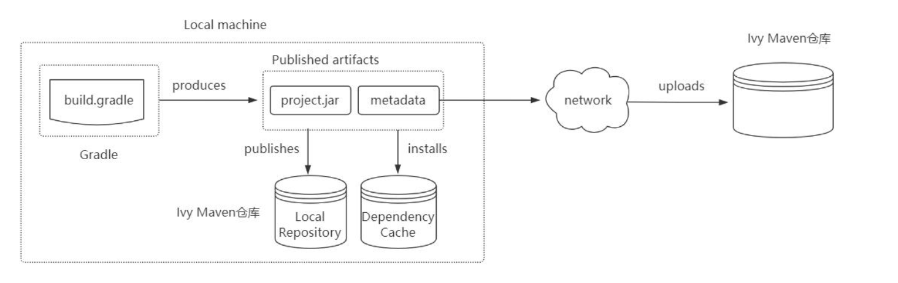

# Publishing 项目发布

接下来，将咱们写好的模块发布到公司的私服以供别人使用，如下所示：

## 引入 maven 发布的插件

~~~groovy
plugins {
    id 'java-library' //如果发布war包， 需要war插件,java-library支持带源码、 文档发布
    id 'maven-publish'
}
~~~

## 设置发布代码

~~~groovy
//带源码和javadoc的发布:需要'java-library'插件支持:它是java的升级版，java插件的功能java-library都有
//javadoc.options.encoding="UTF-8"
//java {
// withJavadocJar()
// withSourcesJar()
//}
publishing {
    publications {
        myLibrary(MavenPublication) {
            groupId = 'org.gradle.sample' //指定GAV坐标信息
            artifactId = 'library'
            version = '1.1'
            from components.java//发布jar包
            //from components.web///引入war插件，发布war包
        }
    }
    repositories {
        //本地仓库位于USER_HOME/.m2/repository
        mavenLocal()
        //发布项目到私服中
        maven {
            name = 'myRepo' //name属性可选,表示仓库名称，url必填
            //发布地址:可以是本地仓库或者maven私服
            //url = layout.buildDirectory.dir("repo")
            // change URLs to point to your repos, e.g. http://my.org/repo
            def releasesRepoUrl = layout.buildDirectory.dir('repos/releases')
            def snapshotsRepoUrl = layout.buildDirectory.dir('repos/snapshots')
            url = version.endsWith('SNAPSHOT') ? snapshotsRepoUrl : releasesRepoUrl
            //认证信息:用户名和密码
            // credentials {
            // username = 'joe'
            // password = 'secret'
            // }
        }
    }
}
~~~

## 执行发布指令

执行发布命令，将项目发布到本地仓库或者远程仓库。常见的发布指令有：

* generatePomFileForPubNamePublication：生成 pom 文件
* publishPubNamePublicationToRepoNameRepository：发布项目到指定仓库,如果没有仓库名，默认为 maven
* publishPubNamePublicationToMavenLocal：将 PubName 发布复制到本地 Maven 仓库中包括 POM 文件和其他元数据
* publish：发布到 repositories 中指定的仓库(为比如 Maven 私服)
* publishToMavenLocal：执行所有发布任务中的操作发布到本地 maven 仓库【默认在用户家目录下的.m2/repository】