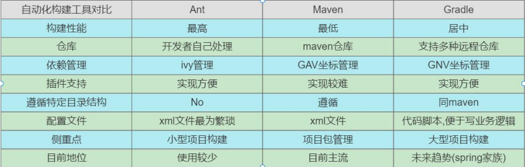
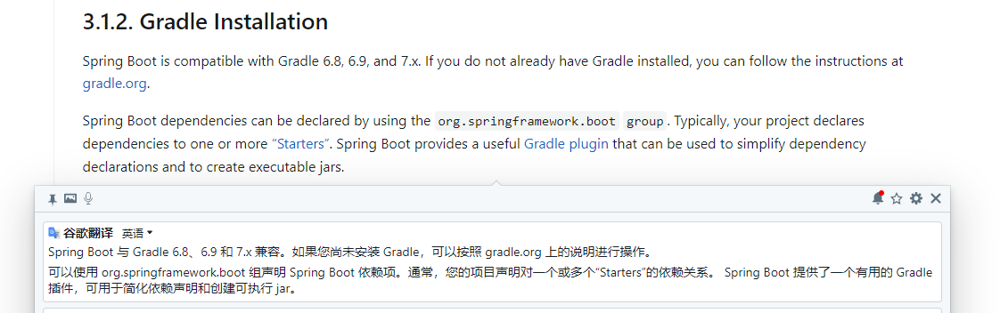
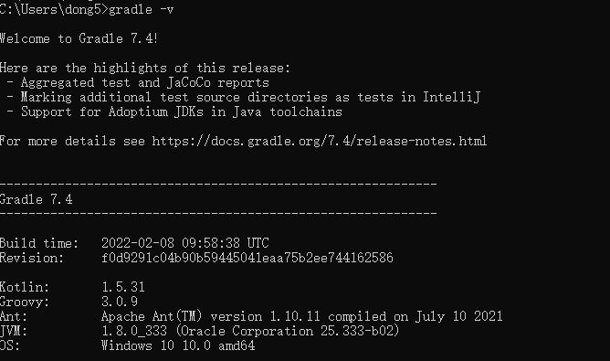
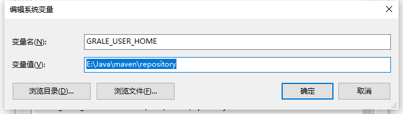
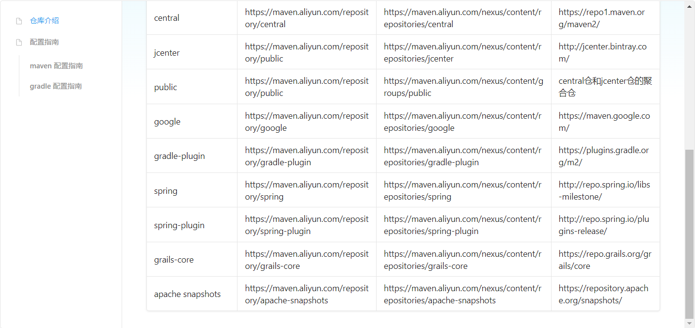
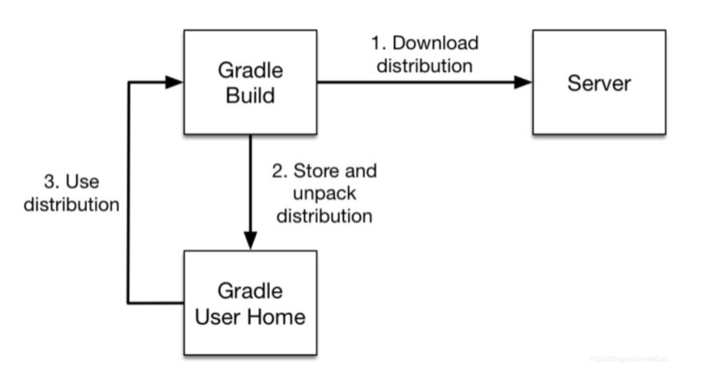

# Gradle 入门

## Gradle 简介

Gradle 是一款 Google 推出的基于 JVM、通用灵活的项目构建工具，支持 Maven，JCenter 多种第三方仓库;支持传递性 依赖管理、废弃了繁杂的 xml 文件，转而使用简洁的、支持多种语言(例如：java、groovy 等)的 build 脚本文件。 官网地址: https://gradle.org。

未来趋势会是 Gradle。

## 常见的项目构建工具

* Ant: 2000 年 Apache 推出的纯 Java 编写构建工具，通过 xml[build.xml]文件管理项目。
  * 优点：使用灵活，速度快(快于 gradle 和 maven) 。
  * 缺点：Ant 没有强加任何编码约定的项目目录结构,开发人员需编写繁杂 XML 文件构建指令,对开发人员是一个挑战。 
* Maven: 2004 年 Apache 组织推出的再次使用 xml 文件[pom.xml]管理项目的构建工具。
  *  优点: 遵循一套约定大于配置的项目目录结构，使用统一的 GAV 坐标进行依赖管理,侧重于包管理。
  *  缺点：项目构建过程僵化,配置文件编写不够灵活、不方便自定义组件,构建速度慢于 gradle。 
* Gradle: 2012 年 Google 推出的基于 Groovy 语言的全新项目构建工具，集合了 Ant 和 Maven 各自的优势。
  * 优点：集 Ant 脚本的灵活性+Maven 约定大于配置的项目目录优势,支持多种远程仓库和插件,侧重于大项目构建。
  * 缺点：学习成本高、资料少、脚本灵活、版本兼容性差等。

## Gradle 安装

### Gradle 安装说明

先看Spring官网的说明。6.8以下的版本是不可以使用的。具体的参考文档：[Getting Started (spring.io)](https://docs.spring.io/spring-boot/docs/current/reference/html/getting-started.html#getting-started)

### 配置环境变量

和Maven的配置一样，首先配置一个为GRADLE_HOME的key，选择Gradle的根目录，然后在Path中配置bin目录即可。

**重要：**再配置一个 GRALE_USER_HOME  环境变量

> GRALE_USER_HOME 相当于配置 Gradle 本地仓库位置和 Gradle 。

## Gradle 项目目录结构

> 1. 只有war工程才有webapp目录，对于普通的jar工程并没有webapp目录 。
>
> 2. gradlew与gradlew.bat执行的指定wrapper版本中的gradle指令,不是本地安装的gradle指令哦 。

## 创建 Gradle 项目

### 脚手架

借助于 spring 脚手架创建一个 gradle 项目。

### 命令行

创建一个文件夹，使用cmd进入文件夹中，执行gradle init命令，前提是需要配置好环境变量。

### Gradle 中的常用指令

|   常用 gradle 命令    |            作用            |
| :-------------------: | :------------------------: |
|     gradle clean      |       清空build目录        |
|    gradle classes     |   编译业务代码和配置文件   |
|      gradle test      | 编译测试代码，生成测试报告 |
|     gradle  build     |          构建项目          |
| gradle  build -x test |        跳过测试构建        |

需要注意的是：gradle 的指令要在含有 build.gradle 的目录执行。

## 修改 Maven 下载源

Gradle 自带的 Maven 源地址是国外的，该 Maven 源在国内的访问速度是很慢的，除非使用了特别的手段。一般情况下，建议使用国内的第三方开放的 Maven 源或企业内部自建 Maven 源。

#### 认识 init.d 文件夹

我们可以在 gradle 的 init.d 目录下创建以.gradle 结尾的文件，.gradle 文件可以实现在 build 开始之前执行，所以你可以在这个文件配置一些你想预先加载的操作。

#### 在 init.d 文件夹创建 init.gradle 文件

~~~json
allprojects {
    repositories { 
        mavenLocal()
        maven { name "Alibaba" ; url "https://maven.aliyun.com/repository/public" } 
        maven { name "Bstek" ; url "https://nexus.bsdn.org/content/groups/public/" } 
        mavenCentral()
    }
    buildscript {
        repositories { 
            maven { name "Alibaba" ; url 'https://maven.aliyun.com/repository/public' } 
            maven { name "Bstek" ; url 'https://nexus.bsdn.org/content/groups/public/' } 
            maven { name "M2" ; url 'https://plugins.gradle.org/m2/' }
        }
    }
}
~~~

#### 启用 init.gradle 文件的方法有

1. 在命令行指定文件,例如：gradle --init-script yourdir/init.gradle -q taskName。你可以多次输入此命令来指定多个init文件
2. 把init.gradle文件放到 USER_HOME/.gradle/ 目录下
3. 把以.gradle结尾的文件放到 USER_HOME/.gradle/init.d/ 目录下
4. 把以.gradle结尾的文件放到 GRADLE_HOME/init.d/ 目录下  

> 如果存在上面的4种方式的2种以上，gradle会按上面的1-4序号依次执行这些文件，如果给定目录下存在多个init脚本，会按拼音a-z顺序执行这些脚本， 每个init脚本都存在一个对应的gradle实例，你在这个文件中调用的所有方法和属性， 都会委托给这个gradle实例， 每个init脚本都实现了Script接口。  

#### 仓库地址说明

* mavenLocal(): 指定使用maven本地仓库，而本地仓库在配置maven时settings文件指定的仓库位置。如E:/repository， gradle查找jar包顺序如下：USER_HOME/.m2/settings.xml >> M2_HOME/conf/settings.xml >> USER_HOME/.m2/repository。
* maven { url 地址：指定maven仓库，一般用私有仓库地址或其它的第三方库【比如阿里镜像仓库地址】。
* mavenCentral()：这是Maven的中央仓库，无需配置，直接声明就可以使用。
* jcenter()：JCenter中央仓库，实际也是是用的maven搭建的，但相比Maven仓库更友好，通过CDN分发，并且支持https访问，在新版本中已经废弃了，替换为了mavenCentral()。

> 总之, gradle可以通过指定仓库地址为本地maven仓库地址和远程仓库地址相结合的方式，避免每次都会去远程仓库下载依赖库。这种方式也有一定的问题，如果本地maven仓库有这个依赖，就会从直接加载本地依赖，如果本地仓库没有该依赖，那么还是会从远程下载。但是下载的jar不是存储在本地maven仓库中，而是放在自己的缓存目录中， 默认在USER_HOME/.gradle/caches目录，当然如果我们配置过GRADLE_USER_HOME环境变量， 则会放在GRADLE_USER_HOME/caches目录，那么可不可以将gradle caches指向maven repository。 但这是不行的， caches下载文件不是按照maven仓库中存放的方式。  

#### 阿里云仓库地址

[使用指南](https://developer.aliyun.com/mvn/guide)。可以直接复制阿里提供的init.gradle。

~~~json
allprojects {
    /* 通常仓库放在这里 */
    repositories { 
        mavenLocal()
        maven { name "Alibaba" ; url "https://maven.aliyun.com/repository/public" }
        maven { name "Bstek" ; url "https://nexus.bsdn.org/content/groups/public/" }
        maven { name "Spring" ; url "https://maven.aliyun.com/repository/spring" }
        maven { name "Google" ; url "https://maven.aliyun.com/repository/google" }
        mavenCentral()
    }
    /* 通常插件放在这里 */
    buildscript {
        repositories {
            maven { name "Alibaba" ; url 'https://maven.aliyun.com/repository/public' } 
            maven { name "Bstek" ; url 'https://nexus.bsdn.org/content/groups/public/' } 
            maven { name "M2" ; url 'https://plugins.gradle.org/m2/' }
            maven { name "Spring-Plugin" ; url 'https://maven.aliyun.com/repository/spring-plugin' }
            maven { name "Gradle-Plugin" ; url 'https://maven.aliyun.com/repository/gradle-plugin' }
        }
    }
}
~~~

## Wrapper 包装器  

Gradle Wrapper 实际上就是对 Gradle 的一层包装，用于解决实际开发中可能会遇到的不同的项目需要不同版本的 Gradle 问题。例如：把自己的代码共享给其他人使用，可能出现如下情况: 

* 对方电脑没有安装 gradle 。
* 对方电脑安装过 gradle，但是版本太旧了 。

这时候，我们就可以考虑使用 Gradle Wrapper 了。这也是官方建议使用 Gradle Wrapper 的原因。实际上有了 Gradle Wrapper 之后，我们本地是可以不配置 Gradle 的，下载 Gradle 项目后，使用 gradle 项目自带的 wrapper 操作也是可以的。

### 如何使用Gradle Wrapper

项目中的gradlew、gradlew.cmd脚本用的就是 wrapper 中规定的 gradle 版本。
而我们上面提到的 gradle 指令用的是本地 gradle ，所以 gradle 指令和 gradlew 指令所使用的 gradle 版本有可能是不一样的。
gradlew、gradlew.cmd的使用方式与 gradle 使用方式完全一致，只不过把gradle指令换成了gradlew指令。  

当然，我们也可在终端执行 gradlew 指令时，指定指定一些参数,来控制 Wrapper 的生成，比如依赖的版本等。

|          参数名           |                 说明                  |
| :-----------------------: | :-----------------------------------: |
|     --gradle-version      |      用于指定使用的 Gradle 版本       |
| --gradle-distribution-url | 用于指定下载 Gradle 发行版的 URL 地址 |

具体操作如下：

~~~
gradle wrapper --gradle-version=4.4：升级wrapper版本号,只是修改gradle.properties中wrapper版本，未实际下载
gradle wrapper --gradle-version 5.2.1 --distribution-type all：关联源码用
~~~

### GradleWrapper 的执行流程

1. 当我们第一次执行 ./gradlew build 命令的时候，gradlew 会读取 gradle-wrapper.properties 文件的配置信息。
2. 准确的将指定版本的 gradle 下载并解压到指定的位置(GRADLE_USER_HOME目录下的wrapper/dists目录中)。
3. 并构建本地缓存(GRADLE_USER_HOME目录下的caches目录中)，下载再使用相同版本的gradle就不用下载了。
4. 之后执行的 ./gradlew 所有命令都是使用指定的 gradle 版本。

gradle-wrapper.properties 文件解读：

| 字段名           | 说明                                                   |
| :--------------- | :----------------------------------------------------- |
| distributionBase | 下载的 Gradle 压缩包解压后存储的主目录                 |
| distributionPath | 相对于 distributionBase 的解压后的 Gradle 压缩包的路径 |
| zipStoreBase     | 同 distributionBase，只不过是存放 zip 的压缩包的       |
| zipStorePath     | 同 distributionPath，只不过是存放 zip 的压缩包的       |
| distributionUrl  | Gradle 发行版压缩包的下载地址                          |

> 前面提到的 GRALE_USER_HOME 环境变量用于这里的 Gradle Wrapper 下载的特定版本的 gradle 存储目录。如果我们没有配置过 GRALE_USER_HOME 环境变量，默认在当前用户目录下的 .gradle 文件夹中。

### 那什么时候选择使用 gradle wrapper，什么时候选择使用本地 gradle?  

* 下载别人的项目或者使用操作以前自己写的不同版本的 gradle 项目时：用Gradle wrapper，也即：gradlew。
* 新建一个项目时：使用 gradle 指令即可。 