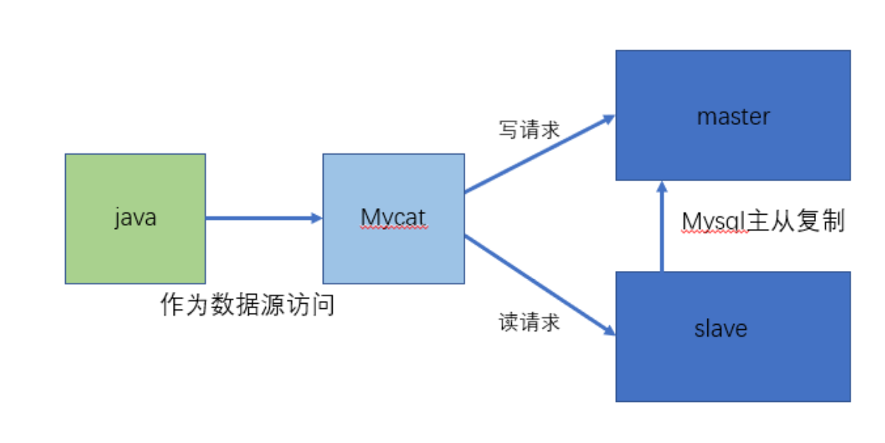
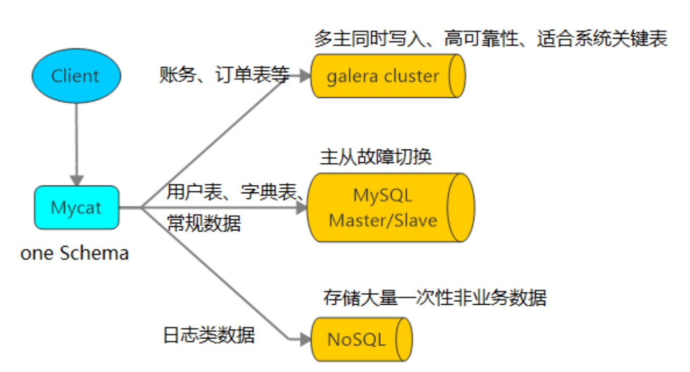

# 概念

## 是什么

**Mycat 是数据库中间件**。

1. 数据库中间件
   中间件： 是一类连接软件组件和应用的计算机软件， 以便于软件各部件之间的沟通。
   例子： Tomcat， web中间件。
   数据库中间件： 连接java应用程序和数据库  
2. 为什么用MyCat？
   ① Java与数据库紧耦合。
   ② 高访问量高并发对数据库的压力。
   ③ 读写请求数据不一致
3. 官网：[MyCat](http://www.mycat.org.cn/)

## 干什么

* 读写分离
  * 
* 数据分片
  * 
* 多数据源整合
  * 

## 原理

Mycat 的原理中最重要的一个动词是“拦截”，它拦截了用户发送过来的 SQL 语句，首先对 SQL语句做了一些特定的分析：如分片分析、路由分析、读写分离分析、缓存分析等，然后将此 SQL 发往后端的真实数据库， 并将返回的结果做适当的处理，最终再返回给用户。

这种方式把数据库的分布式从代码中解耦出来，程序员察觉不出来后台使用 Mycat 还是MySQL。 