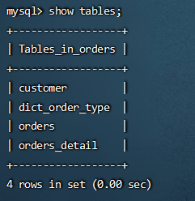

# 垂直拆分—分库

一个数据库由很多表的构成，每个表对应着不同的业务，垂直切分是指按照业务将表进行分类，分布到不同 的数据库上面，这样也就将数据或者说压力分担到不同的库上面，如下图：  


系统被切分成了，用户，订单交易，支付几个模块。

## 如何划分表

一个问题：在两台主机上的两个数据库中的表，能否关联查询？
答案：不可以关联查询。**而且经过测试在远程连接工具中查不到customer表，但是在命令行中可以。**
分库的原则： 有紧密关联关系的表应该在一个库里，相互没有关联关系的表可以分到不同的库里。  

```sql
#客户表 rows:20万
CREATE TABLE customer(
id INT AUTO_INCREMENT,
NAME VARCHAR(200),
PRIMARY KEY(id)
);
#订单表 rows:600万
CREATE TABLE orders(
id INT AUTO_INCREMENT,
order_type INT,
customer_id INT,
amount DECIMAL(10,2),
PRIMARY KEY(id)
);
#订单详细表 rows:600万
CREATE TABLE orders_detail(
id INT AUTO_INCREMENT,
detail VARCHAR(2000),
order_id INT,
PRIMARY KEY(id)
);
#订单状态字典表 rows:20
CREATE TABLE dict_order_type(
id INT AUTO_INCREMENT,
order_type VARCHAR(200),
PRIMARY KEY(id)
);
```

## 修改配置

修改schema.xml

~~~xml
<!--可以使用1M1S-->
<?xml version="1.0"?>
<!DOCTYPE mycat:schema SYSTEM "schema.dtd">
<mycat:schema xmlns:mycat="http://io.mycat/">
    <schema name="TESTDB" checkSQLschema="false" sqlMaxLimit="100" dataNode="dn1">
        <table name="customer" dataNode="dn2"></table>
    </schema>
    <dataNode name="dn1" dataHost="host1" database="orders" />
    <dataNode name="dn2" dataHost="host2" database="orders" />
    <dataHost name="host1" maxCon="1000" minCon="10" balance="0" writeType="0" dbType="mysql" dbDriver="native" switchType="1" slaveThreshold="100">
        <heartbeat>select user()</heartbeat>
        <writeHost host="hostM1" url="192.168.25.11:3306" user="root" password="111111">
        </writeHost>
    </dataHost>    
    <dataHost name="host2" maxCon="1000" minCon="10" balance="0" writeType="0" dbType="mysql" dbDriver="native" switchType="1" slaveThreshold="100">
        <heartbeat>select user()</heartbeat>
        <writeHost host="hostS1" url="192.168.25.12:3306" user="root" password="111111">
        </writeHost>
    </dataHost>
</mycat:schema>
~~~

## 测试

~~~sql
#新增两个空白库
#分库操作不是在原来的老数据库上进行操作，需要准备两台机器分别安装新的数据库
#在数据节点 dn1、 dn2 上分别创建数据库 orders
CREATE DATABASE orders;
#进入mycat，创建四个表。
~~~



查看两个mysql


