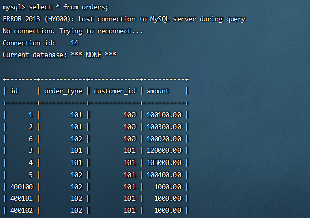

# 基于 HA 机制的 Mycat 高可用

在实际项目中， Mycat 服务也需要考虑高可用性，如果 Mycat 所在服务器出现宕机，或 Mycat 服务故障，需要有备机提供服务，需要考虑 Mycat 集群。  

## 高可用方案

我们可以使用 HAProxy + Keepalived 配合两台 Mycat 搭起 Mycat 集群，实现高可用性。 HAProxy实现了 MyCat 多节点的集群高可用和负载均衡， 而 HAProxy 自身的高可用则可以通过 Keepalived 来实现。

|         角色         |      IP       | 账号 |  密码  |
| :------------------: | :-----------: | :--: | :----: |
|        MyCat1        | 192.168.25.11 | root | 111111 |
|        MyCat2        | 192.168.25.12 | root | 111111 |
|  HAProxy（master）   | 192.168.25.11 | root | 111111 |
| Keepalived（master） | 192.168.25.11 | root | 111111 |
|  HAProxy（backup）   | 192.168.25.12 | root | 111111 |
| Keepalived（backup） | 192.168.25.12 | root | 111111 |

为了方便的搭建选择了2台机器，实际应该是4台机器。

## 安装配置 HAProxy  

~~~yaml
#docker-compose.yml
version: '3.1'
services:
 haproxy:
    image: haproxy:1.5.18
    container_name: haproxy1
    ports:
      - "7777:7777"
      - "48066:48066"
    volumes:
      - ./haproxy:/usr/local/etc/haproxy

~~~

~~~properties
#haproxy.cfg
global
        log 127.0.0.1 local0
        maxconn 4096
        chroot /usr/local/etc/haproxy
        pidfile /usr/local/etc/haproxy/haproxy.pid
        uid 99
        gid 99
        daemon
defaults
        mode            tcp
        option          httplog
        option          abortonclose
        monitor-uri     /monitoruri
        maxconn         2000
        timeout client  30s
        retries         3
        option redispatch
        timeout connect 5s
        timeout server  5s
        stats uri       /status
listen proxy_status
        bind :48066
        mode tcp
        balance roundrobin
        server mycat_1 192.168.25.12:8066 check inter 10s
        server mycat_2 192.168.25.11:8066 check inter 10s
frontend admin_stats
        bind :7777
        mode http
        stats enable
        option httplog
        maxconn 10
        stats refresh 30s
        stats uri /admin
        stats auth admin:admin
        stats hide-version
        stats admin if TRUE
~~~

打开浏览器访问 http://192.168.25.11:7777/admin，在弹出框中输入admin账号密码。

~~~sql
#验证负载均衡，通过HAProxy访问Mycat
mysql -umycat -p111111 -h192.168.25.11 -P48066
~~~

按照同样的操作在另一台计算机上搭建HAProxy。

## 安装Keepalived

~~~sh
yum install keepalived –y
# 查看是否安装成功
rpm -qa|grep keepalived
# 修改 keepalived.conf
cd /etc/keepalived
vim keepalived.conf
~~~

~~~conf
#keepalived.conf
global_defs {
  notification_email {
    xlcocoon@foxmail.com
  }
  notification_email_from keepalived@showjoy.com
  smtp_server 127.0.0.1
  smtp_connect_timeout 30
  router_id LVS_DEVEL
  vrrp_skip_check_adv_addr
  vrrp_garp_interval 0
  vrrp_gna_interval 0
}

vrrp_instance VI_1 {
    #主机配MASTER，备机配BACKUP
    state MASTER
    #所在机器网卡
    interface ens33
    virtual_router_id 51
    #数值越大优先级越高，备机不要超过主机
    priority 100
    advert_int 1
    authentication {
        auth_type PASS
        auth_pass 111111
    }
    virtual_ipaddress {
        #虚拟IP
        192.168.25.200
    }
}

virtual_server 192.168.25.200 48066 {
    delay_loop 6
    lb_algo rr
    lb_kind NAT
    persistence_timeout 50
    protocol TCP
    real_server 192.168.25.11 48066 {
        weight 1
        TCP_CHECK {
        connect_timeout 3
        retry 3
        delay_before_retry 3
      }
    }
    real_server 192.168.25.12 48066 {
        weight 1
        TCP_CHECK {
            connect_timeout 3
            nb_get_retry 3
            delay_before_retry 3
        }
    }
}
~~~

~~~sh
#重启keeplived
systemctl restart keepalived.service
#登录验证
mysql -umycat -p111111 -h192.168.25.200 -P48066
~~~

## 测试高可用

~~~sql
#进入mycat
mysql -umycat -p111111 -h192.168.25.200 -P48066
#查询orders表
select * from orders;
# 关闭一台Mycat
# 再吃查询，会看到如下图效果
~~~

 先是报错找不到链接，很快就又显示了结果。