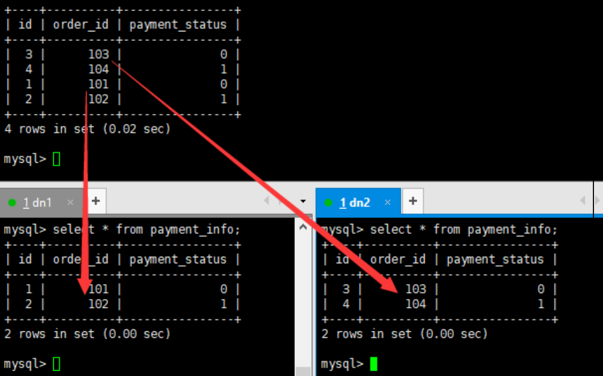
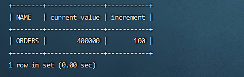
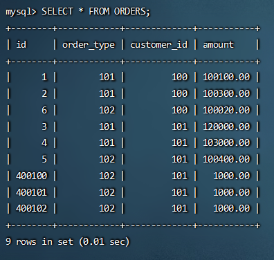
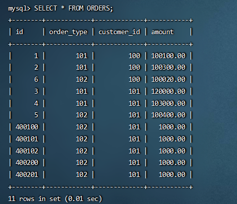

# 常用分片规则

## 取模

此规则为对分片字段求摸运算。 也是水平分表最常用规则。 6.1 配置分表中， orders 表采用了此规则。

## 分片枚举

通过在配置文件中配置可能的枚举 id，自己配置分片，本规则适用于特定的场景，比如有些业务需要按照省份或区县来做保存，而全国省份区县固定的，这类业务使用本条规则。

~~~xml
<!--修改schema.xml-->
<?xml version="1.0"?>
<!DOCTYPE mycat:schema SYSTEM "schema.dtd">
<mycat:schema xmlns:mycat="http://io.mycat/">
    <schema name="TESTDB" checkSQLschema="false" sqlMaxLimit="100" dataNode="dn1">
        <table name="customer" dataNode="dn2"></table>
        <table name="orders" dataNode="dn1,dn2" rule="mod_rule">
            <!--name 子表的名称-->
            <!--joinKey 子表中与主表关联的字段名称-->
            <!--primaryKey 子表的主键-->
            <!--parentKey  对应父表中的字段-->
            <childTable name="orders_detail" primaryKey="id" joinKey="order_id" parentKey="id" />
        </table>
        <table name="dict_order_type" dataNode="dn1,dn2" type="global"></table>
        <table name="orders_ware_info" dataNode="dn1,dn2" rule="sharding_by_intfile"></table>
    </schema>
    <dataNode name="dn1" dataHost="host1" database="orders" />
    <dataNode name="dn2" dataHost="host2" database="orders" />
    <dataHost name="host1" maxCon="1000" minCon="10" balance="0" writeType="0" dbType="mysql" dbDriver="native" switchType="1" slaveThreshold="100">
        <heartbeat>select user()</heartbeat>
        <writeHost host="hostM1" url="192.168.25.11:3306" user="root" password="111111">
        </writeHost>
    </dataHost>    
    <dataHost name="host2" maxCon="1000" minCon="10" balance="0" writeType="0" dbType="mysql" dbDriver="native" switchType="1" slaveThreshold="100">
        <heartbeat>select user()</heartbeat>
        <writeHost host="hostS1" url="192.168.25.12:3306" user="root" password="111111">
        </writeHost>
    </dataHost>
</mycat:schema>
~~~

~~~xml
<!--修改rule.xml-->
<!--新增规则-->
<tableRule name="sharding_by_intfile">
    <rule>
        <!--columns：分片字段-->
        <!--algorithm：分片函数-->
        <columns>areacode</columns>
        <algorithm>hash-int</algorithm>
    </rule>
</tableRule>
------------------------------------------------------
<!--修改function-->
<function name="hash-int"
          class="io.mycat.route.function.PartitionByFileMap">	
    <!--mapFile：标识配置文件名称-->
    <!--type：0为int型、 非0为String-->
    <!--defaultNode：默认节点:小于 0 表示不设置默认节点，大于等于 0 表示设置默认节点(从0开始)，
  设置默认节点如果碰到不识别的枚举值，就让它路由到默认节点，如不设置不识别就报错-->
    <property name="mapFile">partition-hash-int.txt</property>
    <property name="type">1</property>
    <property name="defaultNode">0</property>
</function>
~~~

~~~tex
##areacode为110的分配到dn1，120分配到dn2
110=0
120=1
~~~

~~~sql
#（4） 重启 Mycat
#（5） 访问Mycat创建表
#订单归属区域信息表
CREATE TABLE orders_ware_info
(
`id` INT AUTO_INCREMENT comment '编号',
`order_id` INT comment '订单编号',
`address` VARCHAR(200) comment '地址',
`areacode` VARCHAR(20) comment '区域编号',
PRIMARY KEY(id)
);
#（6） 插入数据
INSERT INTO orders_ware_info(id, order_id,address,areacode) VALUES (1,1,'北京','110');
INSERT INTO orders_ware_info(id, order_id,address,areacode) VALUES (2,2,'天津','120');
~~~


## 范围约定

此分片适用于，提前规划好分片字段某个范围属于哪个分片。

~~~xml
<!--修改schema.xml-->
<?xml version="1.0"?>
<!DOCTYPE mycat:schema SYSTEM "schema.dtd">
<mycat:schema xmlns:mycat="http://io.mycat/">
    <schema name="TESTDB" checkSQLschema="false" sqlMaxLimit="100" dataNode="dn1">
        <table name="customer" dataNode="dn2"></table>
        <table name="orders" dataNode="dn1,dn2" rule="mod_rule">
            <!--name 子表的名称-->
            <!--joinKey 子表中与主表关联的字段名称-->
            <!--primaryKey 子表的主键-->
            <!--parentKey  对应父表中的字段-->
            <childTable name="orders_detail" primaryKey="id" joinKey="order_id" parentKey="id" />
        </table>
        <table name="dict_order_type" dataNode="dn1,dn2" type="global"></table>
        <table name="orders_ware_info" dataNode="dn1,dn2" rule="sharding_by_intfile"></table>
        <table name="payment_info" dataNode="dn1,dn2" rule="auto_sharding_long"></table>
    </schema>
    <dataNode name="dn1" dataHost="host1" database="orders" />
    <dataNode name="dn2" dataHost="host2" database="orders" />
    <dataHost name="host1" maxCon="1000" minCon="10" balance="0" writeType="0" dbType="mysql" dbDriver="native" switchType="1" slaveThreshold="100">
        <heartbeat>select user()</heartbeat>
        <writeHost host="hostM1" url="192.168.25.11:3306" user="root" password="111111">
        </writeHost>
    </dataHost>    
    <dataHost name="host2" maxCon="1000" minCon="10" balance="0" writeType="0" dbType="mysql" dbDriver="native" switchType="1" slaveThreshold="100">
        <heartbeat>select user()</heartbeat>
        <writeHost host="hostS1" url="192.168.25.12:3306" user="root" password="111111">
        </writeHost>
    </dataHost>
</mycat:schema>
~~~

~~~xml
<!--修改rule.xml-->
<tableRule name="auto_sharding_long">
    <rule>
        <columns>order_id</columns>
        <algorithm>rang-long</algorithm>
    </rule>
</tableRule>
----------------------------------------------------
<!--新增规则-->
<tableRule name="auto_sharding_long">
    <rule>
        <columns>order_id</columns>
        <algorithm>rang-long</algorithm>
    </rule>
</tableRule>
-----------------------------------------------------
<!--修改算法-->
<function name="rang-long"
    class="io.mycat.route.function.AutoPartitionByLong">
    <property name="mapFile">autopartition-long.txt</property>
    <property name="defaultNode">0</property>
</function>
~~~

~~~tex
# 修改autopartition-long.txt配置文件
0-102=0
103-200=1
~~~

~~~sql
# 重启 Mycat
# 访问Mycat创建表
#支付信息表
CREATE TABLE payment_info
(
`id` INT AUTO_INCREMENT comment '编号',
`order_id` INT comment '订单编号',
`payment_status` INT comment '支付状态',
PRIMARY KEY(id)
);
# 插入数据
INSERT INTO payment_info (id,order_id,payment_status) VALUES (1,101,0);
INSERT INTO payment_info (id,order_id,payment_status) VALUES (2,102,1);
INSERT INTO payment_info (id,order_id,payment_status) VALUES (3,103,0);
INSERT INTO payment_info (id,order_id,payment_status) VALUES (4,104,1);
# 查询Mycat、 dn1、 dn2可以看到数据分片效果
~~~



## 按日期（天）分片

~~~xml
1） 修改schema.xml配置文件
<table name="login_info" dataNode="dn1,dn2" rule="sharding_by_date"></table>
2） 修改rule.xml配置文件
<tableRule name="sharding_by_date">
    <rule>
        <columns>login_date</columns>
        <algorithm>shardingByDate</algorithm>
    </rule>
</tableRule>
--------------------------------------------------------
<!--dateFormat：日期格式-->
<!--sBeginDate：开始日期-->
<!--sEndDate：结束日期,则代表数据达到了这个日期的分片后循环从开始分片插入-->
<!--sPartionDay：分区天数，即默认从开始日期算起，分隔 2 天一个分区-->
<function name="shardingByDate" class="io.mycat.route.function.PartitionByDate">
    <property name="dateFormat">yyyy-MM-dd</property>
    <property name="sBeginDate">2022-05-27</property>
    <property name="sEndDate">2022-05-31</property>
	<!--sBeginDate-sEndDate的天数/sPartionDay <= 节点数，否则会报错-->
    <property name="sPartionDay">3</property>
</function>
~~~

~~~sql
3） 重启 Mycat
4） 访问Mycat创建表
#用户信息表
CREATE TABLE login_info
(
`id` INT AUTO_INCREMENT comment '编号',
`user_id` INT comment '用户编号',
`login_date` date comment '登录日期',
PRIMARY KEY(id)
);
6） 插入数据
INSERT INTO login_info(id,user_id,login_date) VALUES (1,101,'2022-05-27');
INSERT INTO login_info(id,user_id,login_date) VALUES (2,102,'2022-05-28');
INSERT INTO login_info(id,user_id,login_date) VALUES (3,103,'2022-05-29');
INSERT INTO login_info(id,user_id,login_date) VALUES (4,104,'2022-05-30');
INSERT INTO login_info(id,user_id,login_date) VALUES (5,103,'2022-05-31');
INSERT INTO login_info(id,user_id,login_date) VALUES (6,104,'2022-06-01');
INSERT INTO login_info(id,user_id,login_date) VALUES (7,104,'2022-06-02');
INSERT INTO login_info(id,user_id,login_date) VALUES (8,104,'2022-06-03');
7） 查询Mycat、 dn1、 dn2可以看到数据分片效果
~~~

## 全局序列

在实现分库分表的情况下，数据库自增主键已无法保证自增主键的全局唯一。为此， Mycat 提供了全局 sequence，并且提供了包含本地配置和数据库配置等多种实现方式。

### 本地文件

此方式 Mycat 将 sequence 配置到文件中，当使用到 sequence 中的配置后， Mycat 会更下classpath 中的 sequence_conf.properties文件中 sequence 当前的值。

* 优点： 本地加载，读取速度较快
* 缺点： 抗风险能力差， Mycat 所在主机宕机后，无法读取本地文件。

### 数据库方式

利用数据库一个表 来进行计数累加。但是并不是每次生成序列都读写数据库，这样效率太低。Mycat 会预加载一部分号段到 Mycat 的内存中，这样大部分读写序列都是在内存中完成的。如果内存中的号段用完了 Mycat 会再向数据库要一次。

> 问：那如果 Mycat 崩溃了 ，那内存中的序列岂不是都没了？
> 是的。如果是这样，那么 Mycat 启动后会向数据库申请新的号段，原有号段会弃用。也就是说如果 Mycat 重启，那么损失是当前的号段没用完的号码，但是不会因此出现主键重复 。

~~~sql
#建库序列脚本
#在 dn1 上创建全局序列表
CREATE TABLE MYCAT_SEQUENCE (NAME VARCHAR(50) NOT NULL,current_value INT NOT NULL,increment INT NOT NULL DEFAULT 100, PRIMARY KEY(NAME)) ENGINE=INNODB;
#创建全局序列所需函数
DELIMITER $$
CREATE FUNCTION mycat_seq_currval(seq_name VARCHAR(50)) RETURNS VARCHAR(64)
DETERMINISTIC
BEGIN
DECLARE retval VARCHAR(64);
SET retval="-999999999,null";
SELECT CONCAT(CAST(current_value AS CHAR),",",CAST(increment AS CHAR)) INTO retval FROM
MYCAT_SEQUENCE WHERE NAME = seq_name;
RETURN retval;
END $$
DELIMITER;

#创建全局序列所需函数
DELIMITER $$
CREATE FUNCTION mycat_seq_setval(seq_name VARCHAR(50),VALUE INTEGER) RETURNS
VARCHAR(64)
DETERMINISTIC
BEGIN
UPDATE MYCAT_SEQUENCE
SET current_value = VALUE
WHERE NAME = seq_name;
RETURN mycat_seq_currval(seq_name);
END $$
DELIMITER;

#创建全局序列所需函数
DELIMITER $$
CREATE FUNCTION mycat_seq_nextval(seq_name VARCHAR(50)) RETURNS VARCHAR(64)
DETERMINISTIC
BEGIN
UPDATE MYCAT_SEQUENCE
SET current_value = current_value + increment WHERE NAME = seq_name;
RETURN mycat_seq_currval(seq_name);
END $$
DELIMITER;

#初始化序列表记录
INSERT INTO MYCAT_SEQUENCE(NAME,current_value,increment) VALUES ('ORDERS', 400000,100);
~~~



~~~properties
#修改sequence_db_conf.properties
#sequence stored in datanode
GLOBAL=dn1
COMPANY=dn1
CUSTOMER=dn1
#意思是 ORDERS这个序列在dn1这个节点上，
ORDERS=dn1
~~~

~~~xml
<!--修改server.xml-->
<!--全局序列类型： 0-本地文件， 1-数据库方式， 2-时间戳方式。此处应该修改成1。-->
<property name="sequenceHandlerType">1</property>
<!--重启Mycat-->
~~~

~~~sql
#登录 Mycat，插入数据
insert into orders(id,amount,customer_id,order_type) values(next value for MYCATSEQ_ORDERS,1000,101,102);
~~~



~~~tex
重启Mycat，并且再次插入数据
~~~



> **<font color="red">TIPS:</font>**
>
> 如果在新增函数的时候报错，提示如下
>
> ```sh
> Error Code: 1418. This function has none of DETERMINISTIC, NO SQL, or READS SQL DATA in its declaration and binary logging is enabled (you *might* want to use the less safe log_bin_trust_function_creators variable)
> ```
>
> <font color="green">原因是因为在主从复制的两台MySQL服务器中开启了二进制日志选项log-bin,slave会从master复制数据，而一些操作，比如function所得的结果在master和slave上可能不同，所以存在潜在的安全隐患。因此，在默认情况下回阻止function的创建。</font>
>
> ~~~properties
> # 解决方案
> ## 在my.cnf下增加配置
> log_bin_trust_function_creators=1
> ~~~

### 时间戳方式

全局序列ID= 64 位二进制 (42(毫秒)+5(机器 ID)+5(业务编码)+12(重复累加) 换算成十进制为 18 位数的long 类型，每毫秒可以并发 12 位二进制的累加。

* 优点： 配置简单
* 缺点： 18 位 ID 过长

### 自主生成全局序列

可在 java 项目里自己生成全局序列，如下：

* 根据业务逻辑组合
* 可以利用 redis 的单线程原子性 incr 来生成序列，但自主生成需要单独在工程中用 java 代码实现， 还是推荐使用 Mycat 自带全局序列。  

