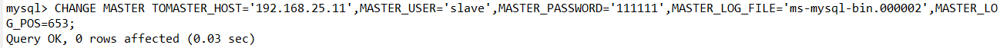

# 搭建读写分离

## 一主一从

修改MySQL配置文件

### 主节点

修改my.cnf

~~~properties
[client]
default-character-set=utf8mb4

[mysqld]
default-authentication-plugin=mysql_native_password
explicit_defaults_for_timestamp=true
lower_case_table_names=1
sql_mode=STRICT_TRANS_TABLES,ERROR_FOR_DIVISION_BY_ZERO,NO_ENGINE_SUBSTITUTION

# 服务器唯一ID，默认是1
server-id=1

## 开启二进制日志功能
log-bin=ms-mysql-bin
log_bin_trust_function_creators=1

## 指定不需要同步的数据库名称, 可指定多个
binlog-ignore-db=mysql
binlog-ignore-db=sys
binlog-ignore-db=information_schema
binlog-ignore-db=performance_schema

## 指定同步的数据库，可指定多个
binlog-do-db=testdb

## 二进制日志使用内存大小（事务）
binlog_cache_size=1M

## 二进制日志格式(mixed, statement,row)
# statement: 将写操作语句添加到binlog,然后在slave机运行。缺点：语句中有now()时，会造成数据不一致
# row: 记录每一行的改变,然后在slave机更新。缺点：批量更新时，会在slave机执行大量update
# mixed: 有类似now()这种会造成数据不一致的函数时，使用row模式，否则还是使用statement模式。
binlog_format=mixed

## 二进制日志过期清理时间，默认2592000秒（30天），604800秒（7天）
binlog_expire_logs_seconds=604800

## 跳过主从复制中遇到的所有错误或指定类型的错误，避免slave复制中断
replica_skip_errors=1062
~~~

### 从节点

my.cnf

~~~properties
[client]
default-character-set=utf8mb4

[mysqld]
default-authentication-plugin=mysql_native_password
explicit_defaults_for_timestamp=true
lower_case_table_names=1
sql_mode=STRICT_TRANS_TABLES,ERROR_FOR_DIVISION_BY_ZERO,NO_ENGINE_SUBSTITUTION

## serverId,局域网内唯一
server_id=2

## 指定不需要同步的数据库名称
binlog-ignore-db=mysql
binlog-ignore-db=sys
binlog-ignore-db=information_schema
binlog-ignore-db=performance_schema

## 开启二进制日志功能
log-bin=ms-mysql-slave11-bin
log_bin_trust_function_creators=1
## 二进制日志使用内存大小（事务）
binlog_cache_size=1M

## 二进制日志格式(mixed, statement,row)
binlog_format=mixed

## 二进制日志过期清理时间，默认2592000秒（30天），604800秒（7天）
binlog_expire_logs_seconds=604800

## 跳过主从复制中遇到的所有错误或指定类型的错误，避免slave复制中断
replica_skip_errors=1062

## relay_log配置slave的中继日志
relay_log=ms-mysql-relay-bin

## 将复制事件写进自己的二进制日志
log_slave_updates=1

## 设置为只读（super权限用户除外）
read_only=1
~~~

### 授权账户

~~~sh
#在主节点MySQL里执行授权命令
CREATE USER 'slave'@'%' IDENTIFIED WITH mysql_native_password BY '111111';
GRANT REPLICATION SLAVE ON *.* TO 'slave'@'%';
#查询master的状态
show master status;
#记录下File和Position的值
#执行完此步骤后不要再操作主服务器MySQL，防止主服务器状态值变化
~~~

~~~sh
# 在从节点输入刚刚记录的值
CHANGE MASTER TO
MASTER_HOST='192.168.25.11', #为Master节点地址
MASTER_USER='slave',		 #为刚刚创建的账户
MASTER_PASSWORD='111111',
MASTER_LOG_FILE='ms-mysql-bin.000002',
MASTER_LOG_POS=653;
~~~

~~~sh
#启动从服务器复制功能
start slave;
#查看从服务器状态
show slave status;
~~~

### 修改MyCat配置文件

**之前的配置已分配了读写主机，是否已实现读写分离？**

验证读写分离

1. 在写主机插入： insert into test values (1,@@hostname); 
2. 在Mycat里查询： select * from test;

发现主从不一致了。

schema.xml文件

修改`<dataHost>`的balance属性，通过此属性配置读写分离的类型

负载均衡类型，目前的取值有4 种： 

* balance="0", 不开启读写分离机制， 所有读操作都发送到当前可用的 writeHost 上。
* balance="1"，全部的 readHost 与 stand by writeHost 参与 select 语句的负载均衡，简单的说，当双主双从 模式(M1->S1， M2->S2，并且 M1 与 M2 互为主备)，正常情况下， M2,S1,S2 都参与 select 语句的负载均衡。
* balance="2"，所有读操作都随机的在 writeHost、 readhost 上分发。
* balance="3"，所有读请求随机的分发到 readhost 执行， writerHost 不负担读压力

**一般设置为1或者3**

为了能够让效果比较明显，将balance设置为2。

~~~xml
<dataHost name="192.168.25.11" maxCon="1000" minCon="10" balance="2"
			  writeType="0" dbType="mysql" dbDriver="native" switchType="1"  slaveThreshold="100">
		<heartbeat>select user()</heartbeat>
		<!-- can have multi write hosts -->
		<writeHost host="hostM1" url="192.168.25.11:3306" user="root"
				   password="111111">
			<!-- can have multi read hosts -->
			<readHost host="hostS1" url="192.168.25.12:3306" user="root" password="111111" />
		</writeHost>
</dataHost>
~~~

### 验证

1. 在写主机上插入INSERT INTO test VALUES(2,@@hostname);
2. 在MyCat里面进行查询，会看到查询结果会在两台机器上切换

## 双主双从

一个主机 m1 用于处理所有写请求，它的从机 s1 和另一台主机 m2 还有它的从机 s2 负责所有读请求。当 m1 主机宕机后，m2 主机负责写请求，m1、 m2 互为备机。架构图如下。

|     主机      | 端口 |  密码  |  名称   |
| :-----------: | :--: | :----: | :-----: |
| 192.168.25.11 | 3306 | 111111 | Master1 |
| 192.168.25.11 | 3307 | 111111 | Master2 |
| 192.168.25.12 | 3306 | 111111 | Slave1  |
| 192.168.25.12 | 3307 | 111111 | Slave2  |

### 主节点

~~~properties
#Master1的配置文件
[client]
default-character-set=utf8mb4
[mysql]
default-character-set=utf8mb4
[mysqld]
default-authentication-plugin=mysql_native_password
explicit_defaults_for_timestamp=true
#不区分大小写
lower_case_table_names=1
#启用二进制日志
log-bin=mysql-bin
log_bin_trust_function_creators=1
#主服务器唯一ID
server-id=1
#语法校验规则
sql_mode=ONLY_FULL_GROUP_BY,STRICT_TRANS_TABLES,NO_ZERO_IN_DATE,NO_ZERO_DATE,ERROR_FOR_DIVISION_BY_ZERO,NO_ENGINE_SUBSTITUTION
#设置logbin格式
binlog_format=STATEMENT
# 在作为从数据库的时候， 有写入操作也要更新二进制日志文件
log-slave-updates
#表示自增长字段每次递增的量，指自增字段的起始值，其默认值是1， 取值范围是1 .. 65535
auto-increment-increment=2
# 表示自增长字段从哪个数开始，指字段一次递增多少，他的取值范围是1 .. 65535
auto-increment-offset=1
#不需要复制的库
binlog-ignore-db=information_schema
binlog-ignore-db=mysql
binlog-ignore-db=performance_schema
binlog-ignore-db=sys
#设置需要复制的数据库
binlog-do-db=testdb
~~~

~~~properties
#Master2的配置文件
[client]
default-character-set=utf8mb4
[mysql]
default-character-set=utf8mb4
[mysqld]
default-authentication-plugin=mysql_native_password
explicit_defaults_for_timestamp=true
#不区分大小写
lower_case_table_names=1
#启用二进制日志
log-bin=mysql-bin
log_bin_trust_function_creators=1
#主服务器唯一ID
server-id=3
#语法校验规则
sql_mode=ONLY_FULL_GROUP_BY,STRICT_TRANS_TABLES,NO_ZERO_IN_DATE,NO_ZERO_DATE,ERROR_FOR_DIVISION_BY_ZERO,NO_ENGINE_SUBSTITUTION
#设置logbin格式
binlog_format=STATEMENT
# 在作为从数据库的时候， 有写入操作也要更新二进制日志文件
log-slave-updates
#表示自增长字段每次递增的量，指自增字段的起始值，其默认值是1， 取值范围是1 .. 65535
auto-increment-increment=2
# 表示自增长字段从哪个数开始，指字段一次递增多少，他的取值范围是1 .. 65535
auto-increment-offset=2
#不需要复制的库
binlog-ignore-db=information_schema
binlog-ignore-db=mysql
binlog-ignore-db=performance_schema
binlog-ignore-db=sys
#设置需要复制的数据库
binlog-do-db=testdb
~~~

~~~yaml
# docker-compose.yml
version: '3.1'
services:
  master1:
    image: mysql
    container_name: master1
    restart: always
    environment:
      MYSQL_ROOT_PASSWORD: 111111
    command:
      --character-set-server=utf8mb4
      --collation-server=utf8mb4_general_ci
    ports:
      - 3306:3306
    volumes:
      - ./master1/data:/var/lib/mysql
      - ./master1/conf:/etc/mysql/
      - ./master1/log:/var/log/mysql
      - ./master1/mysql-files:/var/lib/mysql-files/
  master2:
    image: mysql
    container_name: master2
    restart: always
    environment:
      MYSQL_ROOT_PASSWORD: 111111
    command:
      --character-set-server=utf8mb4
      --collation-server=utf8mb4_general_ci
    ports:
      - 3307:3306
    volumes:
      - ./master2/data:/var/lib/mysql
      - ./master2/conf:/etc/mysql/
      - ./master2/log:/var/log/mysql
      - ./master2/mysql-files:/var/lib/mysql-files/
~~~

### 从节点

~~~properties
#Slave1的配置文件
[client]
default-character-set=utf8mb4
[mysqld]
default-authentication-plugin=mysql_native_password
explicit_defaults_for_timestamp=true
#启用二进制日志
log-bin = mysql-bin
log_bin_trust_function_creators=1
server-id = 2
#不区分大小写
lower_case_table_names=1
sql_mode=ONLY_FULL_GROUP_BY,STRICT_TRANS_TABLES,NO_ZERO_IN_DATE,NO_ZERO_DATE,ERROR_FOR_DIVISION_BY_ZERO,NO_ENGINE_SUBSTITUTION
#启用中继日志
relay-log=mysql-relay
~~~

~~~properties
#Slave2的配置文件
[client]
default-character-set=utf8mb4
[mysqld]
default-authentication-plugin=mysql_native_password
explicit_defaults_for_timestamp=true
#启用二进制日志
log-bin = mysql-bin
log_bin_trust_function_creators=1
server-id = 4
#不区分大小写
lower_case_table_names=1
sql_mode=ONLY_FULL_GROUP_BY,STRICT_TRANS_TABLES,NO_ZERO_IN_DATE,NO_ZERO_DATE,ERROR_FOR_DIVISION_BY_ZERO,NO_ENGINE_SUBSTITUTION
#启用中继日志
relay-log=mysql-relay
~~~

~~~yaml
#docker-compose.yml
version: '3.1'
services:
  slave1:
    image: mysql
    container_name: slave1
    restart: always
    environment:
      MYSQL_ROOT_PASSWORD: 111111
    command:
      --character-set-server=utf8mb4
      --collation-server=utf8mb4_general_ci
    ports:
      - 3306:3306
    volumes:
      - ./slave1/data:/var/lib/mysql
      - ./slave1/conf:/etc/mysql/
      - ./slave1/log:/var/log/mysql
      - ./slave1/mysql-files:/var/lib/mysql-files/
  slave2:
    image: mysql
    container_name: slave2
    restart: always
    environment:
      MYSQL_ROOT_PASSWORD: 111111
    command:
      --character-set-server=utf8mb4
      --collation-server=utf8mb4_general_ci
    ports:
      - 3307:3306
    volumes:
      - ./slave2/data:/var/lib/mysql
      - ./slave2/conf:/etc/mysql/
      - ./slave2/log:/var/log/mysql
      - ./slave2/mysql-files:/var/lib/mysql-files/
~~~

### 授权账号

~~~sh
#在主机MySQL里执行授权命令
CREATE USER 'slave'@'%' IDENTIFIED WITH mysql_native_password BY '111111';
GRANT REPLICATION SLAVE ON *.* TO 'slave'@'%';
#查询Master1和2的状态
show master status;
#分别记录下File和Position的值
#执行完此步骤后不要再操作主服务器MYSQL，防止主服务器状态值变化！！！
~~~

~~~sh
#在从主机上执行
CHANGE MASTER TO MASTER_HOST='192.168.25.11',
MASTER_USER='slave',
MASTER_PASSWORD='111111',
MASTER_PORT=3306,  #需要指定，slave1对应的3306，slave2对应的3307
MASTER_LOG_FILE='mysql-bin.000003', #记录的值
MASTER_LOG_POS=663;
#启动
START SLAVE;
#查看状态
show slave status;
# Slave_IO_Running: Yes
# Slave_SQL_Running: Yes
#证明搭建完成
~~~

### 修改MyCat配置文件

修改schema.xml

~~~xml
<?xml version="1.0"?>
<!DOCTYPE mycat:schema SYSTEM "schema.dtd">
<mycat:schema xmlns:mycat="http://io.mycat/">
    <schema name="TESTDB" checkSQLschema="false" sqlMaxLimit="100" dataNode="dn1"></schema>
    <dataNode name="dn1" dataHost="host1" database="testdb" />
    <dataHost name="host1" maxCon="1000" minCon="10" balance="1" writeType="0" dbType="mysql" dbDriver="native" switchType="1" slaveThreshold="100">
        <heartbeat>select user()</heartbeat>
        <!-- can have multi write hosts -->
        <writeHost host="hostM1" url="192.168.25.11:3306" user="root" password="111111">
            <!-- can have multi read hosts -->
            <readHost host="hostS1" url="192.168.25.12:3306" user="root" password="111111" />
        </writeHost>
        <writeHost host="hostM2" url="192.168.25.11:3307" user="root" password="111111">
            <!-- can have multi read hosts -->
            <readHost host="hostS2" url="192.168.25.12:3307" user="root" password="111111" />
        </writeHost>
    </dataHost>
</mycat:schema>
~~~

* writeType="0": 所有写操作发送到配置的第一个writeHost，第一个挂了切到还生存的第二个。
* writeType="1"，所有写操作都随机的发送到配置的 writeHost， 1.5 以后废弃不推荐。
* writeHost，重新启动后以切换后的为准，切换记录在配置文件中:dnindex.properties。 
* switchType="1": 1 默认值，自动切换。 
  * -1 表示不自动切换。
  * 2 基于 MySQL 主从同步的状态决定是否切换。