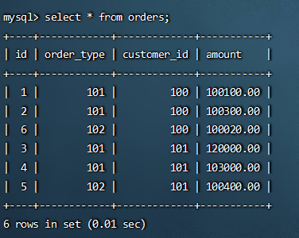
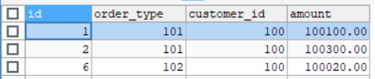
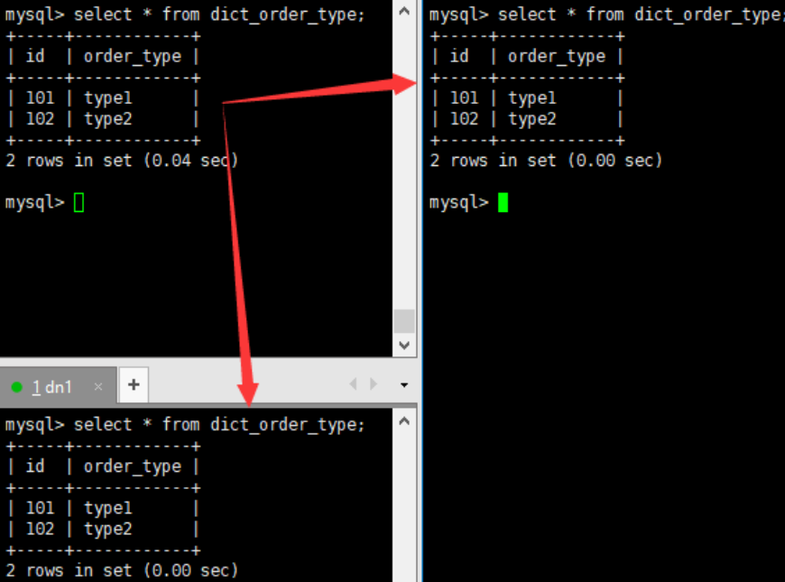

# 水平拆分—分表

相对于垂直拆分，水平拆分不是将表做分类，而是按照某个字段的某种规则来分散到多个库之中，每个表中 包含一部分数据。简单来说，我们可以将数据的水平切分理解为是按照数据行的切分，就是将表中的某些行切分 到一个数据库，而另外的某些行又切分到其他的数据库中，如图：

## 实现分表

1. 选择要拆分的表
   MySQL 单表存储数据条数是有瓶颈的，单表达到 1000 万条数据就达到了瓶颈，会影响查询效率，需要进行水平拆分（分表） 进行优化。例如：例子中的 orders、 orders_detail 都已经达到 600 万行数据，需要进行分表优化。

2. 分表字段

   以 orders 表为例，可以根据不同自字段进行分表

   | 编号 |        分表字段         |                             效果                             |
   | :--: | :---------------------: | :----------------------------------------------------------: |
   |  1   | id（主键、 或创建时间） | 查询订单注重时效，历史订单被查询的次数少，如此分片会造成一个节点访问多，一个访问少，不平均 |
   |  2   | customer_id（客户 id）  | 根据客户 id 去分，两个节点访问平均，一个客户的所 有订单都在同一个节点 |

3. 修改schema.xml

   ~~~xml
   <?xml version="1.0"?>
   <!DOCTYPE mycat:schema SYSTEM "schema.dtd">
   <mycat:schema xmlns:mycat="http://io.mycat/">
       <schema name="TESTDB" checkSQLschema="false" sqlMaxLimit="100" dataNode="dn1">
           <table name="customer" dataNode="dn2"></table>
           <!--为 orders 表设置数据节点为 dn1、 dn2， 并指定分片规则为 mod_rule（自定义的名字）-->
           <table name="orders" dataNode="dn1,dn2" rule="mod_rule"></table>
       </schema>
       <dataNode name="dn1" dataHost="host1" database="orders" />
       <dataNode name="dn2" dataHost="host2" database="orders" />
       <dataHost name="host1" maxCon="1000" minCon="10" balance="0" writeType="0" dbType="mysql" dbDriver="native" switchType="1" slaveThreshold="100">
           <heartbeat>select user()</heartbeat>
           <writeHost host="hostM1" url="192.168.25.11:3306" user="root" password="111111">
           </writeHost>
       </dataHost>    
       <dataHost name="host2" maxCon="1000" minCon="10" balance="0" writeType="0" dbType="mysql" dbDriver="native" switchType="1" slaveThreshold="100">
           <heartbeat>select user()</heartbeat>
           <writeHost host="hostS1" url="192.168.25.12:3306" user="root" password="111111">
           </writeHost>
       </dataHost>
   </mycat:schema>
   ~~~

4. 修改rule.xml

   ~~~xml
   <!--在 rule 配置文件里新增分片规则 mod_rule，并指定规则适用字段为 customer_id，-->
   <tableRule name="mod_rule">
       <rule>
           <!--对应的数据库字段-->
           <columns>customer_id</columns>
           <!--指定算法-->
           <algorithm>mod-long</algorithm>
       </rule>
   </tableRule>
   ------------------------------------------------------------------------------
   <function name="mod-long" class="io.mycat.route.function.PartitionByMod">
       <!--指定节点数-->
       <property name="count">2</property>
   </function>
   
   ~~~

5. 重启MyCat，并且在dn2创建orders表

6. 测试

   ~~~sql
   #在mycat中新增数据
   #在 mycat 里向 orders 表插入数据， INSERT 字段不能省略，否则会报错
   INSERT INTO orders(id,order_type,customer_id,amount) VALUES(1,101,100,100100);
   INSERT INTO orders(id,order_type,customer_id,amount) VALUES(2,101,100,100300);
   INSERT INTO orders(id,order_type,customer_id,amount) VALUES(3,101,101,120000);
   INSERT INTO orders(id,order_type,customer_id,amount) VALUES(4,101,101,103000);
   INSERT INTO orders(id,order_type,customer_id,amount) VALUES(5,102,101,100400);
   INSERT INTO orders(id,order_type,customer_id,amount) VALUES(6,102,100,100020);
   ~~~

   查看两个数据库中的数据

   

   

## Mycat 的分片 “join”

Orders 订单表已经进行分表操作了，和它关联的 orders_detail 订单详情表如何进行 join 查询。我们要对 orders_detail 也要进行分片操作。 Join 的原理如下图：  

1. ER 表
   Mycat 借鉴了 NewSQL 领域的新秀 Foundation DB 的设计思路， Foundation DB 创新性的提出了 Table Group 的概念，其将子表的存储位置依赖于主表，并且物理上紧邻存放，因此彻底解决了JOIN 的效率和性能问 题，根据这一思路，提出了基于 E-R 关系的数据分片策略，子表的记录与所关联的父表记录存放在同一个数据分片上。  

   ~~~xml
   <?xml version="1.0"?>
   <!DOCTYPE mycat:schema SYSTEM "schema.dtd">
   <mycat:schema xmlns:mycat="http://io.mycat/">
       <schema name="TESTDB" checkSQLschema="false" sqlMaxLimit="100" dataNode="dn1">
           <table name="customer" dataNode="dn2"></table>
           <table name="orders" dataNode="dn1,dn2" rule="mod_rule">
               <!--name 子表的名称-->
               <!--joinKey 子表中与主表关联的字段名称-->
               <!--primaryKey 子表的主键-->
               <!--parentKey  对应父表中的字段-->
               <childTable name="orders_detail" primaryKey="id" joinKey="order_id" parentKey="id" />
           </table>
       </schema>
       <dataNode name="dn1" dataHost="host1" database="orders" />
       <dataNode name="dn2" dataHost="host2" database="orders" />
       <dataHost name="host1" maxCon="1000" minCon="10" balance="0" writeType="0" dbType="mysql" dbDriver="native" switchType="1" slaveThreshold="100">
           <heartbeat>select user()</heartbeat>
           <writeHost host="hostM1" url="192.168.25.11:3306" user="root" password="111111">
           </writeHost>
       </dataHost>    
       <dataHost name="host2" maxCon="1000" minCon="10" balance="0" writeType="0" dbType="mysql" dbDriver="native" switchType="1" slaveThreshold="100">
           <heartbeat>select user()</heartbeat>
           <writeHost host="hostS1" url="192.168.25.12:3306" user="root" password="111111">
           </writeHost>
       </dataHost>
   </mycat:schema>
   ~~~

   ~~~sql
   #在dn2上创建orders_detail表，重启mycat
   #访问 Mycat 向 orders_detail 表插入数据
   INSERT INTO orders_detail(id,detail,order_id) values(1,'detail1',1);
   INSERT INTO orders_detail(id,detail,order_id) VALUES(2,'detail1',2);
   INSERT INTO orders_detail(id,detail,order_id) VALUES(3,'detail1',3);
   INSERT INTO orders_detail(id,detail,order_id) VALUES(4,'detail1',4);
   INSERT INTO orders_detail(id,detail,order_id) VALUES(5,'detail1',5);
   INSERT INTO orders_detail(id,detail,order_id) VALUES(6,'detail1',6);
   #在mycat、 dn1、 dn2中运行两个表join语句
   select o.*,od.detail from orders o inner join orders_detail od on o.id=od.order_id;
   ~~~

   

2. 全局表

   在分片的情况下，当业务表因为规模而进行分片以后，业务表与这些附属的字典表之间的关联，就成了比较 棘手的问题，考虑到字典表具有以下几个特性：

   * 变动不频繁
   * 数据量总体变化不大
   * 数据规模不大，很少有超过数十万条记录

   鉴于此， Mycat 定义了一种特殊的表，称之为“全局表”，全局表具有以下特性：

   * 全局表的插入、更新操作会实时在所有节点上执行，保持各个分片的数据一致性
   * 全局表的查询操作，只从一个节点获取
   * 全局表可以跟任何一个表进行 JOIN 操作  

   简单来说每个分片节点上都有这张表，都会运行创建表的DDL语句。多份写入，多处读取。比如说数据库有一张表总体变动很小，而其它的查询操作经常需要关联此表，那么这个表就适合做成mycat全局表。

   ~~~xml
   <!--修改schema.xml-->
   <?xml version="1.0"?>
   <!DOCTYPE mycat:schema SYSTEM "schema.dtd">
   <mycat:schema xmlns:mycat="http://io.mycat/">
       <schema name="TESTDB" checkSQLschema="false" sqlMaxLimit="100" dataNode="dn1">
           <table name="customer" dataNode="dn2"></table>
           <table name="orders" dataNode="dn1,dn2" rule="mod_rule">
               <!--name 子表的名称-->
               <!--joinKey 子表中与主表关联的字段名称-->
               <!--primaryKey 子表的主键-->
               <!--parentKey  对应父表中的字段-->
               <childTable name="orders_detail" primaryKey="id" joinKey="order_id" parentKey="id" />
           </table>
           <table name="dict_order_type" dataNode="dn1,dn2" type="global"></table>
       </schema>
       <dataNode name="dn1" dataHost="host1" database="orders" />
       <dataNode name="dn2" dataHost="host2" database="orders" />
       <dataHost name="host1" maxCon="1000" minCon="10" balance="0" writeType="0" dbType="mysql" dbDriver="native" switchType="1" slaveThreshold="100">
           <heartbeat>select user()</heartbeat>
           <writeHost host="hostM1" url="192.168.25.11:3306" user="root" password="111111">
           </writeHost>
       </dataHost>    
       <dataHost name="host2" maxCon="1000" minCon="10" balance="0" writeType="0" dbType="mysql" dbDriver="native" switchType="1" slaveThreshold="100">
           <heartbeat>select user()</heartbeat>
           <writeHost host="hostS1" url="192.168.25.12:3306" user="root" password="111111">
           </writeHost>
       </dataHost>
   </mycat:schema>
   ~~~

   ~~~sql
   #在dn2 创建 dict_order_type 表
   #重启 Mycat
   #访问 Mycat 向 dict_order_type 表插入数据
   INSERT INTO dict_order_type(id,order_type) VALUES(101,'type1');
   INSERT INTO dict_order_type(id,order_type) VALUES(102,'type2');
   #在Mycat、 dn1、 dn2中查询表数据
   ~~~

   
