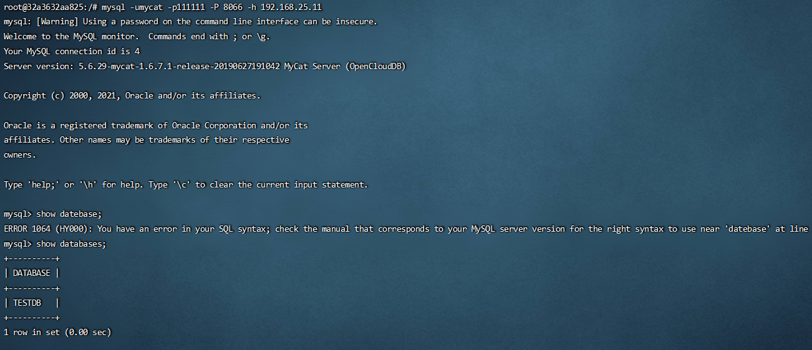

# 登录

## 登录后台管理窗口

此登录方式用于管理维护 Mycat

~~~sh
mysql -umycat -p111111 -P 9066 -h 192.168.25.11
~~~

## 登录数据窗口

此登录方式用于通过 Mycat 查询数据，我们选择这种方式访问 Mycat 

~~~sh
mysql -umycat -p111111 -P 8066 -h 192.168.25.11
~~~

