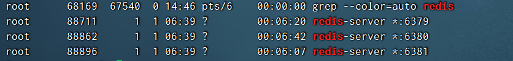
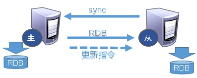
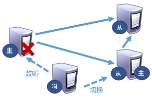
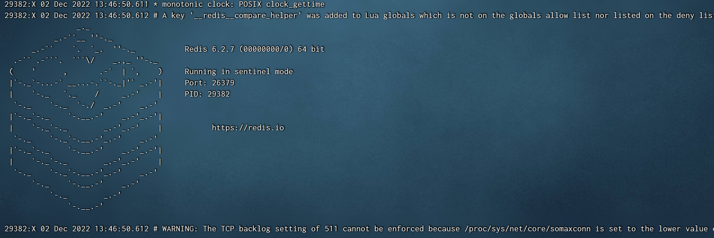

# Redis 主从复制

## 是什么

主机数据更新后根据配置和策略， 自动同步到备机的master/slaver机制，**Master以写为主，Slave以读为主**。

## 能干嘛

* 读写分离，性能扩展
* 容灾快速恢复

## 安装

1. 拷贝多个redis.conf文件include(写绝对路径)
2. 开启daemonize yes
3. Pid文件名字pidfile
4. 指定端口port
5. Log文件名字
6. dump.rdb名字dbfilename
7. Appendonly 关掉或者换名字

### 新建 redis6379.conf，填写以下内容

~~~
include /root/myredis/redis.conf
pidfile /var/run/redis_6379.pid
port 6379
dbfilename dump6379.rdb
~~~

### 新建 redis6380.conf，填写以下内容

~~~
include /root/myredis/redis.conf
pidfile /var/run/redis_6380.pid
port 6380
dbfilename dump6380.rdb
slave-priority 10
slaveof 127.0.0.1 6379
~~~

### 新建 redis6381.conf，填写以下内容

~~~
include /root/myredis/redis.conf
pidfile /var/run/redis_6381.pid
port 6381
dbfilename dump6381.rdb
slaveof 127.0.0.1 6379
~~~

>  slave-priority 10
>
> 设置从机的优先级，值越小，优先级越高，用于选举主机时使用。默认100

### 启动三台 Redis 服务器

~~~bash
redis-server ~/myredis/redis6379.conf
redis-server ~/myredis/redis6380.conf
redis-server ~/myredis/redis6381.conf
~~~

### 查看系统进程

### 查看三台主机运行情况

`info replication`：打印主从复制的相关信息。

### 配从(库)不配主(库**)** 

`slaveof <ip> <port>`：成为某个实例的从服务器。

1. 在6380和6381上执行: `slaveof 127.0.0.1 6379`
2. 在主机上写，在从机上可以读取数据，无法写入

3. 主机挂掉，重启就行，一切如初。
4. 从机重启需重设：`slaveof 127.0.0.1 6379`

**可以将配置增加到文件中。永久生效**。

## 安装（Docker）

目录结构如下

├── redis
│   ├── docker-compose.yml
│   ├── master
│   │   ├── conf
│   │   │   └── redis.conf
│   │   └── data
│   │       ├── appendonlydir
│   │       │   ├── appendonly.aof.1.base.rdb
│   │       │   ├── appendonly.aof.1.incr.aof
│   │       │   └── appendonly.aof.manifest
│   │       └── dump.rdb
│   ├── slave1
│   │   ├── conf
│   │   │   └── redis.conf
│   │   └── data
│   │       ├── appendonlydir
│   │       │   ├── appendonly.aof.15.base.rdb
│   │       │   ├── appendonly.aof.15.incr.aof
│   │       │   └── appendonly.aof.manifest
│   │       └── dump.rdb
│   └── slave2
│       ├── conf
│       │   └── redis.conf
│       └── data
│           ├── appendonlydir
│           │   ├── appendonly.aof.15.base.rdb
│           │   ├── appendonly.aof.15.incr.aof
│           │   └── appendonly.aof.manifest
│           └── dump.rdb
└── sentinel
    ├── docker-compose.yml
    ├── sentinel1.conf
    ├── sentinel2.conf
    └── sentinel3.conf

~~~yml
version: "3.8"

services:
  master:
    image: redis:7.0.5
    container_name: redis-master
    hostname: redis-master
    restart: always
    volumes:
      - ./master/data:/data
    ports:
      - 6379:6379
    ### 这里的slave-announce-ip、slave-announce-port是宿主机IP与端口，不设置的话哨兵模式下访问的是容器内IP端口，不能为外部应用提供服务，原因是由于端口或IP映射导致的无法连接的问题。例如 docker 这种容器，当你使用了端口映射后，运行在 docker 中的 redis 是不知道正真的端口或 IP 的，所以在哨兵模式下，哨兵就无法连接到 master 和 replica。当遇到这种情况后，其实还有另一种解决方式，就是直接使用 docker 的主机网络（启动时加上 --net=host）。
    command: ["redis-server","--requirepass 111111","--masterauth 111111","--slave-announce-ip 192.168.25.10","--slave-announce-port 6379"]

  slave1:
    image: redis:7.0.5
    container_name: redis-slave-1
    hostname: redis-slave-1
    restart: always
    volumes:
      - ./slave1/data:/data
    ports:
      - 6380:6379
    command: ["redis-server","--requirepass 111111","--slaveof redis-master 6379","--masterauth 111111","--slave-announce-ip 192.168.25.10","--slave-announce-port 6380"]

  slave2:
    image: redis:7.0.5
    container_name: redis-slave-2
    hostname: redis-slave-2
    restart: always
    volumes:
      - ./slave2/data:/data
    ports:
      - 6381:6379
    command: ["redis-server","--requirepass 111111","--slaveof redis-master 6379","--masterauth 111111","--slave-announce-ip 192.168.25.10","--slave-announce-port 6381"]
~~~

~~~yaml
version: "3.8"

services:
  sentinel1:
    image: redis:7.0.5
    restart: always
    container_name: redis-sentinel-1
    ports:
      - 26379:26379
    command: ["redis-sentinel","/usr/local/etc/redis/sentinel.conf"]
    volumes:
      - ./sentinel1.conf:/usr/local/etc/redis/sentinel.conf

  sentinel2:
    image: redis:7.0.5
    restart: always
    container_name: redis-sentinel-2
    ports:
      - 26380:26379
    command: ["redis-sentinel","/usr/local/etc/redis/sentinel.conf"]
    volumes:
      - ./sentinel2.conf:/usr/local/etc/redis/sentinel.conf

  sentinel3:
    image: redis:7.0.5
    restart: always
    container_name: redis-sentinel-3
    ports:
      - 26381:26379
    command: ["redis-sentinel","/usr/local/etc/redis/sentinel.conf"]
    volumes:
      - ./sentinel3.conf:/usr/local/etc/redis/sentinel.conf

networks:
  default:
    external:
	  # 次名称是redis目录启动后自动创建的网络名称，如果没看到，可以使用down命令将其删除，就可以看到这个名称了
      name: redis_default
~~~

~~~properties
# 将此文件复制3份 分别叫做sentinel1.conf、sentinel2.conf、sentinel3.conf
port 26379
dir "/tmp"
sentinel monitor mymaster 192.168.25.10 6379 2
# 用于验证主节点和副本的密码
sentinel auth-pass mymaster 111111
sentinel down-after-milliseconds mymaster 30000
sentinel parallel-syncs mymaster 1
sentinel failover-timeout mymaster 180000
sentinel deny-scripts-reconfig yes
~~~

## 常用 3 招

### 一主二仆

* 切入点问题？slave1、slave2是从头开始复制还是从切入点开始复制?比如从k4进来，那之前的k1,k2,k3是否也可以复制？从机是否可以写？set可否？ 
  * 能复制。
  * 不可

主机shutdown后情况如何？从机是上位还是原地待命？

主机又回来了后，主机新增记录，从机还能否顺利复制？ 

其中一台从机down后情况如何？依照原有它能跟上大部队吗？

### 薪火相传

上一个Slave可以是下一个slave的Master，Slave同样可以接收其他 slaves的连接和同步请求，那么该slave作为了链条中下一个的master，可以有效减轻master的写压力，去中心化降低风险。

用 `slaveof <ip> <port>`

中途变更转向：会清除之前的数据，重新建立拷贝最新的。

风险是一旦某个slave宕机，后面的slave都没法备份。**主机挂了，从机还是从机，无法写数据了。**

### 反客为主

当一个master宕机后，后面的slave可以立刻升为master，其后面的slave不用做任何修改。

## 复制原理

* Slave启动成功连接到master后会发送一个sync命令。
* Master接到命令启动后台的存盘进程，同时收集所有接收到的用于修改数据集命令， 在后台进程执行完毕之后，master将传送整个数据文件到slave，以完成一次完全同步。
* 全量复制：而slave服务在接收到数据库文件数据后，将其存盘并加载到内存中。
* 增量复制：Master继续将新的所有收集到的修改命令依次传给slave，完成同步。
* 但是只要是重新连接master，一次完全同步（全量复制）将被自动执行。

## 哨兵模式（sentinel）

### 是什么

**反客为主的自动版**，能够后台监控主机是否故障，如果故障了根据投票数自动将从库转换为主库。

### 使用步骤

1. 调整为一主二仆模式，6379带着6380、6381。

2. 自定义的 myredis 目录下新建 sentinel.conf 文件，名字绝不能错。

3. 配置哨兵，填写内容。

   ~~~sh
   sentinel monitor mymaster 127.0.0.1 6379 1
   #其中mymaster为监控对象起的服务器名称， 1 为至少有多少个哨兵同意迁移的数量。 
   ~~~

4. 启动哨兵

   ~~~sh
   /usr/local/bin/redis-sentinel ~/myredis/sentinel.conf 
   ~~~

   

5. 当主机挂掉，从机选举中产生新的主机(大概10秒左右可以看到哨兵窗口日志，切换了新的主机)，哪个从机会被选举为主机呢？根据优先级别：slave-priority ，原主机重启后会变为从机。

   

6. 通过图形化工具连接26379端口即可访问sentinel

### 复制延时

由于所有的写操作都是先在Master上操作，然后同步更新到Slave上，所以从Master同步到Slave机器有一定的延迟，当系统很繁忙的时候，延迟问题会更加严重，Slave机器数量的增加也会使这个问题更加严重。

### 故障恢复

优先级在redis.conf中默认：slave-priority 100，值越小优先级越高，偏移量是指获得原主机数据最全的，每个redis实例启动后都会随机生成一个40位的runid。

## 代码修改

~~~java
// 在修改代码之前需要将sentinel.conf中的IP修改为真实IP，sentinel monitor mymaster 192.168.25.100 6381 1
// 否则会一直抛出Reason: redis.clients.jedis.exceptions.JedisConnectionException
public class SentinelJedisPool {

    private static JedisSentinelPool pool = null;

    //可用连接实例的最大数目，默认为8；
    //如果赋值为-1，则表示不限制，如果pool已经分配了maxActive个jedis实例，则此时pool的状态为exhausted(耗尽)
    private static Integer MAX_TOTAL = 1024;
    //控制一个pool最多有多少个状态为idle(空闲)的jedis实例，默认值是8
    private static Integer MAX_IDLE = 200;
    //等待可用连接的最大时间，单位是毫秒，默认值为-1，表示永不超时。
    //如果超过等待时间，则直接抛出JedisConnectionException
    private static Integer MAX_WAIT_MILLIS = 10000;
    //客户端超时时间配置
    private static Integer TIMEOUT = 10000;
    //在borrow(用)一个jedis实例时，是否提前进行validate(验证)操作；
    //如果为true，则得到的jedis实例均是可用的
    private static Boolean TEST_ON_BORROW = true;
    //在空闲时检查有效性, 默认false
    private static Boolean TEST_WHILE_IDLE = true;
    //是否进行有效性检查
    private static Boolean TEST_ON_RETURN = true;

    /**
     * 创建连接池
     */
    private static void createJedisPool() {
        JedisPoolConfig config = new JedisPoolConfig();
        /*注意：
            在高版本的jedis jar包，比如本版本2.9.0，JedisPoolConfig没有setMaxActive和setMaxWait属性了
            这是因为高版本中官方废弃了此方法，用以下两个属性替换。
            maxActive  ==>  maxTotal
            maxWait==>  maxWaitMillis
         */
        config.setMaxTotal(MAX_TOTAL);
        config.setMaxIdle(MAX_IDLE);
        config.setMaxWaitMillis(MAX_WAIT_MILLIS);
        config.setTestOnBorrow(TEST_ON_BORROW);
        config.setTestWhileIdle(TEST_WHILE_IDLE);
        config.setTestOnReturn(TEST_ON_RETURN);
        String masterName = "mymaster";
        Set<String> sentinels = new HashSet<String>();
        sentinels.add(new HostAndPort("192.168.25.100", 26379).toString());
//        String password = "1234@abcd";
//        pool = new JedisSentinelPool(masterName, sentinels, config, TIMEOUT,password);
        pool = new JedisSentinelPool(masterName, sentinels, config, TIMEOUT);
    }

    private static synchronized void poolInit() {
        if (pool == null)
            createJedisPool();
    }

    /**
     * 获取一个redis对象
     * @return
     */
    public static Jedis getJedis() {
        if (pool == null)
            poolInit();
        return pool.getResource();
    }

}
~~~