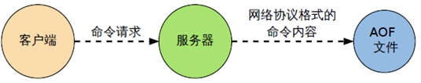

# Redis 持久化之 AOF

## AOF（Append Only File）

### 是什么

以**日志**的形式来记录每个写操作（增量保存），将Redis执行过的所有写指令记录下来(**读操作不记录**)， **只许追加文件但不可以改写文件**，redis启动之初会读取该文件重新构建数据，换言之，redis 重启的话就根据日志文件的内容将写指令从前到后执行一次以完成数据的恢复工作

### AOF 持久化流程

（1）客户端的请求写命令会被append追加到AOF缓冲区内；

（2）AOF缓冲区根据AOF持久化策略[always,everysec,no]将操作sync同步到磁盘的AOF文件中；

（3）AOF文件大小超过重写策略或手动重写时，会对AOF文件rewrite重写，压缩AOF文件容量；

（4）Redis服务重启时，会重新load加载AOF文件中的写操作达到数据恢复的目的；

### AOF 默认不开启

可以在redis.conf中配置文件名称，默认为 appendonly.aof

AOF文件的保存路径，同RDB的路径一致。

### AOF 和 RDB 同时开启，redis 听谁的？

AOF和RDB同时开启，系统默认取AOF的数据（数据不会存在丢失）

### AOF 启动/修复/恢复

* AOF的备份机制和性能虽然和RDB不同, 但是备份和恢复的操作同RDB一样，都是拷贝备份文件，需要恢复时再拷贝到Redis工作目录下，启动系统即加载。
* 正常恢复
  * 修改默认的appendonly no，改为yes。
  * 将有数据的aof文件复制一份保存到对应目录(查看目录：config get dir)。
  * 恢复：重启redis然后重新加载。
* 异常恢复
  * 修改默认的appendonly no，改为yes。
  * 如遇到**AOF文件损坏**，通过/usr/local/bin/**redis-check-aof--fix appendonly.aof**进行恢复。
  * 备份被写坏的AOF文件。
  * 恢复：重启redis，然后重新加载。

### AOF 同步频率设置

* appendfsync always
  * 始终同步，每次Redis的写入都会立刻记入日志；性能较差但数据完整性比较好。

* appendfsync everysec
  * 每秒同步，每秒记入日志一次，如果宕机，本秒的数据可能丢失。

* appendfsync no
  * redis不主动进行同步，把同步时机交给操作系统。

### Rewrite 压缩

#### 是什么

AOF采用文件追加方式，文件会越来越大为避免出现此种情况，新增了重写机制, 当AOF文件的大小超过所设定的阈值时，Redis就会启动AOF文件的内容压缩， 只保留可以恢复数据的最小指令集。可以使用命令`bgrewriteaof`。

#### 重写原理，如何实现重写

AOF文件持续增长而过大时，会fork出一条新进程来将文件重写(也是先写临时文件最后再rename)，redis4.0版本后的重写，是指上就是把rdb 的快照，以二级制的形式附在新的aof头部，作为已有的历史数据，替换掉原来的流水账操作。

`no-appendfsync-on-rewrite`：

* `no-appendfsync-on-rewrite=yes`，不写入aof文件只写入缓存，用户请求不会阻塞，但是在这段时间如果宕机会丢失这段时间的缓存数据。（降低数据安全性，提高性能）。
* `no-appendfsync-on-rewrite=no`，还是会把数据往磁盘里刷，但是遇到重写操作，可能会发生阻塞。（数据安全，但是性能降低）。

#### 触发机制，何时重写

Redis会记录上次重写时的AOF大小，默认配置是当AOF文件大小是上次rewrite后大小的一倍且文件大于64M时触发。

重写虽然可以节约大量磁盘空间，减少恢复时间。但是每次重写还是有一定的负担的，因此设定Redis要满足一定条件才会进行重写。 

`auto-aof-rewrite-percentage`：设置重写的基准值，文件达到100%时开始重写（文件是原来重写后文件的2倍时触发）。

`auto-aof-rewrite-min-size`：设置重写的基准值，最小文件64MB。达到这个值开始重写。

例如：文件达到70MB开始重写，降到50MB，下次什么时候开始重写？100MB

系统载入时或者上次重写完毕时，Redis会记录此时AOF大小，设为base_size，如果Redis的AOF当前大小>= base_size +base_size*100% (默认)且当前大小>=64mb(默认)的情况下，Redis会对AOF进行重写。 

#### 重写流程

1. bgrewriteaof触发重写，判断是否当前有bgsave或bgrewriteaof在运行，如果有，则等待该命令结束后再继续执行。

2. 主进程fork出子进程执行重写操作，保证主进程不会阻塞。

3. 子进程遍历redis内存中数据到临时文件，客户端的写请求同时写入aof_buf缓冲区和aof_rewrite_buf重写缓冲区保证原AOF文件完整以及新AOF文件生成期间的新的数据修改动作不会丢失。

4. 1) 子进程写完新的AOF文件后，向主进程发信号，父进程更新统计信息。2) 主进程把aof_rewrite_buf中的数据写入到新的AOF文件。

5. 使用新的AOF文件覆盖旧的AOF文件，完成AOF重写。

### 优势

* 备份机制更稳健，丢失数据概率更低。
* 可读的日志文本，通过操作AOF稳健，可以处理误操作。

### 劣势

* 比起RDB占用更多的磁盘空间。
* 恢复备份速度要慢。
* 每次读写都同步的话，有一定的性能压力。
* 存在个别Bug，造成恢复不能。