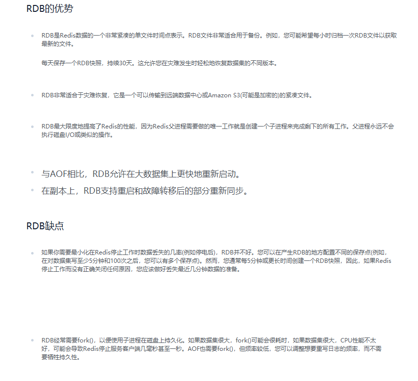
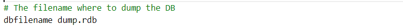

# Redis 持久化—RDB

## 总体介绍

官网介绍：[Redis](https://redis.io/)。

## RDB（Redis DataBase）

### 介绍

翻译

### 是什么

在指定的时间间隔内将内存中的数据集快照写入磁盘， 也就是行话讲的Snapshot**快照**，它恢复时是将快照文件直接读到内存里。

### 备份是如何执行的

Redis会单独创建（fork）一个**子进程**来进行持久化，会先将数据写入到 一个临时文件中，待持久化过程都结束了，再用这个**临时文件替换上次持久化好的文件**。 整个过程中，主进程是不进行任何IO操作的，这就确保了极高的性能 如果需要进行大规模数据的恢复，且对于数据恢复的完整性不是非常敏感，那RDB方式要比AOF方式更加的高效。RDB的缺点是**最后一次持久化后的数据可能丢失**。

### Fork

* Fork的作用是复制一个与当前进程一样的进程。新进程的所有数据（变量、环境变量、程序计数器等） 数值都和原进程一致，但是是一个全新的进程，并作为原进程的子进程。
* 在Linux程序中，fork()会产生一个和父进程完全相同的子进程，但子进程在此后多会exec系统调用，出于效率考虑，Linux中引入了“**写时复制技术**”。
* **一般情况父进程和子进程会共用同一段物理内存**，只有进程空间的各段的内容要发生变化时，才会将父进程的内容复制一份给子进程。

### RDB 持久化流程

### dump.rdb 文件

### 配置位置

rdb文件的保存路径，也可以修改。默认为Redis启动时命令行所在的目录下

### 如何触发 RDB 快照；保持策略

#### 配置文件中默认的快照配置

#### 命令 save VS bgsave

* save ：save时只管保存，其它不管，全部阻塞。手动保存。不建议。
* **bgsave：Redis会在后台异步进行快照操作， 快照同时还可以响应客户端请求。**

可以通过lastsave 命令获取最后一次成功执行快照的时间。