# Redis 新数据类型

## Bitmaps

### 简介

现代计算机用二进制（位） 作为信息的基础单位， 1个字节等于8位， 例如“abc”字符串是由3个字节组成， 但实际在计算机存储时将其用二进制表示， “abc”分别对应的ASCII码分别是97、 98、 99， 对应的二进制分别是01100001、 01100010和01100011，如下图

合理地使用操作位能够有效地提高内存使用率和开发效率。

Redis提供了Bitmaps这个“数据类型”可以实现对位的操作：

（1）  Bitmaps本身不是一种数据类型，实际上它就是字符串（key-value），但是它可以对字符串的位进行操作。

（2）  Bitmaps单独提供了一套命令，所以在Redis中使用Bitmaps和使用字符串的方法不太相同。可以把Bitmaps想象成一个以位为单位的数组，数组的每个单元只能存储0和1，数组的下标在Bitmaps中叫做偏移量。

### 命令

#### setbit

（1）格式

setbit `<key> <offset> <value>`设置Bitmaps中某个偏移量的值（0或1）

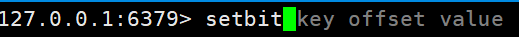

* offset:偏移量从0开始

（2）实例

每个独立用户是否访问过网站存放在Bitmaps中， 将访问的用户记做1， 没有访问的用户记做0， 用偏移量作为用户的id。

设置键的第offset个位的值（从0算起） ， 假设现在有20个用户，userid=1， 6， 11， 15， 19的用户对网站进行了访问， 那么当前Bitmaps初始化结果如图

unique:users:20201106代表2020-11-06这天的独立访问用户的Bitmaps

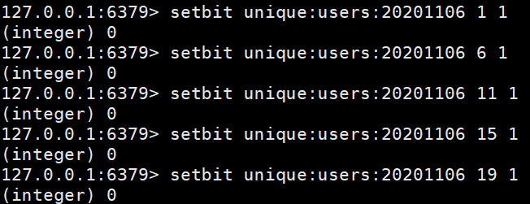

> 很多应用的用户id以一个指定数字（例如10000） 开头， 直接将用户id和Bitmaps的偏移量对应势必会造成一定的浪费， 通常的做法是每次做setbit操作时将用户id减去这个指定数字。
>
> 在第一次初始化Bitmaps时， 假如偏移量非常大， 那么整个初始化过程执行会比较慢， 可能会造成Redis的阻塞。

#### getbit

（1）格式

getbit`<key> <offset>`获取Bitmaps中某个偏移量的值。

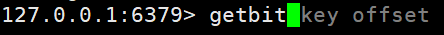

获取键的第offset位的值（从0开始算）。

#### bitcount

统计**字符串**被设置为1的bit数。一般情况下，给定的整个字符串都会被进行计数，通过指定额外的 start 或 end 参数，可以让计数只在特定的位上进行。start 和 end 参数的设置，都可以使用负数值：比如 -1 表示最后一个位，而 -2 表示倒数第二个位，start、end 是指bit组的字节的下标数，二者皆包含。

（1）格式

bitcount `<key> [start end] ` 统计字符串从start字节到end字节比特值为1的数量。

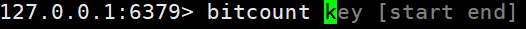

（2）实例

计算2022-11-06这天的独立访问用户数量

start和end代表起始和结束字节数， 下面操作计算用户id在第1个字节到第3个字节之间的独立访问用户数， 对应的用户id是11， 15， 19。

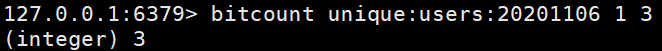

举例： K1 【01000001 01000000 00000000 00100001】，对应【0，1，2，3】。

bitcount K1 1 2 ： 统计下标1、2字节组中bit=1的个数，即01000000 00000000 --》bitcount K1 1 2 --》1 

bitcount K1 1 3 ： 统计下标1、2字节组中bit=1的个数，即01000000 00000000 00100001 --》bitcount K1 1 3 --》3

bitcount K1 0 -2 ： 统计下标0到下标倒数第2，字节组中bit=1的个数，即01000001 01000000  00000000 --》bitcount K1 0 -2 --》3

> redis的setbit设置或清除的是bit位置，而bitcount计算的是byte位置。

#### bitop

(1)格式

`bitop and(or/not/xor) <destkey> [key…]`

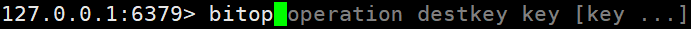       

bitop是一个复合操作， 它可以做多个Bitmaps的and（交集） 、 or（并集） 、 not（非） 、 xor（异或） 操作并将结果保存在destkey中。

(2)实例

2020-11-04 日访问网站的userid=1,2,5,9。

~~~sh
setbit unique:users:20201104 1 1

setbit unique:users:20201104 2 1

setbit unique:users:20201104 5 1

setbit unique:users:20201104 9 1
~~~

2020-11-03 日访问网站的userid=0,1,4,9。

~~~sh
setbit unique:users:20201103 0 1

setbit unique:users:20201103 1 1

setbit unique:users:20201103 4 1

setbit unique:users:20201103 9 1
~~~

计算出两天都访问过网站的用户数量

bitop and unique:users:and:20201104_03 unique:users:20201103unique:users:20201104

计算出任意一天都访问过网站的用户数量（例如月活跃就是类似这种），可以使用or求并集。

### Bitmaps与set对比

假设网站有1亿用户， 每天独立访问的用户有5千万， 如果每天用集合类型和Bitmaps分别存储活跃用户可以得到表

<table class="tg">
<thead>
  <tr>
    <th class="tg-c3ow"  colspan="5">set和Bitmaps存储一天活跃用户对比</th>
  </tr>
</thead>
<tbody>
  <tr>
    <td class="tg-0pky">数据类型</td>
    <td class="tg-0pky">每个用户id占用空间</td>
    <td class="tg-0pky">需要存储的用户量</td>
    <td class="tg-0pky">全部内存量</td>
  </tr>
  <tr>
<td class="tg-0pky">集合类型</td>
    <td class="tg-0pky">64位</td>
    <td class="tg-0pky">50000000</td>
    <td class="tg-0pky">64位*50000000 = 400MB</td>
  </tr>
  <tr>
<td class="tg-0pky">Bitmaps</td>
    <td class="tg-0pky">1位</td>
    <td class="tg-0pky">100000000</td>
    <td class="tg-0pky">1位*100000000 = 12.5MB</td>
  </tr>
</tbody>
</table>

很明显， 这种情况下使用Bitmaps能节省很多的内存空间， 尤其是随着时间推移节省的内存还是非常可观的。

<table class="tg" >
<thead>
  <tr>
    <th class="tg-c3ow"  colspan="5">set和Bitmaps存储独立用户空间对比</th>
  </tr>
</thead>
<tbody>
  <tr>
    <td class="tg-0pky">数据类型</td>
    <td class="tg-0pky">一天</td>
    <td class="tg-0pky">一个月</td>
    <td class="tg-0pky">一年</td>
  </tr>
  <tr>
<td class="tg-0pky">集合类型</td>
    <td class="tg-0pky">400MB</td>
    <td class="tg-0pky">12GB</td>
    <td class="tg-0pky">144GB</td>
  </tr>
  <tr>
<td class="tg-0pky">Bitmaps</td>
    <td class="tg-0pky">12.5MB</td>
    <td class="tg-0pky">375MB</td>
    <td class="tg-0pky">4.5GB</td>
  </tr>
</tbody>
</table>

但Bitmaps并不是万金油，假如该网站每天的独立访问用户很少，例如只有10万（大量的僵尸用户），那么两者的对比如下表所示，很显然，这时候使用Bitmaps就不太合适了，因为基本上大部分位都是0。

<table class="tg" >
<thead>
  <tr>
    <th class="tg-c3ow"  colspan="5">set和Bitmaps存储一天活跃用户对比（独立用户比较少）</th>
  </tr>
</thead>
<tbody>
  <tr>
    <td class="tg-0pky">数据类型</td>
    <td class="tg-0pky">每个userid占用空间</td>
    <td class="tg-0pky">需要存储的用户量</td>
    <td class="tg-0pky">全部内存量</td>
  </tr>
  <tr>
<td class="tg-0pky">集合类型</td>
    <td class="tg-0pky">64位</td>
    <td class="tg-0pky">100000</td>
    <td class="tg-0pky">64位*100000 = 800KB</td>
  </tr>
  <tr>
<td class="tg-0pky">Bitmaps</td>
    <td class="tg-0pky">1位</td>
    <td class="tg-0pky">100000000</td>
    <td class="tg-0pky">1位*100000000 = 12.5MB</td>
  </tr>
</tbody>
</table>

## HyperLogLog

### 简介

​		在工作当中，我们经常会遇到与统计相关的功能需求，比如统计网站PV（PageView页面访问量）,可以使用Redis的incr、incrby轻松实现。

​		但像UV（UniqueVisitor，独立访客）、独立IP数、搜索记录数等需要去重和计数的问题如何解决？这种求集合中不重复元素个数的问题称为基数问题。

**解决**基数问题有很多种方案：

（1）数据存储在MySQL表中，使用distinct count计算不重复个数。

（2）使用Redis提供的hash、set、bitmaps等数据结构来处理。

以上的方案结果精确，**但随着数据不断增加，导致占用空间越来越大，对于非常大的数据集是不切实际的**。

能否能够降低一定的精度来平衡存储空间？Redis推出了HyperLogLog

​		Redis HyperLogLog 是用来做基数统计的算法，HyperLogLog 的优点是，在输入元素的数量或者体积非常非常大时，计算基数所需的空间总是固定的、并且是很小的。

​		在 Redis 里面，每个 HyperLogLog 键只需要花费 12 KB 内存，就可以计算接近 2^64 个不同元素的基数。这和计算基数时，元素越多耗费内存就越多的集合形成鲜明对比。

**什么是基数?**

​		比如数据集 {1, 3, 5, 7, 5, 7, 8}， 那么这个数据集的基数集为 {1, 3, 5 ,7, 8}, 基数(不重复元素)为5。 基数估计就是在误差可接受的范围内，快速计算基数。

### 命令

#### pfadd

（1）格式

`pfadd <key>< element> [element ...]`添加指定元素到 HyperLogLog 中。

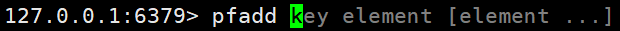

 

（2）实例

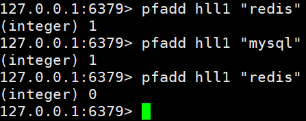

将所有元素添加到指定HyperLogLog数据结构中。如果执行命令后HLL估计的近似基数发生变化，则返回1，否则返回0。

#### pfcount

（1）格式

`pfcount<key> [key ...]`计算HLL的近似基数，可以计算多个HLL，比如用HLL存储每天的UV，计算一周的UV可以使用7天的UV合并计算即可。

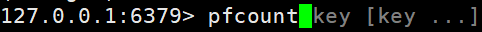

（2）实例

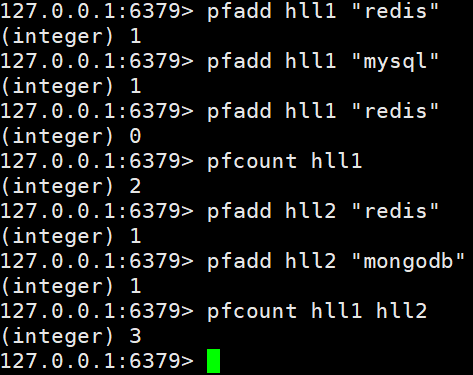

#### pfmerge

（1）格式

`pfmerge<destkey><sourcekey> [sourcekey ...]`将一个或多个HLL合并后的结果存储在另一个HLL中，比如每月活跃用户可以使用每天的活跃用户来合并计算可得。

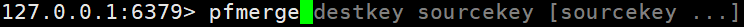

（2）实例

## Geospatial

### 简介

Redis 3.2 中增加了对GEO类型的支持。GEO，Geographic，地理信息的缩写。该类型，就是元素的2维坐标，在地图上就是经纬度。redis基于该类型，提供了经纬度设置，查询，范围查询，距离查询，经纬度Hash等常见操作。

### 命令

#### geoadd

（1）格式

`geoadd <key> <longitude> <latitude> <member> [longitude latitude member...]`添加地理位置（经度，纬度，名称）。

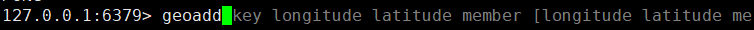

（2）实例

~~~sh
geoadd china:city 121.47 31.23 shanghai

geoadd china:city 106.50 29.53 chongqing 114.05 22.52 shenzhen 116.38 39.90 beijing
~~~

两极无法直接添加，一般会下载城市数据，直接通过 Java 程序一次性导入。

有效的经度从 -180 度到 180 度。有效的纬度从 -85.05112878 度到 85.05112878 度。

当坐标位置超出指定范围时，该命令将会返回一个错误。

已经添加的数据，是无法再次往里面添加的。

#### geopos

（1）格式

`geopos <key> <member> [member...]`获得指定地区的坐标值。

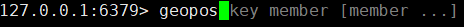

（2）实例

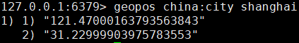

#### geodist

（1）格式

`geodist <key> <member1> <member2> [m|km|ft|mi `获取两个位置之间的直线距离。

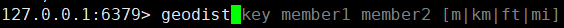

（2）实例

获取两个位置之间的直线距离。

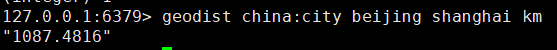

单位：

* m 表示单位为米[默认值]。

* km 表示单位为千米。

* mi 表示单位为英里。

* ft 表示单位为英尺。

如果用户没有显式地指定单位参数， 那么 GEODIST 默认使用米作为单位。

#### georadius

（1）格式

`georadius <key> <longitude> <latitude> radius m|km|ft|mi`**以给定的经纬度为中心，找出某一半径内的元素**。

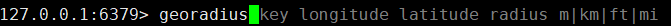

经度 纬度 距离 单位。

（2）实例

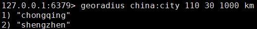

