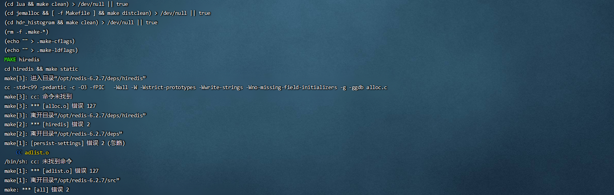
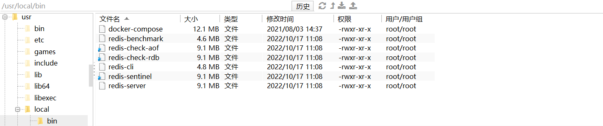
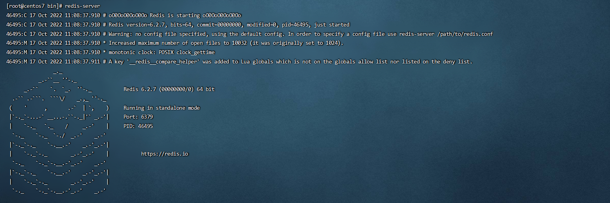

# Redis 概述安装

* Redis是一个开源的key-value存储系统。
* 和Memcached类似，它支持存储的value类型相对更多，包括string(字符串)、list(链表)、set(集合)、zset(sorted set --有序集合)和hash（哈希类型）。
* 这些数据类型都支持push/pop、add/remove及取交集并集和差集及更丰富的操作，而且这些操作都是原子性的。
* 在此基础上，Redis支持各种不同方式的排序。
* 与memcached一样，为了保证效率，数据都是缓存在内存中。
* 区别的是Redis会周期性的把更新的数据写入磁盘或者把修改操作写入追加的记录文件。
* 并且在此基础上实现了master-slave(主从)同步。

## 应用场景

### 配合关系型数据库做高速缓存

高频次，热门访问的数据，降低数据库IO

分布式架构，做session共享

### 多样的数据结构存储持久化数据

## Redis 安装

| Redis官方网站                          | Redis中文官方网站 |
| -------------------------------------- | ----------------- |
| [**http://redis.io**](http://redis.io) | http://redis.cn/  |

### 安装版本

这次选用的是 Redis6.2.7 的版本。

* 6.2.7 for Linux（redis-6.2.7.tar.gz）
* 不用考虑在windows环境下对Redis的支持

### 安装步骤

~~~sh
yum install centos-release-scl scl-utils-build
yum install -y devtoolset-8-toolchain
scl enable devtoolset-8 bash
gcc --version
# 下载 redis-6.2.7.tar.gz 放/opt目录,并且解压，进入目录
# 再根目录执行make命令
~~~

> 如果遇到这个报错说明，没有安装gcc 
>
> 执行 yum -y install gcc automake autoconf libtool make 这个命令，完成后再次make

> 解决方案：运行make distclean，完成后再次make

~~~sh
# 跳过 make test 继续执行
make install
# 安装完成后在/usr/local/bin目录可以看到redis的相关文件
~~~

### 前台启动（不推荐）

前台启动，命令行窗口不能关闭，否则服务器停止

### 后台启动（推荐）

~~~sh
# 拷贝一份redis.conf到其他目录
cp /opt/redis-6.2.7/redis.conf ~/myredis/
# 修改redis.conf(128行)文件将里面的daemonize no 改成 yes，让服务在后台启动
# Redis 启动
redis-server ~/myredis/redis.conf
# 访问
redis-cli
# 测试
ping
~~~

### Redis 介绍相关知识

**Redis是单线程+多路IO复用技术**

多路复用是指使用一个线程来检查多个文件描述符（Socket）的就绪状态，比如调用select和poll函数，传入多个文件描述符，如果有一个文件描述符就绪，则返回，否则阻塞直到超时。得到就绪状态后进行真正的操作可以在同一个线程里执行，也可以启动线程执行（比如使用线程池）。