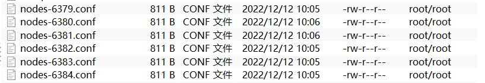
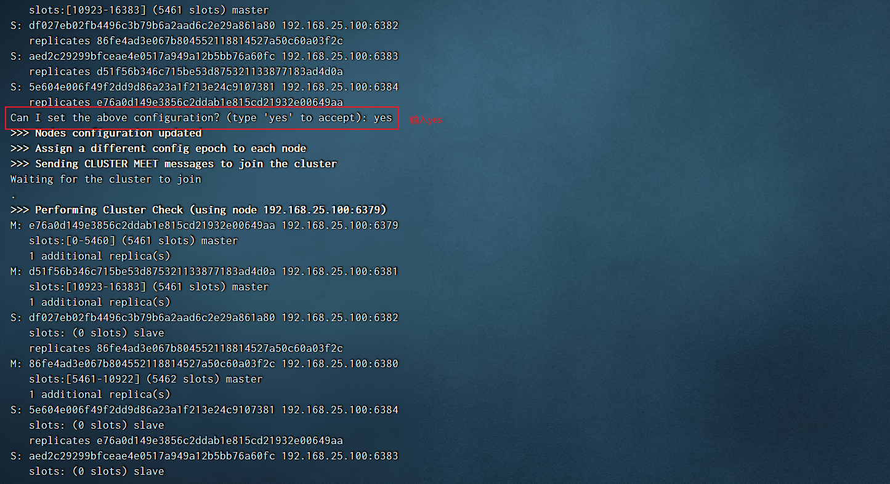
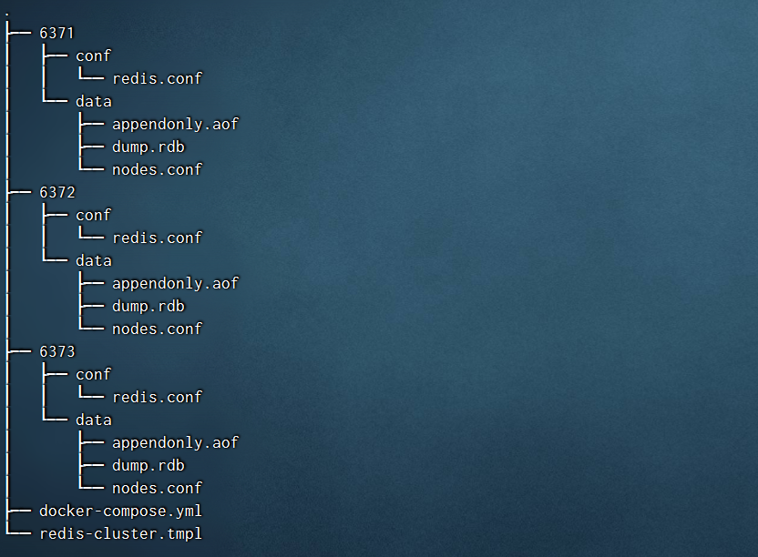
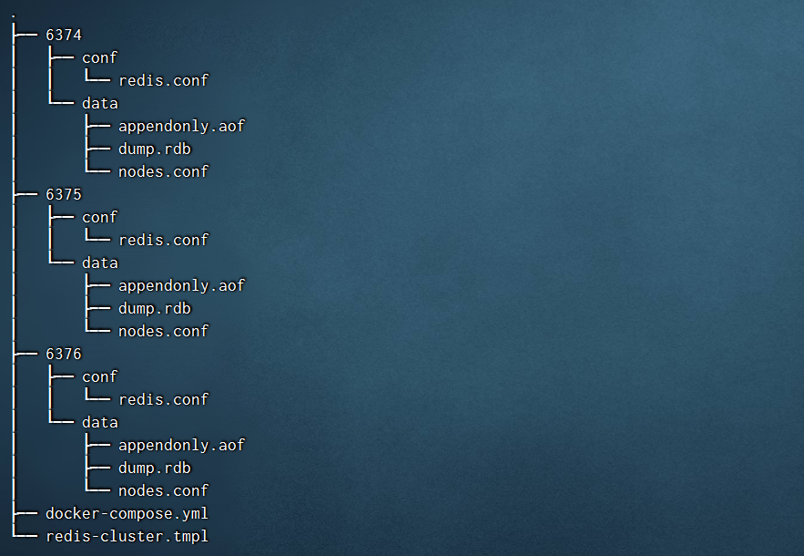
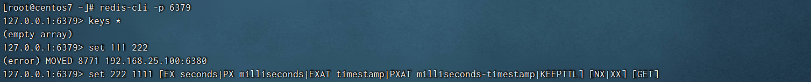
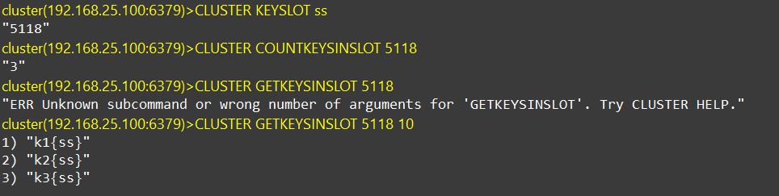
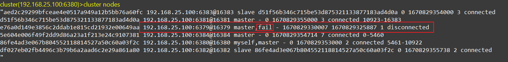
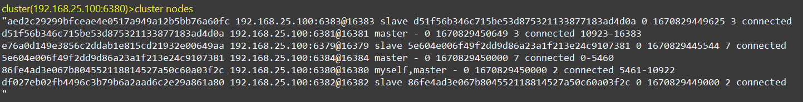

# Redis 集群

## 问题

容量不够，redis如何进行扩容？

并发写操作， redis如何分摊？

另外，主从模式，薪火相传模式，主机宕机，导致ip地址发生变化，应用程序中配置需要修改对应的主机地址、端口等信息。

之前通过代理主机来解决，但是**redis3.0**中提供了解决方案。就是**无中心化集群**配置。

## 什么是集群

Redis 集群实现了对Redis的水平扩容，即启动N个redis节点，将整个数据库分布存储在这N个节点中，每个节点存储总数据的1/N。

Redis 集群通过分区（partition）来提供一定程度的可用性（availability）： 即使集群中有一部分节点失效或者无法进行通讯， 集群也可以继续处理命令请求。

## 安装

* 制作6个实例，6379，6380，6381，6382，6383，6384

  * 配置基本信息

  * ~~~properties
    #开启daemonize yes
    #Pid文件名字
    #指定端口
    #Log文件名字
    #Dump.rdb名字
    #Appendonly 关掉或者换名字
    #cluster-enabled yes    打开集群模式
    #cluster-config-file nodes-6379.conf  设定节点配置文件名
    #cluster-node-timeout 15000   设定节点失联时间，超过该时间（毫秒），集群自动进行主从切换。
    ~~~

  * ~~~properties
    include /root/myredis/redis.conf
    port 6379
    pidfile "/var/run/redis_6379.pid"
    dbfilename "dump6379.rdb"
    dir "/root/redis-cluster"
    logfile "/root/redis-cluster/redis_err_6379.log"
    cluster-enabled yes
    cluster-config-file nodes-6379.conf
    cluster-node-timeout 15000
    ~~~

* 复制五份

  * 使用:%s/6379/638x 替换5个文件配置

* 启动服务

  * redis-server ~/redis-cluster/redis6379.conf
  * ....

* 将六个节点合成一个集群

  * 组合之前，请确保所有redis实例启动后，nodes-xxxx.conf文件都生成正常。

* 启动集群

  * ~~~sh
    cd  /opt/redis-6.2.1/src
    
    redis-cli --cluster create --cluster-replicas 1 192.168.25.100:6379 192.168.25.100:6380 192.168.25.100:6381 192.168.25.100:6382 192.168.25.100:6383 192.168.25.100:6384
    ~~~

  * 此处不要用127.0.0.1，请用真实IP地址，--replicas 1 采用最简单的方式配置集群，一台主机，一台从机，正好三组。
  
  * > 注意：上面的命令只在第一次创建集群时使用，如果想要删除原来的数据重新创建的话，需要删除~/redis-cluster文件夹中的其他文件，仅仅保留.conf文件。

## 安装（Docker）

### 创建目录及文件

分别在 `192.168.25.99` 和 `192.168.25.100` 两台机器上执行以下操作。

~~~sh
# 创建目录
mkdir -p /usr/local/docker/redis-cluster
# 切换至指定目录
cd /usr/local/docker/redis-cluster
# 编写 redis-cluster.tmpl 文件
vi redis-cluster.tmpl
~~~

### 编写配置文件

`192.168.25.99` 机器的 `redis-cluster.tmpl` 文件内容如下：

~~~
port ${PORT}
requirepass 111111
masterauth 111111
protected-mode no
daemonize no
appendonly yes
cluster-enabled yes
cluster-config-file nodes.conf
cluster-node-timeout 15000
cluster-announce-ip 192.168.25.99
cluster-announce-port ${PORT}
cluster-announce-bus-port 1${PORT}
~~~

`192.168.25.100` 机器的 `redis-cluster.tmpl` 文件内容如下：

~~~
port ${PORT}
requirepass 111111
masterauth 111111
protected-mode no
daemonize no
appendonly yes
cluster-enabled yes
cluster-config-file nodes.conf
cluster-node-timeout 15000
cluster-announce-ip 192.168.25.100
cluster-announce-port ${PORT}
cluster-announce-bus-port 1${PORT}
~~~

- `port`：节点端口；
- `requirepass`：添加访问认证；
- `masterauth`：如果主节点开启了访问认证，从节点访问主节点需要认证；
- `protected-mode`：保护模式，默认值 yes，即开启。开启保护模式以后，需配置 `bind ip` 或者设置访问密码；关闭保护模式，外部网络可以直接访问；
- `daemonize`：是否以守护线程的方式启动（后台启动），默认 no；
- `appendonly`：是否开启 AOF 持久化模式，默认 no；
- `cluster-enabled`：是否开启集群模式，默认 no；
- `cluster-config-file`：集群节点信息文件；
- `cluster-node-timeout`：集群节点连接超时时间；
- `cluster-announce-ip`：集群节点 IP，填写宿主机的 IP；
- `cluster-announce-port`：集群节点映射端口；
- `cluster-announce-bus-port`：集群节点总线端口。

>　　每个 Redis 集群节点都需要打开**两个 TCP 连接**。一个用于为客户端提供服务的正常 Redis TCP 端口，例如 6379。还有一个基于 6379 端口加 10000 的端口，比如 16379。
>
>　​	第二个端口用于集群总线，这是一个使用二进制协议的节点到节点通信通道。节点使用集群总线进行故障检测、配置更新、故障转移授权等等。客户端永远不要尝试与集群总线端口通信，与正常的 Redis 命令端口通信即可，但是请确保防火墙中的这两个端口都已经打开，否则 Redis 集群节点将无法通信。

在 `192.168.25.99` 机器的 `redis-cluster` 目录下执行以下命令：

~~~sh
for port in `seq 6371 6373`; do \
  mkdir -p ${port}/conf \
  && PORT=${port} envsubst < redis-cluster.tmpl > ${port}/conf/redis.conf \
  && mkdir -p ${port}/data;\
done
~~~

在 `192.168.25.100` 机器的 `redis-cluster` 目录下执行以下命令：

~~~sh
for port in `seq 6374 6376`; do \
  mkdir -p ${port}/conf \
  && PORT=${port} envsubst < redis-cluster.tmpl > ${port}/conf/redis.conf \
  && mkdir -p ${port}/data;\
done
~~~

`192.168.25.99` 目录结构：

`192.168.25.100` 目录结构：

~~~
============================== 192.168.25.99 ==============================
port 6371
requirepass 111111
masterauth 111111
protected-mode no
daemonize no
appendonly yes
cluster-enabled yes
cluster-config-file nodes.conf
cluster-node-timeout 15000
cluster-announce-ip 192.168.25.99
cluster-announce-port 6371
cluster-announce-bus-port 16371

port 6372
requirepass 111111
masterauth 111111
protected-mode no
daemonize no
appendonly yes
cluster-enabled yes
cluster-config-file nodes.conf
cluster-node-timeout 15000
cluster-announce-ip 192.168.25.99
cluster-announce-port 6372
cluster-announce-bus-port 16372

port 6373
requirepass 111111
masterauth 111111
protected-mode no
daemonize no
appendonly yes
cluster-enabled yes
cluster-config-file nodes.conf
cluster-node-timeout 15000
cluster-announce-ip 192.168.25.99
cluster-announce-port 6373
cluster-announce-bus-port 16373
============================== 192.168.25.99 ==============================
~~~

~~~
============================== 192.168.25.100 ==============================
port 6374
requirepass 111111
masterauth 111111
protected-mode no
daemonize no
appendonly yes
cluster-enabled yes
cluster-config-file nodes.conf
cluster-node-timeout 15000
cluster-announce-ip 192.168.25.100
cluster-announce-port 6374
cluster-announce-bus-port 16374

port 6375
requirepass 111111
masterauth 111111
protected-mode no
daemonize no
appendonly yes
cluster-enabled yes
cluster-config-file nodes.conf
cluster-node-timeout 15000
cluster-announce-ip 192.168.25.100
cluster-announce-port 6375
cluster-announce-bus-port 16375

port 6376
requirepass 111111
masterauth 111111
protected-mode no
daemonize no
appendonly yes
cluster-enabled yes
cluster-config-file nodes.conf
cluster-node-timeout 15000
cluster-announce-ip 192.168.25.100
cluster-announce-port 6376
cluster-announce-bus-port 16376
============================== 192.168.25.100 ==============================
~~~

在 `192.168.25.99` 机器的 `/usr/local/docker/redis-cluster` 目录下创建 `docker-compose.yml` 文件并编辑。

~~~yaml
# 描述 Compose 文件的版本信息
version: "3.8"

# 定义服务，可以多个
services:
  redis-6371: # 服务名称
    image: redis:6.2.5 # 创建容器时所需的镜像
    container_name: redis-6371 # 容器名称
    restart: always # 容器总是重新启动
    network_mode: "host" # host 网络模式
    volumes: # 数据卷，目录挂载
      - ./6371/conf/redis.conf:/usr/local/etc/redis/redis.conf
      - ./6371/data:/data
    command: redis-server /usr/local/etc/redis/redis.conf # 覆盖容器启动后默认执行的命令

  redis-6372:
    image: redis:6.2.5
    container_name: redis-6372
    restart: always
    network_mode: "host"
    volumes:
      - ./6372/conf/redis.conf:/usr/local/etc/redis/redis.conf
      - ./6372/data:/data
    command: redis-server /usr/local/etc/redis/redis.conf

  redis-6373:
    image: redis:6.2.5
    container_name: redis-6373
    restart: always
    network_mode: "host"
    volumes:
      - ./6373/conf/redis.conf:/usr/local/etc/redis/redis.conf
      - ./6373/data:/data
    command: redis-server /usr/local/etc/redis/redis.conf
~~~

在 `192.168.25.100` 机器的 `/usr/local/docker/redis-cluster` 目录下创建 `docker-compose.yml` 文件并编辑。

~~~yaml
# 描述 Compose 文件的版本信息
version: "3.8"

# 定义服务，可以多个
services:
  redis-6374: # 服务名称
    image: redis:6.2.5 # 创建容器时所需的镜像
    container_name: redis-6374 # 容器名称
    restart: always # 容器总是重新启动
    network_mode: "host" # host 网络模式
    volumes: # 数据卷，目录挂载
      - ./6374/conf/redis.conf:/usr/local/etc/redis/redis.conf
      - ./6374/data:/data
    command: redis-server /usr/local/etc/redis/redis.conf # 覆盖容器启动后默认执行的命令

  redis-6375:
    image: redis:6.2.5
    container_name: redis-6375
    restart: always
    network_mode: "host"
    volumes:
      - ./6375/conf/redis.conf:/usr/local/etc/redis/redis.conf
      - ./6375/data:/data
    command: redis-server /usr/local/etc/redis/redis.conf

  redis-6376:
    image: redis:6.2.5
    container_name: redis-6376
    restart: always
    network_mode: "host"
    volumes:
      - ./6376/conf/redis.conf:/usr/local/etc/redis/redis.conf
      - ./6376/data:/data
    command: redis-server /usr/local/etc/redis/redis.conf
~~~

### 启动

执行`docker-compose up -d`，启动两台服务器。

### 创建 Redis Cluster 集群

~~~sh
# 进入容器
docker exec -it redis-6371 bash
# 切换至指定目录
cd /usr/local/bin/
~~~

~~~sh
redis-cli -a 111111 --cluster create 192.168.25.99:6371 192.168.25.99:6372 192.168.25.99:6373 192.168.25.100:6374 192.168.25.100:6375 192.168.25.100:6376 --cluster-replicas 1
~~~

### 查看集群状态

~~~sh
# 进入容器
docker exec -it redis-6371 bash
# 切换至指定目录
cd /usr/local/bin/
redis-cli -a 111111 --cluster check 192.168.25.100:6375
~~~

### 查看集群信息和节点信息

~~~sh
# 连接至集群某个节点
redis-cli -c -a 111111 -h 192.168.25.100 -p 6376
# 查看集群信息
cluster info
# 查看集群结点信息
cluster nodes
~~~

## 登录

### 普通方式登录

可能直接进入读主机，存储数据时，会出现MOVED重定向操作。所以，应该以集群方式登录。

### 集群策略登录

### 通过 cluster nodes 命令查看集群信息

## 如何分配这六个节点

一个集群至少要有三个主节点。

选项 `--cluster-replicas 1` 表示我们希望为集群中的每个主节点创建一个从节点。

**分配原则尽量保证每个主数据库运行在不同的IP地址，每个从库和主库不在一个IP地址上。**

## 什么是 slots

一个 Redis 集群包含 16384 个插槽（hash slot）， 数据库中的每个键都属于这 16384 个插槽的其中一个， 

集群使用公式 **CRC16(key) % 16384** 来计算键 key 属于哪个槽， 其中 CRC16(key) 语句用于计算键 key 的 CRC16 校验和 。

集群中的每个节点负责处理一部分插槽。 举个例子， 如果一个集群可以有主节点， 其中：

节点 A 负责处理 0 号至 5460 号插槽。

节点 B 负责处理 5461 号至 10922 号插槽。

节点 C 负责处理 10923 号至 16383 号插槽。

## 在集群中录入值

在redis-cli每次录入、查询键值，redis都会计算出该key应该送往的插槽，如果不是该客户端对应服务器的插槽，redis会报错，并告知应前往的redis实例地址和端口。

redis-cli客户端提供了 –c 参数实现自动重定向。

如 `redis-cli -c –p 6379` 登入后，再录入、查询键值对可以自动重定向。

### 批量操作

不在一个slot下的键值，是不能使用mget,mset等多键操作。

可以通过{}来定义组的概念，从而使key中{}内相同内容的键值对放到一个slot中去。

## 查询集群中的值

`CLUSTER GETKEYSINSLOT <slot> <count>`返回 count 个 slot 槽中的键。

## 故障恢复

如果主节点下线？从节点能否自动升为主节点？注意：**15秒超时。**

主节点恢复后，主从关系会如何？主节点回来变成从机。

如果所有某一段插槽的主从节点都宕掉，redis服务是否还能继续？

* 如果某一段插槽的主从都挂掉
  * redis.conf中的参数 cluster-require-full-coverage 为 yes，整个集群都挂掉
  * redis.conf中的参数 cluster-require-full-coverage 为 no，该插槽数据全都不能使用，也无法存储。

## 集群的 Jedis 开发

即使连接的不是主机，集群会自动切换主机存储。主机写，从机读。

无中心化主从集群。无论从哪台主机写的数据，其他主机上都能读到数据。

~~~java
public class JedisClusterTest {
    public static void main(String[] args) {
        Set<HostAndPort> set = new HashSet<HostAndPort>();
        set.add(new HostAndPort("192.168.25.100", 6379));
        JedisCluster jedisCluster = new JedisCluster(set);
        jedisCluster.set("k1", "v1");
        System.out.println(jedisCluster.get("k1"));
    }
}
~~~

## Redis 集群提供了以下好处

* 实现扩容
* 分摊压力
* 无中心配置相对简单

## Redis 集群的不足

* 多键操作是不被支持的 
* 多键的Redis事务是不被支持的。lua脚本不被支持
* 由于集群方案出现较晚，很多公司已经采用了其他的集群方案，而代理或者客户端分片的方案想要迁移至redis cluster，需要整体迁移而不是逐步过渡，复杂度较大

