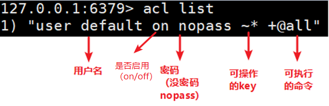
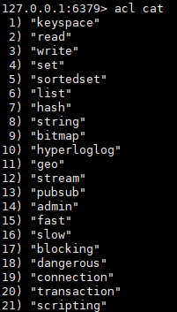
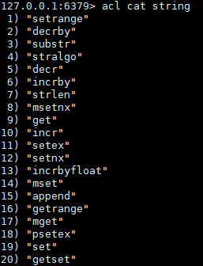
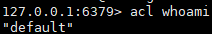
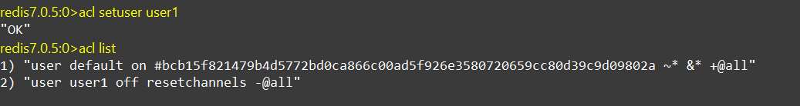
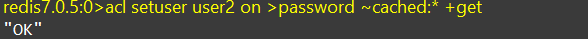
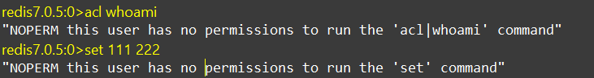

# Redis6 新功能

## ACL

### 简介

Redis ACL是Access Control List（访问控制列表）的缩写，该功能允许根据可以执行的命令和可以访问的键来限制某些连接。

在Redis 5版本之前，Redis 安全规则只有密码控制还有通过 rename 来调整高危命令比如 flushdb，KEYS*，shutdown 等。

Redis 6 则提供ACL的功能对用户进行更细粒度的权限控制 。

* 接入权限:用户名和密码 
* 可以执行的命令 
* 可以操作的 KEY

参考官网：[ACL | Redis](https://redis.io/docs/management/security/acl/)

### 命令

1、使用`ACL LIST`命令展现用户权限列表

（1）数据说明

2、使用命令

使用`ACL CAT`命令

（1）查看添加权限指令类别

（2）加参数类型名可以查看类型下具体命令

3、使用`ACL WHOAMI`命令查看当前用户

4、使用`ACL SETUSER`命令创建和编辑用户ACL

（1）ACL规则

​		下面是有效ACL规则的列表。某些规则只是用于激活或删除标志，或对用户ACL执行给定更改的单个单词。其他规则是字符前缀，它们与命令或类别名称、键模式等连接在一起。

 <table>
    <caption><b>ACL 规则</b></caption>
	<tr>
	    <th>类型</th>
	    <th>参数</th>
	    <th>说明</th>  
	</tr>
	<tr>
	    <td style="width:200px" rowspan="2">启动和禁用用户</td>
	    <td>on</td>
	    <td>激活某用户账号</td>
	</tr>
     	<tr>
	    <td>off</td>
	    <td>禁用某用户账号。注意，已验证的连接仍然可以工作。如果默认用户被标记为off，则新连接将在未进行身份验证的情况下启动，并要求用户使用AUTH选项发送AUTH或HELLO，以便以某种方式进行身份验证。</td>
	</tr>
     <tr>
	    <td  style="width:200px" rowspan="6">权限的添加删除</td>
        <td  style="width:150px">+&ltcommand&gt</td>
	    <td>将指令添加到用户可以调用的指令列表中</td>
	</tr>
    <tr>
        <td  style="width:150px">-&ltcommand&gt</td>
	    <td>从用户可执行指令列表移除指令</td>
	</tr>
    <tr>
        <td  style="width:150px">+@&ltcategory&gt</td>
	    <td>添加该类别中用户要调用的所有指令，有效类别为@admin、@set、@sortedset…等，通过调用ACL CAT命令查看完整列表。特殊类别@all表示所有命令，包括当前存在于服务器中的命令，以及将来将通过模块加载的命令。</td>
	</tr>
    <tr>
        <td  style="width:150px">-@&ltcategory&gt</td>
	    <td>从用户可调用指令中移除类别</td>
	</tr>
    <tr>
        <td  style="width:150px">allcommands</td>
	    <td>+@all的别名</td>
	</tr>
    <tr>
        <td  style="width:150px">nocommand</td>
	    <td>-@all的别名</td>
	</tr>
    <tr>
	    <td  style="width:200px">可操作键的添加或删除</td>
        <td  style="width:150px">~&ltpattern&gt</td>
        <td>添加可作为用户可操作的键的模式。例如~*允许所有的键</td>
	</tr>
</table>

（2）通过命令创建新用户默认权限

`acl setuser user1`

                          

在上面的示例中，我根本没有指定任何规则。如果用户不存在，这将使用just created的默认属性来创建用户。如果用户已经存在，则上面的命令将不执行任何操作。

（3）设置有用户名、密码、ACL权限、并启用的用户

`acl setuser user2 on >password ~cached:* +get`

（4）切换用户，验证权限

