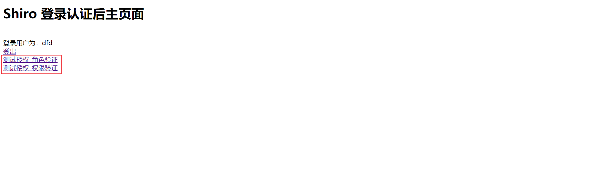
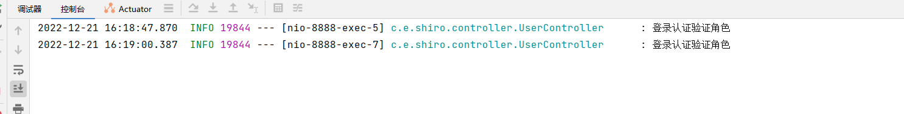

# 整合 EhCache

Shiro官方提供了shiro-ehcache，实现了整合EhCache作为Shiro的缓存工具。可以缓存认证执行的Realm方法，减少对数据库的访问，提高认证效率。

## 添加依赖

~~~xml
<!--Shiro 整合 EhCache-->
<dependency>
    <groupId>org.apache.shiro</groupId>
    <artifactId>shiro-ehcache</artifactId>
    <version>1.4.2</version>
</dependency>
<dependency>
    <groupId>commons-io</groupId>
    <artifactId>commons-io</artifactId>
    <version>2.6</version>
</dependency>
~~~

## 新增配置文件

在 resources 下添加配置文件 ehcache/ehcache-shiro.xml

~~~xml
<?xml version="1.0" encoding="UTF-8"?>
<ehcache name="ehcache" updateCheck="false">
    <!--磁盘的缓存位置-->
    <diskStore path="java.io.tmpdir"/>
    <!--默认缓存-->
    <defaultCache
            maxEntriesLocalHeap="1000"
            eternal="false"
            timeToIdleSeconds="3600"
            timeToLiveSeconds="3600"
            overflowToDisk="false">
    </defaultCache>
    <!--登录认证信息缓存：缓存用户角色权限-->
    <cache name="loginRolePsCache"
           maxEntriesLocalHeap="2000"
           eternal="false"
           timeToIdleSeconds="600"
           timeToLiveSeconds="0"
           overflowToDisk="false"
           statistics="true"/>
</ehcache>
~~~

## 修改配置类

~~~java
@Bean
public DefaultWebSecurityManager webSecurityManager() {
    //1 创建 defaultWebSecurityManager 对象
    DefaultWebSecurityManager defaultWebSecurityManager = new DefaultWebSecurityManager();
    //2 创建认证对象，并设置认证策略
    ModularRealmAuthenticator modularRealmAuthenticator = new ModularRealmAuthenticator();
    modularRealmAuthenticator.setAuthenticationStrategy(new AllSuccessfulStrategy());
    //2 创建加密对象，并设置相关属性
    HashedCredentialsMatcher matcher = new HashedCredentialsMatcher();
    //2.1 采用 md5 加密
    matcher.setHashAlgorithmName(Sha256Hash.ALGORITHM_NAME);
    //2.2 迭代加密次数
    matcher.setHashIterations(3);
    //3 将加密对象存储到 myRealm 中
    customRealm.setCredentialsMatcher(matcher);
    //4 将 myRealm 存入 defaultWebSecurityManager 对象
    defaultWebSecurityManager.setRealm(customRealm);
    //5 设置Remember me
    defaultWebSecurityManager.setRememberMeManager(rememberMeManager());
    //设置缓存管理器
    defaultWebSecurityManager.setCacheManager(getEhCacheManager());
    //6 返回
    return defaultWebSecurityManager;
}

//缓存管理器
public EhCacheManager getEhCacheManager() {
    EhCacheManager ehCacheManager = new EhCacheManager();
    InputStream is = null;
    try {
        is = ResourceUtils.getInputStreamForPath("classpath:ehcache/ehcache-shiro.xml");
    } catch (IOException e) {
        e.printStackTrace();
    }
    CacheManager cacheManager = new CacheManager(is);
    ehCacheManager.setCacheManager(cacheManager);
    return ehCacheManager;
}
~~~

## 测试

当第二次点击角色或者权限后后台并没有发送SQL请求。

