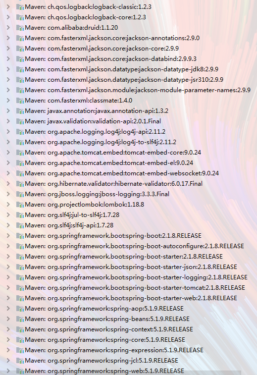
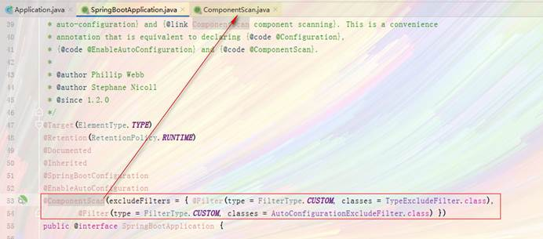
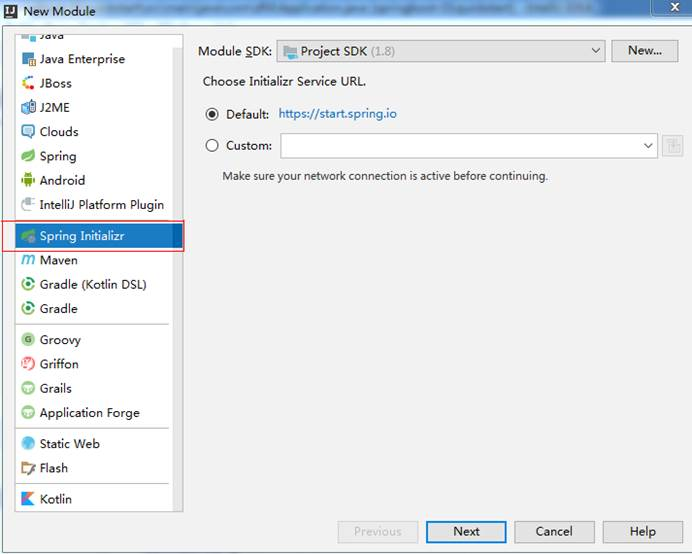
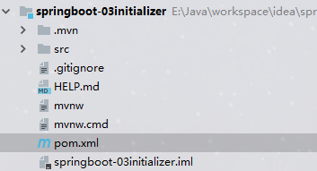

# Spring Boot 快速入门

## 创建一个Maven项目

### 添加依赖

看到这里会有疑惑，前面说传统开发的问题之一就是依赖管理混乱，怎么这里我们还需要管理依赖呢？难道SpringBoot不帮我们管理吗？

别着急，现在我们的项目与SpringBoot还没有什么关联。SpringBoot提供了一个名为spring-boot-starter-parent的工程，里面已经对各种常用依赖（并非全部）的版本进行了管理，我们的项目需要以这个项目为父工程，这样我们就不用操心依赖的版本问题了，需要什么依赖，直接引入坐标即可！

这里我们使用 Intellij IDEA 来新建一个 Spring Boot 项目。

### 添加父工程坐标

这里我采用的是这时候最新的SpringBoot版本2019年9月20日22:03:52

~~~xml
<parent>
    <groupId>org.springframework.boot</groupId>
    <artifactId>spring-boot-starter-parent</artifactId>
    <version>2.1.8.RELEASE</version>
</parent>
~~~

### 添加WEB启动器

~~~xml
<dependency>
    <groupId>org.springframework.boot</groupId>
    <artifactId>spring-boot-starter-web</artifactId>
    <version>2.1.8.RELEASE</version>
</dependency>
~~~

为了让SpringBoot帮我们自动配置，所以必须引入这个，我们称之为启动器，因为我们使用的web项目，所以我们需要引入web启动器这时观察一下jar包 。

### 完整的POM依赖

~~~xml
<?xml version="1.0" encoding="UTF-8"?>
<project xmlns="http://maven.apache.org/POM/4.0.0"
         xmlns:xsi="http://www.w3.org/2001/XMLSchema-instance"
         xsi:schemaLocation="http://maven.apache.org/POM/4.0.0 http://maven.apache.org/xsd/maven-4.0.0.xsd">
    <modelVersion>4.0.0</modelVersion>
    <groupId>com.dfd</groupId>
    <artifactId>springboot-01quickstart</artifactId>
    <version>1.0-SNAPSHOT</version>
    <!--  管理一下jdk的版本  -->
    <properties>
        <java.version>1.8</java.version>
    </properties>
    <parent>
        <groupId>org.springframework.boot</groupId>
        <artifactId>spring-boot-starter-parent</artifactId>
        <version>2.1.8.RELEASE</version>
    </parent>
    <dependencies>
        <dependency>
            <groupId>org.springframework.boot</groupId>
            <artifactId>spring-boot-starter-web</artifactId>
            <version>2.1.8.RELEASE</version>
        </dependency>

        <dependency>
            <groupId>com.alibaba</groupId>
            <artifactId>druid</artifactId>
            <version>1.1.20</version>
        </dependency>
        <dependency>
            <groupId>org.projectlombok</groupId>
            <artifactId>lombok</artifactId>
            <version>1.18.8</version>
        </dependency>
    </dependencies>
</project>
~~~

## 入门案例

### 编写启动器

~~~java
@SpringBootApplication
public class Application {
    public static void main(String[] args) {
        SpringApplication.run(Application.class, args);
    }
}
~~~

当点击运行，会出现如下所示，就说明已经启动成功了

为了我们能够看到显示页面，我们还需要提供Controller

### 编写Controller

~~~java
@RestController
public class HelloController {
    @GetMapping("hello")
    public String hello(){
        return "hello, spring boot!";
    }
}
~~~

我们还可以按照以前SpringMVC的步骤写，还可以在类上写上@Controller，但是还需要在方法上加上@ResponseBody。

我们访问localhost:8080/hello,就会看到返回的字符串

### 出现问题

当访问这个页面出现这个问题的时候，就代表的是你的启动器和你的数据源或者是Controller在同一级

当点开源码包会发现作者的一段注释

> If specific packages are not defined, scanning will occur from the package of the class that declares this annotation.
>
> 如果没有定义特定的包，则将对声明此注释的类的包进行扫描。

就是说如果我们把它放到了一个包中比如com.dfd.boot。那么它就只会扫描当前的包

#### 特定需求

如果你非要将这个类放入一个包，那么就必须自己手动配置一个@ComponentScan来指定你需要扫描的包，但是还是会发生一些问题，我需要扫描哪些包，不需要扫描哪些包。

## 使用idea自带工具初始化springboot项目

在这个功能页面中选择需要的一些依赖然后下一步就OK了

这个就是创建完成后的目录结构

* 这个项目中已经包含了启动类，这个效率要高的多

* 但是这个也有弊端，只能创建最新的springboot项目，如果你要的是老版本的需要手动修改pom文件