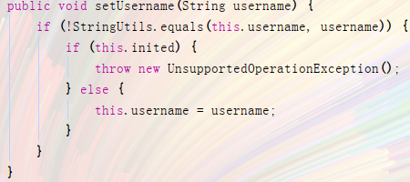

# Spring Boot 的配置文件

## SpringBoot配置文件类型

### SpringBoot配置文件类型和作用

SpringBoot是基于约定的，所以很多配置都有默认值，但如果想使用自己的配置替换默认配置的话，就可以使用application.properties或者application.yml（application.yaml）进行配置。


 SpringBoot默认会从Resources目录下加载application.properties或application.yml（application.yaml）文件其中，application.properties文件是键值对类型的文件，之前一直在使用，所以此处不在对properties文件的格式
 进行阐述。除了properties文件外，SpringBoot还可以使用yml文件进行配置。

### application.yaml

#### yaml文件的简介

YML文件格式是YAML (YAML Aint Markup Language)编写的文件格式，YAML是一种直观的能够被电脑识别的的数据数据序列化格式，并且容易被人类阅读，容易和脚本语言交互的，可以被支持YAML库的不同的编程语言程序导入，比如： C/C++, Ruby, Python, Java, Perl, C#, PHP等。YML文件是以数据为核心的，比传统的xml方式更加简洁。
 YML文件的扩展名可以使用.yml或者.yaml。

#### yml配置文件的语法

##### 配置普通数据

语法： key: value

示例代码：

name: haohao

注意：value之前有一个空格

##### 配置对象数据

语法： 

   key:

​      key1: value1

​      key2: value2

   或者：

   key: {key1: value1,key2: value2}

示例代码：

```yaml
person:
name: haohao
age: 31
addr: beijing

#或者
person: {name: haohao,age: 31,addr: beijing}
```

注意：key1前面的空格个数不限定，在yml语法中，相同缩进代表同一个级别

##### 配置Map数据

同上面的对象写法

##### 配置数组（List、Set）数据

语法： 

   key:

​      \- value1

​      \- value2

或者：

   key: [value1,value2]

示例代码：

```yaml
city:
- beijing
- tianjin
- shanghai
- chongqing
 #
#或者

city: [beijing,tianjin,shanghai,chongqing]

#集合中的元素是对象形式
student:
- name: zhangsan
  age: 18
  score: 100
- name: lisi
  age: 28
  score: 88
- name: wangwu
  age: 38
  score: 90
```

注意：value1与之间的 - 之间存在一个空格

## Java配置

如果没有任何的xml，那么我们如果要配置一个Bean该怎么办？比如我们要配置一个数据库连接池，以前会这么写

~~~xml
<!-- 配置连接池 -->
<bean id="dataSource" class="com.alibaba.druid.pool.DruidDataSource" init-method="init" destroy-method="close">
  <property name="url" value="${jdbc.url}" />
  <property name="username" value="${jdbc.username}" />
  <property name="password" value="${jdbc.password}" />
</bean>
~~~

### 注解的方式配置

在此前学习Spring的过程中也已经尝试过了如果使用纯注解开发

* 首先写一个JdbcConfiguration的类

* 将这个类当作创建数据源，和注入到Spring的容器中

~~~java
@Configuration
@PropertySource("classpath:jdbc.properties")

public class JdbcConfiguration {
    @Value("${jdbc.driverClassName}")
    private String driverClassName;
    @Value("${jdbc.url}")
    private String url;
    @Value("${jdbc.username}")
    private String username;
    @Value("${jdbc.password}")
    private String password;

    @Bean(name = "dataSource")
    public DataSource getDateSource(JdbcProperties jdbcProperties) {
        DruidDataSource dataSource = new DruidDataSource();
        dataSource.setDriverClassName(driverClassName);
        dataSource.setUrl(url);
        dataSource.setUsername(username);
        dataSource.setPassword(password);
        return dataSource;
    }
}
~~~

解读：

1. @Configuration：声明我们JdbcConfig是一个配置类

2. @PropertySource：指定属性文件的路径是:classpath:jdbc.properties

3. 通过@Value为属性注入值

4. 通过@Bean将 dataSource()方法声明为一个注册Bean的方法，Spring会自动调用该方法，将方法的返回值加入Spring容器中。然后就可以在任意位置通过@Autowired注入DataSource了！

Debug发现已经被注入了


### 通过SpringBoot的方式

在上面的案例中，我们实验了java配置方式。不过属性注入使用的是@Value注解。这种方式虽然可行，但是不够强大，因为它只能注入基本类型值。

在SpringBoot中，提供了新的属性注入方式，支持各种java基本数据类型及复杂类型的注入。

#### 方式一：依赖注入

1. application.properties中需要配置相关的配置信息

   ~~~properties
   jdbc.driverClassName=com.mysql.cj.jdbc.Driver
   jdbc.url=jdbc:mysql:///test
   jdbc.username=root
   jdbc.password=root
   ~~~

2. 创建对应的属性类

   ~~~java
   //* 在类上通过@ConfigurationProperties注解声明当前类为属性读取类，prefix="jdbc"读取属性文件中，前缀为jdbc的值。
   @ConfigurationProperties(prefix = "jdbc")
   //* 并且需要加入到Spring容器中
   @Component
   @Data
   public class JdbcProperties {
       /*
       	在类上定义各个属性，名称必须与属性文件中jdbc.后面部分一致
       */
       String driverClassName;
       String url;
       String username;
       String password;
   }
   
   ~~~

3. 创建配置类

   ~~~java
   @Configuration
   //@EnableConfigurationProperties(JdbcProperties.class) 括号内的加不加都可，经测试，只要在方法的参数里包含了属性的配置类都能够成功注入
   @EnableConfigurationProperties
   public class JdbcConfiguration {
       @Bean(name = "dataSource")
       public DataSource getDateSource(JdbcProperties jdbcProperties) {
           DruidDataSource dataSource = new DruidDataSource();
           dataSource.setDriverClassName(jdbcProperties.getDriverClassName());
           dataSource.setUrl(jdbcProperties.getUrl());
           dataSource.setUsername(jdbcProperties.getUsername());
           dataSource.setPassword(jdbcProperties.getPassword());
           return dataSource;
       }
   }
   ~~~

#### 方式二：构造方法

通过构造方法来注入JdbcProperties

~~~java
@Configuration
public class JdbcConfiguration { 
    private JdbcProperties jdbcProperties; 
    public JdbcConfiguration(JdbcProperties prop) {
        this.jdbcProperties = prop;
    }

    @Bean(name = "dataSource")
    public DataSource getDateSource() {
        DruidDataSource dataSource = new DruidDataSource();
        dataSource.setDriverClassName(jdbcProperties.getDriverClassName());
        dataSource.setUrl(jdbcProperties.getUrl());
        dataSource.setUsername(jdbcProperties.getUsername());
        dataSource.setPassword(jdbcProperties.getPassword());
        return dataSource;
    }
}
~~~

#### 方式三：@Autowired

```java
@Configuration
@EnableConfigurationProperties(JdbcProperties.class)
public class JdbcConfiguration {
    @Autowired
    private JdbcProperties jdbcProperties;

    @Bean(name = "dataSource")
    public DataSource getDateSource() {
        DruidDataSource dataSource = new DruidDataSource();
        dataSource.setDriverClassName(jdbcProperties.getDriverClassName());
        dataSource.setUrl(jdbcProperties.getUrl());
        dataSource.setUsername(jdbcProperties.getUsername());
        dataSource.setPassword(jdbcProperties.getPassword());
        return dataSource;
    }
}
```

>  可能会觉得这比@Value的方式更麻烦了，实际上这种方式有着更加强大的功能，也是SpringBoot推荐的注入方式。


* 优势
  * Relaxed bingding ：松散绑定
  * 不严格要求属性中的属性名和成员变量名一致，支持驼峰，中划线，下划线等转换，甚至支持对象的引导。比如user.friend.name,这个代表的是user中的friend对象中的name属性。@Value就无法完成这样的操作。
  * meta-data support：元数据支持，帮助IDE生成属性提示（写开源框架会用到）。

#### 方式四：更为推荐的注入方式

事实上，如果一段属性只有一个Bean需要使用，我们无需将其注入到一个类（JdbcProperties）中。而是直接在需要的地方声明即可。

直接在JdbcConfig类中的获取连接源的方法上写上@ConfigurationProperties

~~~java
@Configuration
public class JdbcConfiguration {

    @Bean(name = "dataSource")
    @ConfigurationProperties(prefix = "jdbc")
    public DataSource getDateSource() {
        DruidDataSource dataSource = new DruidDataSource();
        return dataSource;
    }
}
~~~

<font color="red">我们直接把这个@ConfigurationProperties写入到方法上，但是前提是一定要有对应属性的setter。</font>

问题：我们没有写入这些属性的get和set方法但是却注入了呢？

那是因为在DataSource中提供了对应我们properties中属性的set方法




### properties和yaml共存

 **bootstrap.properties -> bootstrap.yml -> application.properties -> application.yml**

 先加载的会被后加载的覆盖掉，所以**.properties**和**.yml**同时存在时，**.properties**会失效，**.yml**会起作用。