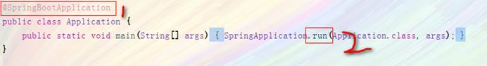
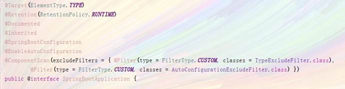
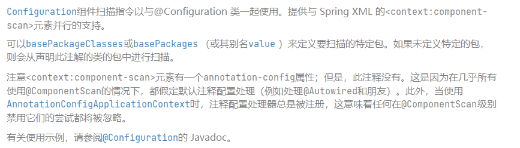
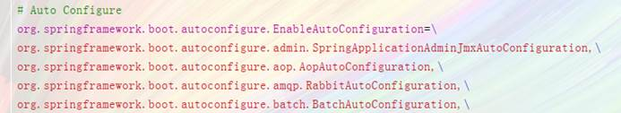
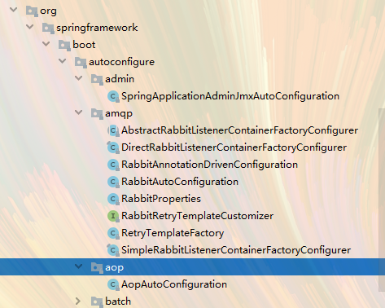
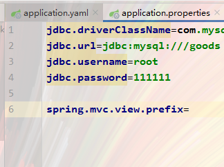
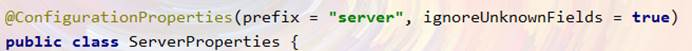

# Spring Boot 自动配置的原理

当配置好Spring-Boot的时候，会发现以前那么多的繁琐的操作不见了。这是为什么？原因就在如下两个地方

## SpringBootApplication

这里重要的注解有三个：

* @SpringBootConfiguration
* @EnableAutoConfiguration
* @ComponentScan

### @SpringBootConfiguration

我们点开源码

会发现有@Configuration注解，这个注解就是声明这是一个配置类，然后Spring会自动扫描到添加了@Configuration的类，并且读取其中的配置信息。而@SpringBootConfiguration是来声明当前类是SpringBoot应用的配置类，项目中只能有一个。所以一般我们无需自己添加。

### @EnableAutoConfiguration

这是注释中给我们的说明，大致意思是，当配置这个注解，SpringBoot会去猜测你注入的依赖，比如我们注入了一个**spring-boot-starter-web**这样一个依赖，那么这个注解就会知道你要开发一个web的application，他就会**自动帮你配置SpringMVC和WEB相关的配置**

总结：

* SpringBoot内部对大量的第三方库或Spring内部库进行了默认配置，这些配置是否生效，取决于我们是否引入了对应库所需的依赖，如果有那么默认配置就会生效。
* 所以，我们使用SpringBoot构建一个项目，只需要引入所需框架的依赖，配置就可以交给SpringBoot处理了。除非你不希望使用SpringBoot的默认配置，它也提供了自定义配置的入口。

### @ComponentScan

这个注解我以前是接触过的，在我学习Spring纯注解开发的时候，这个就代表的是要扫描的包，可以传递一个数组来扫描多个包。

配置这个注解就代表着在XML文件中配置了一个组件扫描的标签。

### @Configuration

@Configuration注解主要标注在某个类上，相当于xml配置文件中的`<beans>`

## Run

### 首先是webEnvironment

点开源码来观察

~~~java

/**
 * An enumeration of possible types of web application.
 *
 * @author Andy Wilkinson
 * @author Brian Clozel
 * @since 2.0.0
 */
public enum WebApplicationType {

	/**
	 * 该应用程序不应作为 Web 应用程序运行，也不应启动嵌入式 Web 服务器。
	 */
	NONE,

	/**
	 *该应用程序应作为基于 servlet 的 Web 应用程序运行，并应启动嵌入式 servlet Web 服务器。.
	 */
	SERVLET,

	/**
	 * 该应用程序应作为响应式 Web 应用程序运行，并应启动嵌入式响应式 Web 服务器。
	 */
	REACTIVE;

	private static final String[] SERVLET_INDICATOR_CLASSES = { "javax.servlet.Servlet",
			"org.springframework.web.context.ConfigurableWebApplicationContext" };
    .......
}
~~~

### 然后是initializers

initializers成员变量，是一个ApplicationContextInitializer类型对象的集合。 顾名思义，ApplicationContextInitializer是一个可以用来初始化ApplicationContext的接口。

initializers成员变量，是一个ApplicationContextInitializer类型对象的集合。 顾名思义，ApplicationContextInitializer是一个可以用来初始化ApplicationContext的接口。

~~~java
private List<ApplicationContextInitializer<?>> initializers;
private void initialize(Object[] sources) {
    ...
    // 为成员变量initializers赋值
    setInitializers((Collection) getSpringFactoriesInstances(
            ApplicationContextInitializer.class));
    ...
}
public void setInitializers(
        Collection<? extends ApplicationContextInitializer<?>> initializers) {
    this.initializers = new ArrayList<ApplicationContextInitializer<?>>();
    this.initializers.addAll(initializers);
}
~~~

可以看到，关键是调用 getSpringFactoriesInstances(ApplicationContextInitializer.class)，来获取ApplicationContextInitializer类型对象的列表。

 ~~~java
private <T> Collection<T> getSpringFactoriesInstances(Class<T> type) {
   return getSpringFactoriesInstances(type, new Class<?>[] {});
}

private <T> Collection<T> getSpringFactoriesInstances(Class<T> type, Class<?>[] parameterTypes, Object... args) {
   ClassLoader classLoader = getClassLoader();
   // Use names and ensure unique to protect against duplicates
   Set<String> names = new LinkedHashSet<>(SpringFactoriesLoader.loadFactoryNames(type, classLoader));
   List<T> instances = createSpringFactoriesInstances(type, parameterTypes, classLoader, args, names);
   AnnotationAwareOrderComparator.sort(instances);
   return instances;
}
 ~~~

在该方法中，首先通过调用SpringFactoriesLoader.loadFactoryNames(type, classLoader)来获取所有Spring Factories的名字，然后调用createSpringFactoriesInstances方法根据读取到的名字创建对象。最后会将创建好的对象列表排序并返回。

~~~java
/**
 * The location to look for factories.
 * 
Can be present in multiple JAR files.
Factories的位置，存在多个jar文件中
 */
public static final String FACTORIES_RESOURCE_LOCATION = "META-INF/spring.factories";
~~~

在spring-boot-autoconfiguration中的这个位置可以看到这个文件

可以看到在EnableAutoConfiguration中这个属性下有许多属性，这些其实都是要加载的jar包

所以说@EnableAutoConfiguration能够生效和这些是无法分开的

## 默认配置原理

例如我们熟悉的SpringMVC，位置如下

我们看到这个类上的4个注解：

* @Configuration：声明这个类是一个配置类
* @ConditionalOnWebApplication(type = Type.SERVLET)
  * ConditionalOn，翻译就是在某个条件下，此处就是满足项目的类是是Type.SERVLET类型，也就是一个普通web工程，显然我们就是
* @ConditionalOnClass({ Servlet.class, DispatcherServlet.class, WebMvcConfigurer.class })
  * 这里的条件是OnClass，也就是满足以下类存在：Servlet、DispatcherServlet、WebMvcConfigurer，其中Servlet只要引入了tomcat依赖自然会有，后两个需要引入SpringMVC才会有。这里就是判断你是否引入了相关依赖，引入依赖后该条件成立，当前类的配置才会生效！
* @ConditionalOnMissingBean(WebMvcConfigurationSupport.class)
  * 这个条件与上面不同，OnMissingBean，是说环境中没有指定的Bean这个才生效。其实这就是自定义配置的入口，也就是说，如果我们自己配置了一个WebMVCConfigurationSupport的类，那么这个默认配置就会失效！ 

### 视图解析器

~~~java
@Bean
@ConditionalOnMissingBean
public InternalResourceViewResolver defaultViewResolver() {
   InternalResourceViewResolver resolver = new InternalResourceViewResolver();
   resolver.setPrefix(this.mvcProperties.getView().getPrefix());
   resolver.setSuffix(this.mvcProperties.getView().getSuffix());
   return resolver;
}
~~~

如果我们要自定义，可以自己配置一个视图解析器那么这个就失效了，但是如果我们只是需要其中的Prefix和Suffix，我们可以打开MvcProperties这个类。

发现这有个注解@ConfigurationProperties注解，这我们就应该明白我们必须在application.xml或者appliction.yaml中配置以spring.mvc 开头的属性。接着往下看，在这个类中有个类为View的类中有这两个属性。

所以，如果要是需要指定这两个属性就需要在spring.mvc后面继续.view.prefix和.view.suffix

* Properties文件

* Yaml文件

### Tomcat

在ServletWebServerFactoryAutoConfiguration中有一个注解

 

在这个ServerProperties中配置了关于端口和路径的信息

## 总结

SpringBoot为我们提供了默认配置，而默认配置生效的条件一般有两个：

* 你引入了相关依赖

* 你自己没有配置

1） 启动器

所以，我们如果不想配置，只需要引入依赖即可，而依赖版本我们也不用操心，因为只要引入了SpringBoot提供的stater（启动器），就会自动管理依赖及版本了。

因此，玩SpringBoot的第一件事情，就是找启动器，SpringBoot提供了大量的默认启动器。

2） 全局配置

另外，SpringBoot的默认配置，都会读取默认属性，而这些属性可以通过自定义application.properties文件来进行覆盖。这样虽然使用的还是默认配置，但是配置中的值改成了我们自定义的。

因此，玩SpringBoot的第二件事情，就是通过application.properties来覆盖默认属性值，形成自定义配置。我们需要知道SpringBoot的默认属性key，非常多。